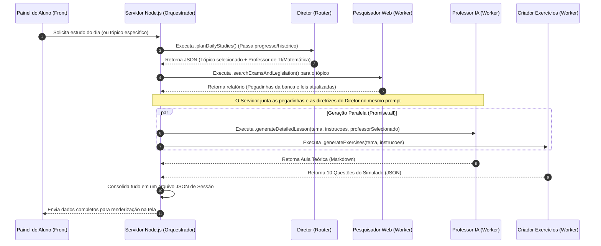

# 🎓 Caso Real: O Padrão Router-Workers na AcademiaIA (Diretor, Professores e Simulados)

Este documento detalha **exatamente como a técnica Router-Workers foi aplicada de forma prática no projeto atual (AcademiaIA)**. Ele serve como engenharia reversa e guia arquitetural para você entender o funcionamento da orquestração entre o Diretor (Roteador), os Professores Especialistas (Trabalhadores), o Criador de Exercícios e o Avaliador de Desempenho.

---

## 1. O Mapeamento de Papéis no Projeto

Neste ecossistema, os papéis do padrão Router-Workers foram distribuídos da seguinte forma:

| Agente | Papel no Padrão | Responsabilidade | Prompt de Sistema Associado |
| :--- | :--- | :--- | :--- |
| **`DirectorAgent`** | **Router (Roteador)** | O coordenador que decide a matéria, o sub-tópico e seleciona qual professor irá redigir a aula. | `director_system.md` / `director_macro_system.md` |
| **`TeacherAgent`** | **Worker (Trabalhador)** | O especialista que redige a aula em Markdown e tira dúvidas no chat, adaptando-se dinamicamente ao professor escolhido pelo Diretor. | `teacher_system.md` (Base) + `teacher_[materia].md` (Especialidade) |
| **`ExerciseCreatorAgent`** | **Worker (Trabalhador)** | O especialista em testes que cria o simulado correspondente. | `exercise_creator_system.md` |
| **`PerformanceEvaluatorAgent`** | **Worker (Trabalhador)** | O especialista corretor que avalia as respostas do simulado e calcula a nota. | `evaluator_system.md` |
| **`WebResearcherAgent`** | **Worker (Trabalhador)** | O assistente de pesquisa que mapeia pegadinhas e regras da banca. | `web_researcher_system.md` |

---

## 2. Diagrama de Orquestração Real

O ciclo de vida de uma aula, desde a decisão do Diretor até a entrega teórica e prática em paralelo, funciona conforme o diagrama a seguir:



---

## 3. Simplificação do Código de Orquestração Real

Veja como esse fluxo é programado no arquivo [server.ts](file:///c:/Temp/_adriano/Projetos/Concurso_Agentes/src/server.ts) de forma simplificada:

### Passo 1: O Diretor (Roteador) decide o Tópico e o Professor
O servidor chama o Diretor passando o progresso atual. O Diretor escolhe, por exemplo, o tema `"Lógica de Programação"` e seleciona o `"Professor de TI"`.

```typescript
// Executa o Diretor (Router) para planejar
const dailyPlan = await director.planDailyStudies(progress.objetivoGeral, progress);

const principalTopic = dailyPlan.topicosAEstudar[0]; // ex: "Lógica de Programação"
const professorSelecionado = dailyPlan.professorSelecionado; // ex: "Professor de TI"
```

### Passo 2: O Pesquisador Web colhe dados para enriquecer o prompt
O servidor passa o tópico decidido para o pesquisador obter dados reais da banca.

```typescript
const searchReport = await webResearcher.searchExamsAndLegislation(principalTopic);
```

### Passo 3: O Orquestrador repassa a decisão do Roteador para os Workers em paralelo
Agora, o servidor instacia as classes trabalhadoras correspondentes. O `TeacherAgent` lerá o nome do professor escolhido e carregará dinamicamente o prompt especialista correspondente (`teacher_ti.md`).

```typescript
// Une as diretrizes do Diretor com o relatório do Pesquisador Web
let instructionsForAgents = dailyPlan.instrucoesParaOProfessor;
instructionsForAgents += `\nPegadinhas da banca: ${searchReport.armadilhasComuns.join(', ')}`;

// Dispara os dois trabalhadores (Workers) em paralelo
const [detailedLesson, exercises] = await Promise.all([
  teacher.generateDetailedLesson(principalTopic, instructionsForAgents, dailyPlan.professorSelecionado),
  exerciseCreator.generateExercises(principalTopic, instructionsForAgents)
]);
```

---

## 4. Por que essa técnica é usada no seu projeto?

1. **Separação de Tamanho de Prompt (Context Window):** Redigir uma aula teórica aprofundada de 1.500 palavras exige espaço e foco. Se o `TeacherAgent` também tivesse que decidir o cronograma, pesquisar na web e formular questões no mesmo prompt, a qualidade do texto cairia e o modelo estouraria o limite de tokens de saída estruturada.
2. **Especialistas Reais:** Um professor de matemática escreve de forma diferente de um professor de português ou legislação. Ter o `DirectorAgent` como roteador permite carregar a "persona" exata apenas no momento em que ela é necessária, economizando memória do sistema.
3. **Escutabilidade do Chat:** No chat com o professor, o servidor sabe exatamente qual foi o trabalhador que gerou a aula e carrega o mesmo prompt especialista (`teacher_ti.md`, `teacher_math.md`) para responder às dúvidas do aluno, garantindo coerência pedagógica.

---

## 5. Passo a Passo Simples: Como criar seu próprio sistema do zero

Siga este roteiro minimalista para construir uma aplicação de atendimento ao cliente usando a técnica **Router-Workers**:

### 1. Inicializar o Projeto no Terminal
Crie uma nova pasta e instale os pacotes principais do Node e do SDK do Gemini:
```bash
npm init -y
npm install @google/genai dotenv
npm install -D typescript @types/node tsx
npx tsc --init
```

### 2. Criar a Classe de Agente Genérica (`src/Agent.ts`)
Esta classe lê qualquer prompt e envia a pergunta para a IA:
```typescript
import { GoogleGenAI } from '@google/genai';
import fs from 'fs/promises';

const ai = new GoogleGenAI();

export class Agent {
  private promptPath: string;

  constructor(promptPath: string) {
    this.promptPath = promptPath;
  }

  public async ask(userQuestion: string, jsonMode = false): Promise<string> {
    const systemPrompt = await fs.readFile(this.promptPath, 'utf-8');
    const response = await ai.models.generateContent({
      model: 'gemini-2.5-flash',
      contents: userQuestion,
      config: {
        systemInstruction: systemPrompt,
        responseMimeType: jsonMode ? 'application/json' : 'text/plain',
      }
    });
    return response.text || '';
  }
}
```

### 3. Criar os Arquivos de Instruções (Prompts)
Crie uma pasta chamada `prompts/` e adicione estes arquivos de texto:
* **`prompts/gerente.txt` (Router):**
  ```text
  Você é o Gerente de Suporte. Analise a reclamação do cliente e decida:
  Se for sobre pagamento/boleto, responda "FINANCEIRO".
  Se for sobre login/senha/bugs, responda "TECNICO".
  Responda estritamente no formato JSON: {"departamento": "FINANCEIRO" ou "TECNICO"}
  ```
* **`prompts/financeiro.txt` (Worker 1):**
  ```text
  Você é o especialista Financeiro. Escreva uma resposta ajudando o cliente com boletos, reembolso ou faturamento de forma simpática.
  ```
* **`prompts/tecnico.txt` (Worker 2):**
  ```text
  Você é o suporte Técnico. Escreva uma resposta instruindo o cliente a resetar a senha, limpar cookies ou abrir o console do navegador.
  ```

### 4. Criar o Orquestrador (`src/index.ts`)
Este código recebe a entrada, decide o Worker com o Router e o executa:
```typescript
import { Agent } from './Agent';
import * as dotenv from 'dotenv';
dotenv.config();

async function processarChamado(mensagemDoCliente: string) {
  console.log(`\nReclamação: "${mensagemDoCliente}"`);

  // 1. Gerente decide o departamento
  const gerente = new Agent('./prompts/gerente.txt');
  const decisaoRaw = await gerente.ask(mensagemDoCliente, true);
  const decisao = JSON.parse(decisaoRaw);
  console.log(`Gerente encaminhou para: ${decisao.departamento}`);

  // 2. Orquestrador inicializa o especialista dinamicamente
  const pathPrompt = decisao.departamento === 'FINANCEIRO' 
    ? './prompts/financeiro.txt' 
    : './prompts/tecnico.txt';
  
  const especialista = new Agent(pathPrompt);

  // 3. Especialista gera a resposta final
  const resposta = await especialista.ask(mensagemDoCliente);
  console.log('\n=== RESPOSTA AO CLIENTE ===');
  console.log(resposta);
}

async function rodar() {
  await processarChamado('Não consigo pagar meu boleto vencido');
  await processarChamado('Esqueci minha senha e o email de recuperação não chega');
}
rodar();
```

### 5. Executar o Projeto
Crie um arquivo `.env` com a sua chave `GEMINI_API_KEY=sua_chave` e execute:
```bash
npx tsx src/index.ts
```
