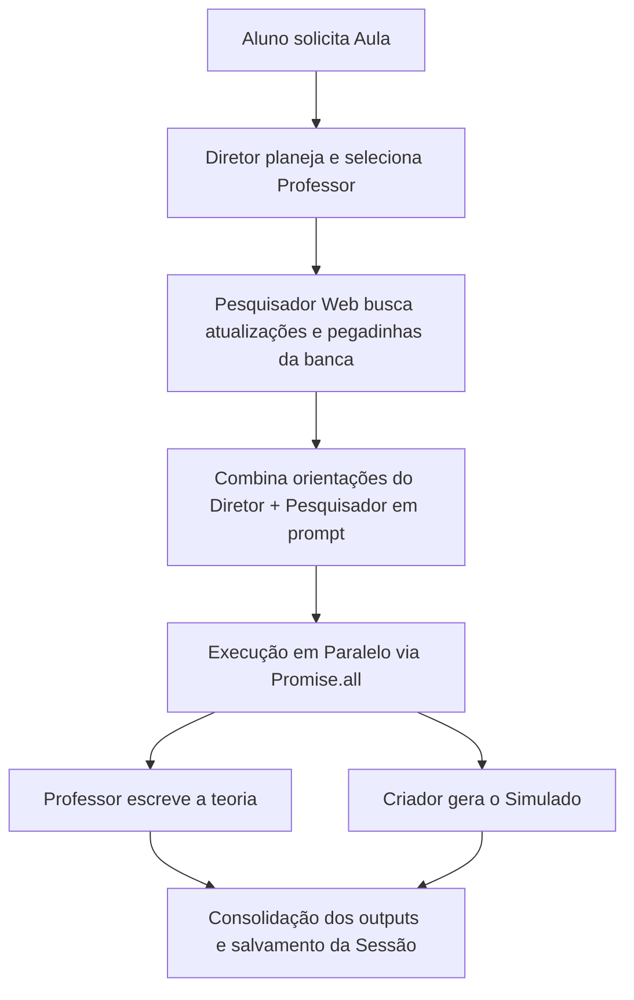

# 🏗️ Arquitetura de Equipes de Agentes de IA: Entendendo este Projeto e Como Criar a sua Própria Equipe

Este documento explica detalhadamente como o sistema multiagente (Diretor, Professores, Criador de Exercícios, Pesquisador Web e Avaliador) foi construído neste projeto e fornece um guia prático completo com código para que você crie o seu próprio ecossistema de agentes em TypeScript/Node.js.

---

## 1. Como a Equipe de Agentes deste Projeto foi Feita

A equipe de agentes foi projetada seguindo os princípios de **Separação de Preocupações (Separation of Concerns)** e **Orquestração de Fluxo (Workflow Orchestration)**. Cada agente possui uma persona e responsabilidades bem delineadas no diretório [src/agents/](file:///c:/Temp/_adriano/Projetos/Concurso_Agentes/src/agents).

### A Estrutura de Classes (Orientação a Objetos)

1. **A Classe Base (`Agent.ts`):**
   * Todos os agentes herdam de uma classe abstrata comum chamada [Agent](file:///c:/Temp/_adriano/Projetos/Concurso_Agentes/src/agents/Agent.ts).
   * Ela é responsável por carregar o prompt de sistema do disco (da pasta `src/prompts/`) e gerenciar o histórico da conversa (`chatMessages`).
   * Fornece o método genérico `.ask(userMessage, jsonMode)` que chama o serviço do Gemini.

2. **Os Agentes Especialistas (Herdeiros de `Agent`):**
   * [DirectorAgent](file:///c:/Temp/_adriano/Projetos/Concurso_Agentes/src/agents/DirectorAgent.ts): O "Cérebro Organizador" que decide qual matéria/tópico estudar hoje com base no histórico do aluno e seleciona qual professor deve ministrar a aula.
   * [WebResearcherAgent](file:///c:/Temp/_adriano/Projetos/Concurso_Agentes/src/agents/WebResearcherAgent.ts): O "Pesquisador" que varre a web em busca de atualizações legais ou técnicas e mapeia o comportamento da banca FUNDATEC para o tema selecionado.
   * [TeacherAgent](file:///c:/Temp/_adriano/Projetos/Concurso_Agentes/src/agents/TeacherAgent.ts): O "Especialista em Conteúdo" que redige a aula expositiva avançada em formato Markdown e faz a mentoria no chat de dúvidas.
   * [ExerciseCreatorAgent](file:///c:/Temp/_adriano/Projetos/Concurso_Agentes/src/agents/ExerciseCreatorAgent.ts): O "Criador de Testes" que gera as 10 questões interativas com opções (A a E) e as resoluções comentadas.
   * [PerformanceEvaluatorAgent](file:///c:/Temp/_adriano/Projetos/Concurso_Agentes/src/agents/PerformanceEvaluatorAgent.ts): O "Avaliador" que confronta as respostas do aluno com o gabarito oficial, emite o parecer pedagógico e atualiza o progresso.

---

## 2. O Fluxo de Orquestração no Servidor (`server.ts`)

A orquestração (coordenação) ocorre no arquivo [server.ts](file:///c:/Temp/_adriano/Projetos/Concurso_Agentes/src/server.ts) nos endpoints `/api/daily/generate` e `/api/quiz/submit`. O fluxo segue um padrão sequencial-paralelo:



### Por que rodar em paralelo?
Usar `Promise.all` para executar o **Professor** e o **Criador de Exercícios** concorrentemente reduz o tempo de resposta da API pela metade, pois ambas as chamadas de LLM ocorrem de forma assíncrona e simultânea.

---

## 3. Tutorial: Criando a sua Própria Equipe de Agentes Simples

Vamos criar um pequeno sistema de **"Equipe de Produção de Conteúdo de Marketing"** composto por:
1. **Coordenador:** Planeja a pauta.
2. **Redator:** Escreve o artigo.
3. **Revisor:** Corrige e sugere melhorias.

### Passo 1: O Agente Base (`BaseAgent.ts`)

```typescript
import { GoogleGenAI } from '@google/genai';

const ai = new GoogleGenAI({ apiKey: process.env.GEMINI_API_KEY });

export class BaseAgent {
  protected name: string;
  protected systemPrompt: string;

  constructor(name: string, systemPrompt: string) {
    this.name = name;
    this.systemPrompt = systemPrompt;
  }

  public async ask(userMessage: string, jsonMode = false): Promise<string> {
    const response = await ai.models.generateContent({
      model: 'gemini-2.5-flash',
      contents: userMessage,
      config: {
        systemInstruction: this.systemPrompt,
        responseMimeType: jsonMode ? 'application/json' : 'text/plain',
      }
    });

    return response.text || '';
  }
}
```

### Passo 2: Definir os Papéis e Prompts dos Agentes

```typescript
// 1. O Coordenador de Pauta
const coordenadorPrompt = `
Você é o Coordenador de Marketing. Sua tarefa é receber um tema bruto e gerar um planejamento de pauta contendo:
- Título sugerido
- Palavras-chave essenciais
- Tópicos obrigatórios que o texto deve cobrir
Retorne estritamente em formato JSON:
{
  "titulo": "string",
  "palavrasChave": ["string"],
  "topicosObrigatorios": ["string"]
}
`;

// 2. O Redator Técnico
const redatorPrompt = `
Você é o Redator Técnico. Sua tarefa é escrever um artigo completo em Markdown baseado no planejamento de pauta enviado pelo Coordenador.
Siga as palavras-chave e tópicos solicitados. Escreva de forma didática e fluida.
`;

// 3. O Revisor Crítico
const revisorPrompt = `
Você é o Revisor Editorial. Sua tarefa é analisar o artigo escrito pelo Redator, apontar pontos de melhoria, correções gramaticais e reescrever seções confusas.
`;
```

### Passo 3: Orquestração do Fluxo (`index.ts`)

```typescript
import { BaseAgent } from './BaseAgent';

async function runCreativePipeline(temaBruto: string) {
  console.log(`[PIPELINE] Iniciando produção para o tema: "${temaBruto}"`);

  // Inicializa os agentes
  const coordenador = new BaseAgent('Coordenador', coordenadorPrompt);
  const redator = new BaseAgent('Redator', redatorPrompt);
  const revisor = new BaseAgent('Revisor', revisorPrompt);

  // 1. Etapa de Planejamento (Coordenador)
  console.log('[1/3] Planejando pauta...');
  const pautaRaw = await coordenador.ask(`Crie a pauta para o tema: ${temaBruto}`, true);
  const pauta = JSON.parse(pautaRaw);
  console.log(`Pauta planejada: "${pauta.titulo}"`);

  // 2. Etapa de Produção (Redator)
  console.log('[2/3] Redigindo artigo...');
  const artigo = await redator.ask(`Escreva o artigo baseado nesta pauta: ${JSON.stringify(pauta, null, 2)}`);
  console.log('Artigo escrito com sucesso.');

  // 3. Etapa de Controle de Qualidade (Revisor)
  console.log('[3/3] Revisando conteúdo...');
  const revisao = await revisor.ask(`Analise e revise o seguinte artigo:\n\n${artigo}`);
  
  console.log('\n=== ARTIGO REVISADO E FINALIZADO ===\n');
  console.log(revisao);
}

runCreativePipeline('Como funciona o docker e conteinerização para iniciantes');
```

---

## 4. Lições Aprendidas de Arquitetura Multiagente

1. **Separação de Contextos:** Evite colocar instruções de várias tarefas no mesmo prompt do LLM. Separar em vários agentes (ex: criar exercícios vs escrever aula) evita alucinações e melhora drasticamente a qualidade de cada resposta.
2. **Transferência de Estado:** Os agentes interagem compartilhando dados de saída como entrada para o próximo agente (ex: o relatório de busca do Pesquisador Web é injetado no prompt de contexto do Professor).
3. **Consolidação em APIs:** Encapsular todo o fluxo de agentes atrás de um servidor Express/Node (como no [server.ts](file:///c:/Temp/_adriano/Projetos/Concurso_Agentes/src/server.ts)) permite que seu frontend (HTML/JS) chame apenas um endpoint (`/api/daily/generate`) e receba o resultado consolidado das várias IAs de forma transparente.
4. **Decisão Inteligente vs. Execução por Código (Router-Workers):** Em arquiteturas de agentes reais, a IA coordenadora (como o Diretor) toma a decisão de *quem* deve trabalhar retornando uma escolha textual estruturada (ex: `"professorSelecionado": "Professor de Matemática"` no JSON). O código do servidor (o orquestrador) lê essa decisão e executa o carregamento dos prompts de especialidade corretos (`teacher_math.md` ou `teacher_portuguese.md`). Isso separa a lógica de controle cognitivo da lógica de execução do sistema.

---

## 5. Lendo Arquivos (PDF, Planilhas e Textos) com @google/genai

Para ler arquivos locais e passá-los como contexto aos seus agentes utilizando a biblioteca `@google/genai`, existem duas abordagens principais:

### Método A: Leitura e Extração Local de Texto (Simples e Seguro)
Você lê o arquivo localmente no Node.js usando pacotes do ecossistema e passa o texto limpo direto no prompt.

1. **Arquivos de Texto Puro / Markdown / JSON / CSV:**
   * Basta ler nativamente com `fs/promises`:
   ```typescript
   import fs from 'fs/promises';
   const dadosCSV = await fs.readFile('./planilha.csv', 'utf-8');
   const resposta = await redator.ask(`Analise os seguintes dados:\n${dadosCSV}`);
   ```

2. **Arquivos PDF:**
   * Instale o pacote `pdf-parse`: `npm install pdf-parse`
   ```typescript
   import fs from 'fs/promises';
   import pdf from 'pdf-parse';

   const dataBuffer = await fs.readFile('./documento.pdf');
   const parsedPDF = await pdf(dataBuffer);
   
   const resposta = await redator.ask(`Resuma o seguinte PDF:\n${parsedPDF.text}`);
   ```

3. **Planilhas Excel (.xlsx):**
   * Instale o pacote `xlsx`: `npm install xlsx`
   ```typescript
   import * as XLSX from 'xlsx';

   const workbook = XLSX.readFile('./dados.xlsx');
   const sheetName = workbook.SheetNames[0];
   const worksheet = workbook.Sheets[sheetName];
   const dadosJSON = XLSX.utils.sheet_to_json(worksheet);

   const resposta = await redator.ask(`Consulte a planilha:\n${JSON.stringify(dadosJSON, null, 2)}`);
   ```

4. **Arquivos Microsoft Word (.docx):**
   * Instale o pacote `mammoth` (focado em extrair texto limpo de docx): `npm install mammoth`
   ```typescript
   import fs from 'fs/promises';
   import mammoth from 'mammoth';

   const dataBuffer = await fs.readFile('./documento.docx');
   const result = await mammoth.extractRawText({ buffer: dataBuffer });
   
   const textoExtraido = result.value; // O texto bruto extraído do Word
   const resposta = await redator.ask(`Analise o seguinte arquivo Word:\n${textoExtraido}`);
   ```

### Método B: API Nativa de Upload de Arquivos do Gemini (Recomendado para Arquivos Grandes)
O Gemini suporta nativamente formatos como PDF, imagens e áudios diretamente em seu prompt por possuir uma janela de contexto gigante (até 2 milhões de tokens).

```typescript
import { GoogleGenAI } from '@google/genai';
import fs from 'fs';

const ai = new GoogleGenAI({ apiKey: process.env.GEMINI_API_KEY });

async function analisarDocumentoGrande() {
  // 1. Faz o upload do arquivo para a API do Gemini
  console.log('Subindo arquivo para a API do Gemini...');
  const uploadResult = await ai.files.upload({
    file: fs.createReadStream('./relatorio_financeiro.pdf'),
    mimeType: 'application/pdf',
  });

  console.log(`Upload concluído! URI do arquivo: ${uploadResult.uri}`);

  // 2. Passa a referência do arquivo diretamente na geração de conteúdo
  const response = await ai.models.generateContent({
    model: 'gemini-2.5-flash',
    contents: [
      uploadResult, // A referência direta ao arquivo carregado
      'Forneça uma análise comparativa dos trimestres e elabore um resumo dos pontos fracos apontados no relatório.'
    ],
  });

  console.log('Análise do Gemini:');
  console.log(response.text);

  // 3. Opcional: Limpa o arquivo da API após o uso
  await ai.files.delete({ name: uploadResult.name });
}
```

