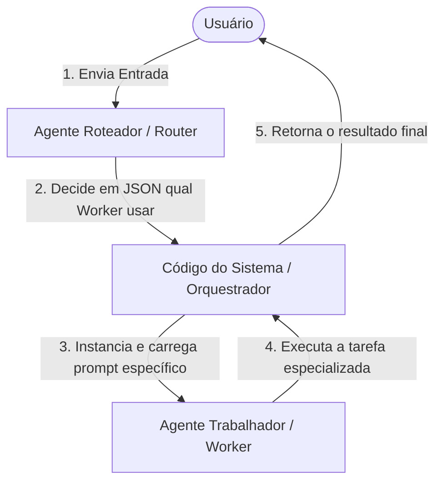

# 🏗️ Passo a Passo: Construindo uma Equipe de IA com o Padrão Router-Workers (Roteador-Trabalhadores)

O padrão **Router-Workers** é um dos modelos mais eficientes de engenharia de software para sistemas de IA (Agentic Workflows). Ele consiste em um agente principal (o **Router**) que analisa a requisição do usuário e seleciona, de forma dinâmica, qual agente especialista (o **Worker**) é o mais qualificado para resolver o problema, repassando a tarefa para ele.

Este documento fornece um guia passo a passo completo, com código real e pronto para rodar em TypeScript/Node.js, utilizando o novo SDK `@google/genai`.

---

## Como o Padrão Funciona (Fluxo de Dados)



---

## Passo 1: Configuração do Ambiente e Instalação

Inicie um projeto Node.js e instale as dependências necessárias (incluindo o novo SDK oficial do Gemini):

```bash
npm init -y
npm install typescript @types/node tsx @google/genai
npx tsc --init
```

Certifique-se de configurar a sua chave de API nas variáveis de ambiente:
* No Windows (CMD): `set GEMINI_API_KEY=sua_chave_aqui`
* No Windows (PowerShell): `$env:GEMINI_API_KEY="sua_chave_aqui"`
* No Linux/macOS: `export GEMINI_API_KEY="sua_chave_aqui"`

---

## Passo 2: Definir os Prompts dos Trabalhadores (Workers)

Crie uma pasta para armazenar os arquivos de prompt dos agentes especialistas.

### Arquivo: `prompts/worker_seo.md`
```markdown
Você é o Especialista em SEO (Search Engine Optimization). Sua tarefa é analisar o texto do usuário e fornecer:
1. Um título otimizado para motores de busca.
2. Uma meta-description persuasiva de até 150 caracteres.
3. Sugestão de 5 palavras-chave estratégicas baseadas no tema.
```

### Arquivo: `prompts/worker_creative.md`
```markdown
Você é o Redator Criativo. Sua tarefa é transformar o tema enviado em um texto cativante, focado em redes sociais, utilizando técnicas de storytelling, emojis e gatilhos de engajamento.
```

---

## Passo 3: Criar o Roteador (Router Agent)

O Roteador analisa o pedido do usuário e decide qual Worker utilizar, retornando estritamente um JSON estruturado.

### Arquivo: `prompts/router_system.md`
```markdown
Você é o Diretor de Operações de Conteúdo. Sua tarefa é analisar a mensagem do usuário e decidir qual especialista deve atendê-lo.

Escolha entre os seguintes trabalhadores:
- "SEO": Selecione se o usuário deseja otimização de busca, palavras-chave ou meta tags.
- "Creative": Selecione se o usuário deseja redação para redes sociais, storytelling ou textos de engajamento.

Você deve responder RIGOROSAMENTE no formato JSON, sem texto explicativo adicional:
{
  "trabalhadorSelecionado": "SEO" | "Creative",
  "justificativa": "Sua justificativa didática de escolha"
}
```

---

## Passo 4: Implementação das Classes em TypeScript

Aqui está o código completo para implementar os agentes e a orquestração do fluxo.

### Arquivo: `Agent.ts` (Classe Base)
```typescript
import { GoogleGenAI } from '@google/genai';
import fs from 'fs/promises';
import path from 'path';

// Inicializa o SDK oficial do Gemini (ele busca a chave em process.env.GEMINI_API_KEY automaticamente)
const ai = new GoogleGenAI();

export class Agent {
  protected name: string;
  protected promptFileName: string;
  protected systemInstruction = '';

  constructor(name: string, promptFileName: string) {
    this.name = name;
    this.promptFileName = promptFileName;
  }

  // Carrega o prompt de sistema do arquivo local
  public async initialize(): Promise<void> {
    const filePath = path.join(process.cwd(), 'prompts', this.promptFileName);
    this.systemInstruction = await fs.readFile(filePath, 'utf-8');
  }

  // Envia a mensagem para a API do Gemini com o prompt de sistema correspondente
  public async ask(userMessage: string, jsonMode = false): Promise<string> {
    if (!this.systemInstruction) {
      await this.initialize();
    }

    const response = await ai.models.generateContent({
      model: 'gemini-2.5-flash',
      contents: userMessage,
      config: {
        systemInstruction: this.systemInstruction,
        responseMimeType: jsonMode ? 'application/json' : 'text/plain',
      },
    });

    return response.text || '';
  }
}
```

### Arquivo: `Orchestrator.ts` (O Orquestrador do Fluxo)
```typescript
import { Agent } from './Agent.js';

export class Orchestrator {
  private router: Agent;

  constructor() {
    // Inicializa o roteador com seu prompt correspondente
    this.router = new Agent('Router', 'router_system.md');
  }

  public async processRequest(userInput: string): Promise<void> {
    console.log(`\n[USUÁRIO]: "${userInput}"`);
    console.log('[SISTEMA]: Acionando o Roteador...');

    // 1. O Roteador analisa e decide
    const routerDecisionRaw = await this.router.ask(userInput, true);
    const decision = JSON.parse(routerDecisionRaw);

    console.log(`[ROTEADOR]: Selecionou o trabalhador: "${decision.trabalhadorSelecionado}"`);
    console.log(`[JUSTIFICATIVA]: ${decision.justificativa}\n`);

    // 2. Mapeamento e Inicialização Dinâmica do Trabalhador Escolhido
    let workerPromptFile = '';
    if (decision.trabalhadorSelecionado === 'SEO') {
      workerPromptFile = 'worker_seo.md';
    } else if (decision.trabalhadorSelecionado === 'Creative') {
      workerPromptFile = 'worker_creative.md';
    } else {
      console.error('[ERRO]: Trabalhador desconhecido selecionado!');
      return;
    }

    console.log(`[SISTEMA]: Inicializando o Trabalhador Especialista (${decision.trabalhadorSelecionado})...`);
    const worker = new Agent(decision.trabalhadorSelecionado, workerPromptFile);

    // 3. O Trabalhador executa a tarefa
    const result = await worker.ask(`Execute a seguinte tarefa: ${userInput}`);

    console.log(`\n=== RESPOSTA DO TRABALHADOR (${decision.trabalhadorSelecionado}) ===\n`);
    console.log(result);
    console.log('\n==================================================');
  }
}
```

### Arquivo: `index.ts` (Arquivo de Execução Principal)
```typescript
import { Orchestrator } from './Orchestrator.js';

async function main() {
  const orchestrator = new Orchestrator();

  // Teste 1: O roteador deve escolher o trabalhador de SEO
  await orchestrator.processRequest(
    'Preciso planejar os metadados de busca e as palavras-chave para o lançamento de um app de finanças pessoais.'
  );

  // Teste 2: O roteador deve escolher o trabalhador Criativo
  await orchestrator.processRequest(
    'Escreva um post curto para o LinkedIn ensinando a importância de salvar dinheiro usando analogia com videogame.'
  );
}

main().catch(console.error);
```

---

## Benefícios deste Padrão em Produção

1. **Eficiência de Custos e Latência:** Em vez de usar um modelo gigante e caro (como o Gemini Pro) carregado com dezenas de instruções e diretrizes para fazer tudo, você usa um modelo leve e rápido (como o Gemini Flash) para rotear e um especialista pequeno para executar, economizando tokens e tempo de processamento.
2. **Alta Escalabilidade:** Para adicionar um novo papel à equipe (ex: "Trabalhador de Tradução"), basta criar o prompt `worker_translator.md`, adicionar a opção nas instruções do `router_system.md` e mapear o arquivo no código do `Orchestrator.ts`. Nenhuma classe nova de agente precisa ser programada.
3. **Facilidade de Depuração:** Se o especialista de SEO apresentar problemas de formatação, você ajusta apenas o arquivo `worker_seo.md`, sem risco de quebrar o redator criativo.
