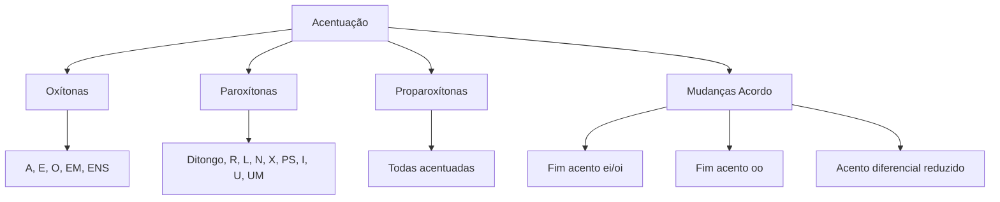

# 🎓 AcademiaIA - Aula Diária de Estudos
**Objetivo Geral:** Passar no cargo de Analista de Desenvolvimento de Sistemas no concurso da FUNDATEC
**Plano do Dia:** Dominar as regras de acentuação gráfica vigentes, superando lacunas detectadas em simulados anteriores.
**Tema:** Acentuação Gráfica Conforme o Novo Acordo Ortográfico

---

## 📅 Roteiro de Estudos Planejado pelo Diretor
* **Data:** 2026-07-23
* **Tópicos a Estudar:**
    - Acentuação gráfica conforme sistema oficial vigente (inclusive Acordo Ortográfico vigente)
* **Justificativa da Escolha:**
  O aluno escolheu especificamente o tema de acentuação e o histórico de desempenho mostrou falhas consistentes nesse tópico (reprovação nos simulados de ortografia com erros ligados a acentos diferenciais e supressão de ditongos). Portanto, a aula é vital para corrigir estas lacunas críticas antes de avançar na gramática.
* **Professor Responsável:** Professor de Português

---

## 🔍 Análise Estratégica da Banca (FUNDATEC)
* **Recorrência do Assunto:** `Alta`
* **Foco da Banca nas Provas:**
  A FUNDATEC possui um perfil extremamente normativo e literal. O foco principal recai sobre a memorização das regras fundamentais para paroxítonas, proparoxítonas e oxítonas, com ênfase especial nas alterações introduzidas pelo Acordo Ortográfico, como o fim dos acentos nos ditongos abertos 'ei' e 'oi' em palavras paroxítonas (ex: ideia, jiboia) e o fim do acento no hiato 'oo' (ex: voo, enjoo). A banca frequentemente apresenta listas de palavras pedindo para identificar qual termo está incorreto ou exige a justificativa gramatical para o uso do acento.
* **Pegadinhas Clássicas Mapeadas:**
    - Armadilha 1: Confusão entre o acento diferencial (que foi amplamente reduzido) e a regra geral de acentuação. A banca costuma manter o acento em 'pôr' (verbo) para diferenciar de 'por' (preposição), mas tenta confundir com o 'para' (verbo/preposição) que não possui mais acento.
  - Armadilha 2: Palavras terminadas em ditongos crescentes (ex: 'área', 'história'). A banca explora o fato de que estas podem ser classificadas como paroxítonas terminadas em ditongo crescente ou proparoxítonas aparentes, focando na regra que exige o acento devido à terminação.
  - Armadilha 3: Omissão do acento em hiatos. A banca cobra frequentemente o acento no 'i' e 'u' tônicos formadores de hiato (ex: 'saída', 'baú'), muitas vezes incluindo armadilhas com o hiato seguido de 'nh' ou sílaba repetida.
* **Atualizações Importantes:**
  O Acordo Ortográfico consolidado desde 2016 permanece como a base técnica. As mudanças mais cobradas são: exclusão do acento em ditongos 'ei' e 'oi' de paroxítonas (ex: assembleia, heroico), exclusão do acento em hiatos 'oo' (ex: voo, leem) e a manutenção da regra para hiatos 'i' e 'u' tônicos precedidos de vogal, sem ser seguidos de 'nh'.

---

### 📝 Questões Reais de Concursos Anteriores (Referência)

#### Questão de Referência 1 (2023 | Prefeitura de Caxias do Sul | Analista Administrativo)
Assinale a alternativa em que a palavra destacada NÃO deve ser acentuada graficamente, de acordo com as normas atuais da língua portuguesa. A) Está na hora de tomar um CHÁ. B) O herói da história é um ILHÉU. C) Eles não conseguiram ver o VOO. D) O processo foi arquivado na ÁREA administrativa. E) O baú está cheio de PÓ.

* **Gabarito Oficial:** **Opção (C)**


---

## 📚 Conteúdo Expositivo da Aula: Acentuação Gráfica Conforme o Novo Acordo Ortográfico

### 🎯 Objetivos de Aprendizagem
* **Dominar as regras fundamentais de acentuação para oxítonas, paroxítonas e proparoxítonas.**
* **Identificar as alterações do Acordo Ortográfico (ditongos abertos e hiatos).**
* **Diferenciar o acento diferencial remanescente das formas que perderam o acento.**
* **Compreender a regra das proparoxítonas aparentes (terminadas em ditongo crescente) para evitar erros em provas da banca FUNDATEC.**

### 📝 Teoria Detalhada
## 1. Introdução e a "Analogia de Ouro"
A acentuação gráfica existe para indicar a sílaba tônica (mais forte) de uma palavra e para garantir a pronúncia correta de certas vogais. Imagine que as palavras são como prédios: o acento é a "luz de sinalização" no topo da antena. Se o prédio é muito alto, precisamos avisar onde está o topo para ninguém bater. As regras de acentuação são as leis de trânsito desse prédio: elas definem quando a luz é obrigatória, opcional ou proibida, garantindo que todos leiam a planta da palavra da mesma maneira.

## 2. Nivelamento e Conceituação Progressiva
- **Sílaba Tônica:** É a sílaba pronunciada com maior intensidade. Toda palavra tem apenas uma.
- **Oxítonas:** O último andar é o mais forte (ex: café, cajá).
- **Paroxítonas:** O penúltimo andar é o mais forte (ex: mesa, fácil).
- **Proparoxítonas:** O antepenúltimo andar é o mais forte (ex: médico, lâmpada). *Dica: Todas as proparoxítonas são acentuadas sem exceção.*

## 3. Aprofundamento Teórico Avançado
### A Regra das Paroxítonas (Onde a FUNDATEC mais cobra)
As paroxítonas são acentuadas quando terminadas em: R, L, N, X, PS, I(s), U(s), UM(ns) e DITONGOS (crescentes ou decrescentes). 
Importante: Paroxítonas terminadas em A(s), E(s), O(s), EM, ENS NÃO recebem acento, pois essas terminações são exclusivas das oxítonas.

### Mudanças do Acordo Ortográfico:
1. **Ditongos Abertos (EI, OI) em paroxítonas:** Perderam o acento. Exemplos: Ideia (antigamente idéia), Jiboia (antigamente jibóia), Heroico (antigamente heróico).
2. **Hiatos OO:** O hiato 'oo' perdeu o acento. Exemplos: Voo, enjoo, perdoo.
3. **Hiatos I e U tônicos:** Mantêm-se acentuados se estiverem sozinhos na sílaba ou seguidos de S. Exceção: Se forem precedidos de ditongo na mesma palavra (ex: feiura - não acentua) ou seguidos de 'nh' (ex: rainha - não acentua).

### Acentuação Diferencial:
O Acordo reduziu drasticamente. Permanece apenas o acento em:
- **Pôr (verbo)** vs Por (preposição).
- **Pôde (passado)** vs Pode (presente).
*Observação: Para (verbo) perdeu o acento, sendo agora igual à preposição 'para'.*

## 4. Quadro Comparativo Visual
| Categoria | Regra Geral | Exemplo (Certo) | Exemplo (Errado) |
| :--- | :--- | :--- | :--- |
| Oxítonas | Terminadas em A(s), E(s), O(s), EM(ens) | Sofá, Armazém | Café (ok), sofa |
| Paroxítonas | Terminadas em ditongo, R, L, N, X, PS, I, U, UM | Fácil, História | Idea, Jiboia |
| Proparoxítonas | Todas acentuadas | Lâmpada, Próximo | Lampada |

## 5. Mnemônicos e Técnicas de Memorização
Para as paroxítonas acentuadas, use a frase: "**R**ou**L**o **N**o **X**adrez **PS**iquiatra **I****U** **UM** **Ditongo**".

## 6. Radar de Pegadinhas (Foco na FUNDATEC)
1. **Proparoxítonas Aparentes:** Palavras como 'história', 'lírio' ou 'névoa'. A FUNDATEC tenta confundir o aluno. Elas são tecnicamente paroxítonas terminadas em ditongo crescente, mas na fonética, podem ser lidas como proparoxítonas (histó-ria ou histó-ri-a). Por regra, elas recebem acento pois são paroxítonas terminadas em ditongo. Não confunda com erro ortográfico.
2. **Crase e Acento:** A banca ama misturar acento agudo com crase. Lembre-se: acento gráfico marca tonicidade; crase é fenômeno de fusão de vogais.

## 7. Perguntas de Auto-Verificação
1. Qual a regra para 'ideia'? R: Não tem acento, pois é paroxítona com ditongo aberto 'ei'.
2. 'Pára' (verbo) ainda tem acento? R: Não, perdeu com o Acordo Ortográfico.
3. Por que 'história' é acentuada? R: É uma paroxítona terminada em ditongo crescente.

### 💡 Exemplos Práticos

#### Exemplo 1: Regra das Oxítonas (terminação EM/ENS)
* **Descrição:** Verbo no plural ou singular com terminação em em/ens.
* **Especificação Técnica:**
```sql
Ele tem (sem acento) / Eles têm (com acento diferencial de número).
```


#### Exemplo 2: Hiatos I e U tônicos
* **Descrição:** Quando a vogal I ou U forma sílaba sozinha ou com S, recebe acento.
* **Especificação Técnica:**
```sql
Sa-í-da (acentuada); Ba-ú (acentuada); Ra-i-nha (não acentua pois tem 'nh').
```


#### Exemplo 3: Paroxítonas terminadas em Ditongo
* **Descrição:** Acentuação de palavras terminadas em ditongo crescente.
* **Especificação Técnica:**
```sql
Fá-cil (paroxítona em L); Hár-duo (paroxítona em ditongo).
```


#### Exemplo 4: Proparoxítonas Aparentes
* **Descrição:** Palavras que podem ser interpretadas como proparoxítonas, mas são paroxítonas terminadas em ditongo.
* **Especificação Técnica:**
```sql
História (His-tó-ria - Paroxítona); Névoa (Né-voa - Paroxítona). Ambas acentuadas pela regra das paroxítonas terminadas em ditongo.
```


### 📌 Resumo de Fixação
Oxítonas acentuadas: terminadas em A, E, O, EM, ENS.,Paroxítonas acentuadas: R, L, N, X, PS, I(s), U(s), UM(ns) e DITONGOS.,Ditongos abertos (EI, OI) em paroxítonas: perderam o acento (ideia, jiboia).,Hiatos OO: perderam o acento (voo, enjoo).,Acento diferencial: sobrevive apenas em 'pôr' (verbo) e 'pôde' (passado).,Proparoxítonas aparentes: são paroxítonas terminadas em ditongo e seguem a regra das paroxítonas.

---

## 🧠 Mapa Mental (Visualização Gráfica)


---

## 🗂️ Flashcards (Fixação Ativa)
| ❓ Pergunta | 💡 Resposta |
|---|---|
| **Qual a regra das proparoxítonas?** | Todas, sem exceção, são acentuadas. |
| **A palavra 'ideia' tem acento?** | Não, pois é uma paroxítona com ditongo aberto 'ei'. |
| **Como diferenciar 'pôr' e 'por'?** | 'Pôr' é verbo (com acento), 'por' é preposição (sem acento). |
| **Por que 'rainha' não tem acento no 'i'?** | Porque o hiato está seguido de 'nh'. |

---

## 📝 Simulado de Fixação (Criador de Exercícios)

### ❓ Caderno de Questões

#### Questão 1
* **Dificuldade:** `Fácil` | **Edital:** *Ortografia oficial: acentuação gráfica*

Assinale a alternativa em que todas as palavras estão grafadas corretamente, respeitando a eliminação dos acentos nos ditongos abertos de paroxítonas pelo Acordo Ortográfico.

  - **(A)** Idéia, heroico, plateia, jiboia.
  - **(B)** Assembleia, ideia, paranoico, boia.
  - **(C)** Jibóia, heroico, colmeia, plateia.
  - **(D)** Ideia, heroíco, plateia, boia.
  - **(E)** Assembléia, jiboia, heroico, colmeia.


---
#### Questão 2
* **Dificuldade:** `Médio` | **Edital:** *Acento diferencial*

Sobre o uso do acento diferencial na norma vigente, assinale a alternativa correta.

  - **(A)** A forma verbal 'pode' (presente) e 'pôde' (passado) não possuem mais acento diferencial.
  - **(B)** O acento em 'pôr' (verbo) é obrigatório para diferenciá-lo da preposição 'por'.
  - **(C)** O vocábulo 'para' (preposição) deve ser acentuado para diferenciar do verbo 'para'.
  - **(D)** O acento diferencial em 'dê' (verbo) foi abolido pelo Acordo Ortográfico.
  - **(E)** A palavra 'fôrma' (substantivo) é, obrigatoriamente, escrita com acento para diferenciar de 'forma'.


---
#### Questão 3
* **Dificuldade:** `Difícil` | **Edital:** *Regras de acentuação: paroxítonas e proparoxítonas aparentes*

Assinale a alternativa na qual todas as palavras são acentuadas pela regra das paroxítonas terminadas em ditongo crescente.

  - **(A)** Saída, baú, faísca, heroico.
  - **(B)** Álbum, hífen, caráter, armazéns.
  - **(C)** História, pátio, área, série.
  - **(D)** Céu, papéis, anéis, herói.
  - **(E)** Voo, enjoo, leem, deem.


---
#### Questão 4
* **Dificuldade:** `Médio` | **Edital:** *Acentuação de hiatos*

Com base na regra dos hiatos, assinale a palavra que recebe acento por possuir 'i' ou 'u' tônico formando hiato com a vogal anterior.

  - **(A)** Rainha.
  - **(B)** Saúva.
  - **(C)** Contribuinte.
  - **(D)** Juiz.
  - **(E)** Ruim.


---
#### Questão 5
* **Dificuldade:** `Médio` | **Edital:** *Eliminação do acento no hiato 'ee'*

Assinale a alternativa que apresenta erro de acentuação conforme a norma culta vigente.

  - **(A)** Ele lê o livro.
  - **(B)** Eles veem o filme.
  - **(C)** Ele detém o poder.
  - **(D)** O voo foi cancelado.
  - **(E)** Eles lêm o jornal.


---
#### Questão 6
* **Dificuldade:** `Fácil` | **Edital:** *Alterações do Acordo Ortográfico*

Qual das alternativas abaixo contém um vocábulo cujo acento gráfico foi eliminado pelo Acordo Ortográfico?

  - **(A)** Trânsito.
  - **(B)** Músculo.
  - **(C)** Jiboia.
  - **(D)** Órfão.
  - **(E)** Pássaro.


---
#### Questão 7
* **Dificuldade:** `Médio` | **Edital:** *Acentuação das oxítonas*

Assinale a alternativa em que todas as palavras são oxítonas e seguem obrigatoriamente a regra de acentuação para essa classe.

  - **(A)** Café, vovô, também, pastéis.
  - **(B)** Saci, maracatu, caracu, abacaxi.
  - **(C)** Pátio, história, área, série.
  - **(D)** Hífen, álbum, caráter, fórceps.
  - **(E)** Amável, útil, túnel, fácil.


---
#### Questão 8
* **Dificuldade:** `Fácil` | **Edital:** *Acentuação e concordância*

A palavra 'têm' (plural) é acentuada para concordar com o sujeito. Qual das opções abaixo apresenta corretamente a forma singular e plural?

  - **(A)** Ele tem / Eles têm.
  - **(B)** Ele têm / Eles tem.
  - **(C)** Ele tem / Eles tem.
  - **(D)** Ele têm / Eles têm.
  - **(E)** Ele tem / Eles teem.


---
#### Questão 9
* **Dificuldade:** `Médio` | **Edital:** *Acentuação de hiatos*

As palavras 'saída' e 'faísca' são acentuadas. Assinale a alternativa que explica corretamente a causa dessa acentuação.

  - **(A)** São proparoxítonas, pois a sílaba tônica é a antepenúltima.
  - **(B)** São oxítonas terminadas em 'a'.
  - **(C)** São acentuadas pela regra do hiato do 'i' tônico.
  - **(D)** São paroxítonas terminadas em 'a', logo deveriam perder o acento.
  - **(E)** Recebem acento pois terminam em ditongo crescente.


---
#### Questão 10
* **Dificuldade:** `Médio` | **Edital:** *Acentuação de paroxítonas*

Assinale a alternativa em que a palavra 'hífen' e seu plural 'hifens' estão grafados corretamente.

  - **(A)** Hífen e hífenes.
  - **(B)** Hífen e hifens.
  - **(C)** Hifen e hifens.
  - **(D)** Hífen e hífens.
  - **(E)** Hifen e hífenes.


---

### 🔑 Gabarito e Resoluções Comentadas

#### Questão 1
* **Gabarito:** **Opção (B)**
* **Resolução e Comentário:**
  O Acordo Ortográfico eliminou o acento dos ditongos abertos 'ei' e 'oi' em palavras paroxítonas. Assim, 'ideia', 'assembleia', 'jiboia', 'heroico', 'boia', 'paranoico' e 'colmeia' perderam seus acentos. A alternativa B é a única em que todos os termos seguem essa norma.


---
#### Questão 2
* **Gabarito:** **Opção (B)**
* **Resolução e Comentário:**
  O Acordo manteve poucos acentos diferenciais. O acento em 'pôr' (verbo) permanece para diferenciar da preposição 'por'. 'Pôde' também mantém o acento para diferenciar de 'pode'. As demais opções citam formas que não exigem acento diferencial ou que tiveram o acento abolido (como 'forma' e 'para').


---
#### Questão 3
* **Gabarito:** **Opção (C)**
* **Resolução e Comentário:**
  As palavras 'história', 'pátio', 'área' e 'série' são paroxítonas terminadas em ditongo crescente, sendo, por isso, acentuadas. Na alternativa A, 'saída' e 'baú' seguem a regra do hiato. Na B, as regras são de terminação em 'um', 'n', 'r', 'ens'. Na D, temos monossílabos e oxítonas. Na E, nenhuma palavra possui acento.


---
#### Questão 4
* **Gabarito:** **Opção (B)**
* **Resolução e Comentário:**
  A regra do hiato determina o acento no 'i' ou 'u' tônicos quando isolados na sílaba ou seguidos de 's', desde que não sejam seguidos de 'nh' na sílaba seguinte. 'Saúva' segue a regra. Em 'rainha', o 'i' não recebe acento porque é seguido de 'nh'. Em 'juiz' e 'ruim', o hiato não ocorre da mesma forma.


---
#### Questão 5
* **Gabarito:** **Opção (E)**
* **Resolução e Comentário:**
  O Acordo Ortográfico eliminou o acento no hiato 'ee' das formas verbais da terceira pessoa do plural. Portanto, o correto é 'leem' e 'veem', sem acento circunflexo. A forma 'lêm' (do verbo ler) está grafada incorretamente com acento.


---
#### Questão 6
* **Gabarito:** **Opção (C)**
* **Resolução e Comentário:**
  A palavra 'jiboia' era acentuada antes do acordo ('jibóia') por ser paroxítona com ditongo aberto 'oi'. Com o novo acordo, o acento foi removido. As outras opções mantêm suas regras de acentuação (proparoxítonas ou paroxítonas em 'ão').


---
#### Questão 7
* **Gabarito:** **Opção (A)**
* **Resolução e Comentário:**
  As oxítonas acentuadas são aquelas terminadas em 'a(s)', 'e(s)', 'o(s)', 'em/ens' e ditongos abertos tônicos. A alternativa A contém apenas oxítonas acentuadas conforme essas regras. As demais alternativas contêm palavras que não são oxítonas ou não recebem acento.


---
#### Questão 8
* **Gabarito:** **Opção (A)**
* **Resolução e Comentário:**
  O acento circunflexo em 'têm' indica que o verbo está na terceira pessoa do plural, concordando com um sujeito plural. No singular, a forma é 'tem', sem acento. Trata-se de uma marca de concordância, não de acento diferencial.


---
#### Questão 9
* **Gabarito:** **Opção (C)**
* **Resolução e Comentário:**
  A regra do hiato exige o acento gráfico quando o 'i' ou 'u' formam sílaba sozinhos ou seguidos de 's', não havendo 'nh' após eles. 'Saída' e 'faísca' se enquadram exatamente nessa regra.


---
#### Questão 10
* **Gabarito:** **Opção (B)**
* **Resolução e Comentário:**
  A palavra 'hífen' é paroxítona terminada em 'n', sendo acentuada. No plural, 'hifens', a palavra passa a ser paroxítona terminada em 'ens'. Segundo a regra de tonicidade, paroxítonas terminadas em 'ens' não são acentuadas. Logo, o acento é removido no plural.

