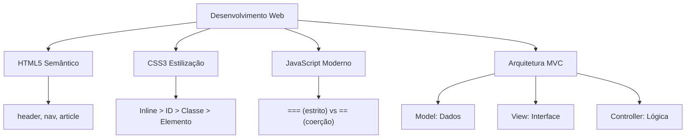

# 🎓 AcademiaIA - Aula Diária de Estudos
**Objetivo Geral:** Passar no cargo de Analista de Desenvolvimento de Sistemas no concurso da FUNDATEC
**Plano do Dia:** Iniciar a base técnica em desenvolvimento web e arquitetura de software para o cargo de Analista
**Tema:** Desenvolvimento de sistemas Web: HTML5, CSS3, JavaScript e Arquitetura MVC

---

## 📅 Roteiro de Estudos Planejado pelo Diretor
* **Data:** 2023-10-27
* **Tópicos a Estudar:**
    - Desenvolvimento de sistemas Web: HTML, CSS, JavaScript
  - Arquitetura de software: arquitetura 3 camadas, modelo MVC
* **Justificativa da Escolha:**
  Como o aluno ainda não iniciou os estudos, priorizei os pilares de desenvolvimento de sistemas, que compõem o núcleo dos conhecimentos específicos para a vaga de Analista, garantindo uma base sólida para a compreensão dos tópicos subsequentes de banco de dados e segurança.
* **Professor Responsável:** Professor de TI

---

## 🔍 Análise Estratégica da Banca (FUNDATEC)
* **Recorrência do Assunto:** `Alta`
* **Foco da Banca nas Provas:**
  A FUNDATEC possui um foco misto que alterna entre conceitos teóricos de semântica (HTML5) e sintaxe prática de programação (JavaScript). Em HTML, a banca prioriza a utilização correta de tags semânticas e a hierarquia de elementos. Em CSS, foca em seletores, especificidade (cascata) e modelo de caixa (box model). Em JavaScript, a banca exige conhecimento de manipulação de DOM, tipos de dados, métodos de arrays e, frequentemente, funções assíncronas (promises/async-await) para cargos de nível superior.
* **Pegadinhas Clássicas Mapeadas:**
    - Confusão entre seletores CSS: A banca costuma cobrar a precedência de seletores (ID vs Classe vs Elemento), frequentemente inserindo exemplos de 'estilo em linha' para testar se o candidato sabe que este possui a maior prioridade.
  - Comportamento do operador '==' vs '===': A banca frequentemente apresenta blocos de código JavaScript comparando tipos diferentes (ex: número vs string) para verificar se o candidato entende que o operador de igualdade estrita não realiza coerção de tipo.
  - Uso de tags obsoletas: A banca pode apresentar um código HTML utilizando tags de formatação visual (como <font> ou <center>) e pedir para o candidato identificar se o código segue os padrões modernos do HTML5, onde a formatação deve ser feita exclusivamente via CSS.
* **Atualizações Importantes:**
  A banca tem se alinhado aos padrões atuais do ECMAScript (ES6+), cobrando frequentemente arrow functions, let/const em substituição ao var, e desestruturação de objetos. No HTML, a ênfase total é em acessibilidade (ARIA labels) e tags semânticas (header, nav, article, section, footer) que substituem o uso genérico de <div> para estruturação de layout.

---

### 📝 Questões Reais de Concursos Anteriores (Referência)

#### Questão de Referência 1 (2023 | Prefeitura de Caxias do Sul | Analista de Sistemas)
No contexto da linguagem JavaScript, qual é a diferença fundamental entre o uso de 'let' e 'var' para declaração de variáveis?

* **Gabarito Oficial:** **Opção (O 'let' possui escopo de bloco, enquanto o 'var' possui escopo de função ou global.)**


---
#### Questão de Referência 2 (2022 | Câmara Municipal de Esteio | Técnico em Informática)
Considerando o modelo de caixa (Box Model) no CSS, qual das propriedades abaixo determina o espaço entre o conteúdo e a borda do elemento?

* **Gabarito Oficial:** **Opção (padding)**


---

## 📚 Conteúdo Expositivo da Aula: Desenvolvimento de sistemas Web: HTML5, CSS3, JavaScript e Arquitetura MVC

### 🎯 Objetivos de Aprendizagem
* **Dominar a semântica do HTML5 e a importância da acessibilidade**
* **Compreender a especificidade no CSS e o modelo de caixa (Box Model)**
* **Aplicar sintaxe moderna de JavaScript (ES6+) e manipulação do DOM**
* **Distinguir a arquitetura em 3 camadas e o padrão MVC na separação de responsabilidades**

### 📝 Teoria Detalhada
O desenvolvimento web moderno baseia-se na tríade: HTML (estrutura), CSS (apresentação) e JavaScript (comportamento). No HTML5, a mudança fundamental foi a semântica: abandonar o uso de 'divs' genéricas em favor de tags como <header>, <nav>, <article> e <footer>, que conferem significado ao conteúdo para motores de busca e leitores de tela. No CSS, o ponto crucial para a FUNDATEC é a 'Especificidade': seletores de ID ganham de classes, que ganham de elementos, mas o estilo 'inline' (dentro da tag) sobrepõe a todos, exceto se houver um !important. O 'Box Model' define como elementos ocupam espaço (content + padding + border + margin). Já no JavaScript, o paradigma mudou: esqueça o 'var' (escopo de função) e utilize 'let/const' (escopo de bloco). A banca cobra a diferença entre '==' (que faz coerção de tipos, ex: 1 == '1' é true) e '===' (comparação estrita, ex: 1 === '1' é false). Por fim, a arquitetura MVC (Model-View-Controller) é a espinha dorsal de sistemas corporativos. O 'Model' gerencia os dados e regras de negócio; a 'View' é a interface visual; e o 'Controller' é o mediador que processa a entrada do usuário e atualiza a View/Model. Essa separação garante que mudanças na interface não quebrem a lógica de negócio.

### 💡 Exemplos Práticos

#### Exemplo 1: Especificidade CSS
* **Descrição:** Demonstração da hierarquia de prioridades. O estilo inline prevalece sobre IDs e classes.
* **Especificação Técnica:**
```sql
/* CSS */
#titulo { color: blue; } /* ID: prioridade média */
.destaque { color: green; } /* Classe: prioridade baixa */

<!-- HTML -->
<h1 id="titulo" class="destaque" style="color: red;">Texto Teste</h1>
/* Resultado: O texto ficará vermelho devido ao estilo inline. */
```


#### Exemplo 2: Comparação JS: == vs ===
* **Descrição:** Diferença crucial para provas: a coerção de tipos.
* **Especificação Técnica:**
```sql
console.log(10 == '10');  // true (ocorre coerção de tipo)
console.log(10 === '10'); // false (tipos diferentes: number vs string)
```


#### Exemplo 3: Estrutura MVC
* **Descrição:** Separando responsabilidades em uma aplicação.
* **Especificação Técnica:**
```sql
Model: { id: 1, nome: 'Produto' } // Dados
View: <h1>Nome do Produto</h1> // HTML/CSS
Controller: function atualizarProduto() { ... } // Lógica de processamento
```


### 📌 Resumo de Fixação
- HTML5: Foco em tags semânticas (nav, section, article) e acessibilidade (ARIA).
- CSS: Entenda a cascata e a especificidade (Inline > ID > Classe > Elemento).
- JavaScript: Priorize ES6+ (arrow functions, const/let, template literals) e entenda o operador ===.
- MVC: Modelo para separar dados (Model), interface (View) e lógica de controle (Controller).

---

## 🧠 Mapa Mental (Visualização Gráfica)


---

## 🗂️ Flashcards (Fixação Ativa)
| ❓ Pergunta | 💡 Resposta |
|---|---|
| **Qual a diferença entre 'var' e 'let' no JavaScript moderno?** | 'var' possui escopo de função e sofre içamento (hoisting), enquanto 'let' possui escopo de bloco e não sofre içamento da mesma forma. |
| **Qual a ordem de prioridade (especificidade) no CSS?** | Estilo em linha (inline) > ID > Classes/Pseudo-classes > Elementos/Tags. |
| **O que o operador '===' verifica no JavaScript?** | Verifica tanto o valor quanto o tipo do dado, impedindo a coerção automática de tipos. |
| **Qual é a função do 'Model' no padrão MVC?** | Gerenciar os dados, regras de negócio e a persistência da informação. |

---

## 📝 Simulado de Fixação (Criador de Exercícios)

### ❓ Caderno de Questões

#### Questão 1
* **Dificuldade:** `Fácil` | **Edital:** *HTML5: Estrutura semântica*

No contexto do HTML5, qual das alternativas abaixo apresenta tags semânticas utilizadas para definir a estrutura de um layout, em substituição ao uso excessivo de elementos <div>?

  - **(A)** <font>, <center>, <big>
  - **(B)** <header>, <nav>, <section>, <article>, <footer>
  - **(C)** <span>, <br>, <hr>, <b>
  - **(D)** <script>, <style>, <meta>, <link>
  - **(E)** <table>, <tr>, <td>, <th>


---
#### Questão 2
* **Dificuldade:** `Médio` | **Edital:** *CSS: Especificidade e Cascata*

Sobre a especificidade em CSS, qual das seguintes declarações possui a maior prioridade de aplicação ao elemento?

  - **(A)** Seletor de tag (elemento): p { color: red; }
  - **(B)** Seletor de classe: .texto { color: blue; }
  - **(C)** Seletor de ID: #id-unico { color: green; }
  - **(D)** Estilo em linha: <p style='color: yellow;'>Texto</p>
  - **(E)** Seletor universal: * { color: black; }


---
#### Questão 3
* **Dificuldade:** `Médio` | **Edital:** *JavaScript: Operadores e coerção de tipos*

Considere o código JavaScript: console.log(5 == '5'); console.log(5 === '5');. Qual a saída correta?

  - **(A)** true, true
  - **(B)** false, false
  - **(C)** true, false
  - **(D)** false, true
  - **(E)** Erro de sintaxe


---
#### Questão 4
* **Dificuldade:** `Médio` | **Edital:** *Arquitetura Web: Padrão MVC*

No padrão de projeto MVC (Model-View-Controller) aplicado ao desenvolvimento web, qual é a responsabilidade da camada 'Controller'?

  - **(A)** Armazenar os dados brutos e regras de negócio da aplicação.
  - **(B)** Gerenciar a interface de usuário e a exibição de dados.
  - **(C)** Intermediar a comunicação, recebendo entradas do usuário e processando-as para atualizar o Model e a View.
  - **(D)** Executar apenas chamadas de banco de dados diretamente via navegador.
  - **(E)** Substituir a necessidade de utilizar HTML/CSS.


---
#### Questão 5
* **Dificuldade:** `Fácil` | **Edital:** *JavaScript: ES6+ (let, const)*

Qual a principal diferença entre 'let' e 'var' no JavaScript moderno (ES6+)?

  - **(A)** Não há diferença, são apenas nomes diferentes para a mesma funcionalidade.
  - **(B)** var possui escopo de bloco, enquanto let possui escopo de função.
  - **(C)** let possui escopo de bloco e não permite redeclaração no mesmo escopo, diferentemente de var.
  - **(D)** var é exclusivo para constantes.
  - **(E)** let só funciona em ambientes Node.js, não em navegadores.


---
#### Questão 6
* **Dificuldade:** `Médio` | **Edital:** *CSS: Modelo de caixa*

Sobre o Box Model no CSS, quais propriedades compõem, da borda para dentro, a estrutura interna de um elemento?

  - **(A)** Content, Padding, Border, Margin
  - **(B)** Margin, Border, Padding, Content
  - **(C)** Border, Padding, Content
  - **(D)** Content, Border, Margin
  - **(E)** Padding, Margin, Border


---
#### Questão 7
* **Dificuldade:** `Médio` | **Edital:** *JavaScript: Sintaxe ES6+*

Qual das seguintes construções em JavaScript utiliza a sintaxe de 'arrow function' corretamente?

  - **(A)** function soma = (a, b) => { return a + b };
  - **(B)** const soma = (a, b) => a + b;
  - **(C)** const soma = (a, b) { a + b };
  - **(D)** arrow soma(a, b) => a + b;
  - **(E)** soma = a, b => a + b;


---
#### Questão 8
* **Dificuldade:** `Difícil` | **Edital:** *HTML5: Acessibilidade e ARIA*

Em relação à acessibilidade em HTML5, qual o papel do atributo 'aria-label'?

  - **(A)** Alterar a cor de fundo do elemento para alto contraste.
  - **(B)** Definir um rótulo de texto descritivo para leitores de tela em elementos sem conteúdo textual claro.
  - **(C)** Criar um atalho de teclado para o botão.
  - **(D)** Validar campos de formulário no lado do cliente.
  - **(E)** Substituir a tag  para carregar imagens mais rápidas.


---
#### Questão 9
* **Dificuldade:** `Difícil` | **Edital:** *Arquitetura de sistemas: 3 camadas*

Em uma arquitetura de 3 camadas (3-tier), qual é a finalidade da camada de Persistência (Data Access Layer)?

  - **(A)** Processar a lógica complexa de cálculos matemáticos do sistema.
  - **(B)** Renderizar elementos gráficos no navegador do usuário.
  - **(C)** Gerenciar o acesso direto ao banco de dados, isolando as consultas da lógica de negócio.
  - **(D)** Validar entradas de formulários via JavaScript.
  - **(E)** Substituir a necessidade de um servidor web.


---
#### Questão 10
* **Dificuldade:** `Difícil` | **Edital:** *JavaScript: Spread operator e arrays*

Analise o trecho de código abaixo: const numeros = [1, 2, 3]; const novosNumeros = [...numeros, 4];. Qual é o resultado de 'novosNumeros'?

  - **(A)** [1, 2, 3, [4]]
  - **(B)** [1, 2, 3, 4]
  - **(C)** [4, 1, 2, 3]
  - **(D)** Erro, o operador '...' não existe.
  - **(E)** [1, 2, 3]


---

### 🔑 Gabarito e Resoluções Comentadas

#### Questão 1
* **Gabarito:** **Opção (B)**
* **Resolução e Comentário:**
  O HTML5 introduziu tags semânticas para dar significado à estrutura do documento, facilitando a acessibilidade e a indexação. Tags como <header>, <nav>, <section>, <article> e <footer> descrevem a função do conteúdo, enquanto as outras alternativas listam tags obsoletas, genéricas ou destinadas a outros propósitos.


---
#### Questão 2
* **Gabarito:** **Opção (D)**
* **Resolução e Comentário:**
  Na cascata do CSS, o estilo definido diretamente no atributo 'style' do elemento (inline style) possui a maior prioridade, sobrepondo definições feitas via ID, classe ou tag em arquivos externos ou blocos <style>.


---
#### Questão 3
* **Gabarito:** **Opção (C)**
* **Resolução e Comentário:**
  O operador '==' realiza coerção de tipo, logo o número 5 é igual à string '5'. Já o operador '===' (estrita igualdade) compara tanto o valor quanto o tipo; como um é number e o outro é string, o resultado é false.


---
#### Questão 4
* **Gabarito:** **Opção (C)**
* **Resolução e Comentário:**
  O MVC separa o sistema em: Model (dados/regras), View (interface) e Controller. O Controller atua como o cérebro que recebe as requisições, interage com o Model para buscar/atualizar dados e decide qual View retornar ao usuário.


---
#### Questão 5
* **Gabarito:** **Opção (C)**
* **Resolução e Comentário:**
  O 'var' tem escopo de função ou global e permite redeclarações, o que causa erros difíceis de rastrear. O 'let' introduz o escopo de bloco (respeita chaves {}) e não permite redeclaração, sendo a prática recomendada no ES6+.


---
#### Questão 6
* **Gabarito:** **Opção (C)**
* **Resolução e Comentário:**
  O Box Model consiste em Margin (externa), Border (borda), Padding (espaçamento interno) e Content (conteúdo). A pergunta pede da borda para dentro: Border -> Padding -> Content.


---
#### Questão 7
* **Gabarito:** **Opção (B)**
* **Resolução e Comentário:**
  Arrow functions são uma forma concisa de escrever funções. A sintaxe correta atribui a função a uma constante ou variável, usa parênteses para os parâmetros e o operador '=>', com retorno implícito se não usar chaves.


---
#### Questão 8
* **Gabarito:** **Opção (B)**
* **Resolução e Comentário:**
  O 'aria-label' é fundamental para a acessibilidade (WAI-ARIA). Ele fornece um nome acessível para elementos que não possuem um rótulo visual direto, permitindo que tecnologias assistivas, como leitores de tela, informem ao usuário o propósito daquele componente.


---
#### Questão 9
* **Gabarito:** **Opção (C)**
* **Resolução e Comentário:**
  A arquitetura de 3 camadas divide o sistema em: Apresentação (UI), Negócio (Lógica) e Dados (Persistência). A camada de persistência encapsula as operações de banco de dados, protegendo a camada de negócio de conhecer detalhes da implementação do SQL ou do SGBD.


---
#### Questão 10
* **Gabarito:** **Opção (B)**
* **Resolução e Comentário:**
  O operador de espalhamento (spread operator '...') copia os elementos do array 'numeros' para um novo array, adicionando o número 4 ao final. É uma técnica comum no ES6 para imutabilidade e manipulação de arrays.

