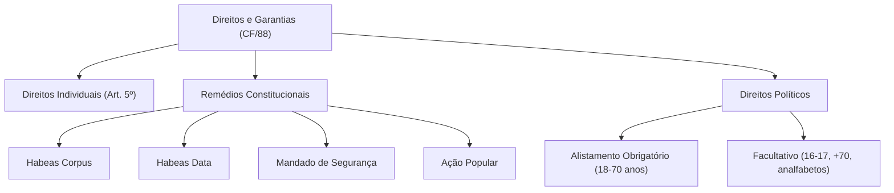

# 🎓 AcademiaIA - Aula Diária de Estudos
**Objetivo Geral:** Passar no cargo de Analista de Desenvolvimento de Sistemas no concurso da FUNDATEC
**Plano do Dia:** Domínio aprofundado dos Direitos e Garantias Fundamentais da Constituição Federal de 1988
**Tema:** Constituição Federal de 1988: Direitos e Garantias Fundamentais (Art. 5° ao 17)

---

## 📅 Roteiro de Estudos Planejado pelo Diretor
* **Data:** 2026-07-28
* **Tópicos a Estudar:**
    - Constituição Federal de 1988: Dos Direitos e Garantias Fundamentais (Arts. 5° ao 17)
* **Justificativa da Escolha:**
  O aluno solicitou especificamente este tópico de Legislação e, apesar de ter passado no último simulado de Legislação, o histórico aponta lacunas em conceitos fundamentais de cidadania e princípios constitucionais (questões deixadas em branco e erros em princípios de relações internacionais). A priorização deste tema é necessária para consolidar a base da Constituição Federal, essencial para o cargo de Analista.
* **Professor Responsável:** Professor de Legislação

---

## 🔍 Análise Estratégica da Banca (FUNDATEC)
* **Recorrência do Assunto:** `Alta`
* **Foco da Banca nas Provas:**
  A FUNDATEC possui um perfil altamente literal. O foco principal recai sobre o Art. 5º, exigindo o conhecimento exato do texto constitucional. A banca costuma extrair incisos e parágrafos, realizando pequenas trocas de palavras para verificar se o candidato decorou a norma ou apenas leu por alto. Há uma recorrência significativa em questões sobre remédios constitucionais, direitos de nacionalidade e direitos políticos, onde a banca explora as condições de elegibilidade e inelegibilidade de forma objetiva.
* **Pegadinhas Clássicas Mapeadas:**
    - Armadilha 1: Troca de termos excludentes, como substituir 'todos' por 'somente brasileiros', ou inverter prazos e condições previstas nos incisos do Art. 5º.
  - Armadilha 2: Confusão entre os remédios constitucionais, descrevendo a finalidade de um (ex: Habeas Data) e atribuindo ao outro (ex: Mandado de Segurança) para confundir o candidato sobre a gratuidade e o cabimento.
  - Armadilha 3: Alteração sutil nas vedações aos direitos políticos, inserindo exceções que não existem na lei ou invertendo o alcance de inelegibilidades (ex: militares e conscritos).
* **Atualizações Importantes:**
  É fundamental estar atento à Emenda Constitucional nº 132/2023 (Reforma Tributária), que impactou indiretamente diversos aspectos da organização do Estado, e às atualizações constantes sobre a aplicação de direitos fundamentais no ambiente digital, embora a FUNDATEC priorize o texto seco da CF/88 em detrimento de inovações doutrinárias ou jurisprudenciais profundas.

---

### 📝 Questões Reais de Concursos Anteriores (Referência)

#### Questão de Referência 1 (2023 | Prefeitura de Gramado | Assistente Administrativo)
De acordo com a Constituição Federal de 1988, sobre os direitos e deveres individuais e coletivos, assinale a alternativa correta.

* **Gabarito Oficial:** **Opção (A)**


---
#### Questão de Referência 2 (2022 | Câmara Municipal de Esteio | Analista Legislativo)
Segundo a CF/88, qual dos remédios constitucionais abaixo é gratuito, na forma da lei, para a proteção de direito líquido e certo, não amparado por habeas corpus ou habeas data?

* **Gabarito Oficial:** **Opção (C)**


---

## 📚 Conteúdo Expositivo da Aula: Constituição Federal de 1988: Direitos e Garantias Fundamentais (Art. 5° ao 17)

### 🎯 Objetivos de Aprendizagem
* **Compreender a estrutura e a aplicabilidade dos direitos individuais e coletivos contidos no Art. 5º da CF/88.**
* **Dominar os requisitos e finalidades dos remédios constitucionais para a proteção de direitos lesados.**
* **Diferenciar situações de exercício da cidadania democrática, foco em direitos políticos e alistamento eleitoral.**
* **Identificar as 'pegadinhas' clássicas da banca FUNDATEC relacionadas à literalidade da lei.**

### 📝 Teoria Detalhada
## 1. Introdução e a "Analogia de Ouro"
Imagine que a Constituição Federal de 1988 é o 'Manual de Conduta e Proteção' de um condomínio gigante chamado Brasil. O Artigo 5º é o capítulo das 'Regras de Ouro' que impedem o síndico (Estado) de invadir o seu apartamento ou multar você injustamente. Os remédios constitucionais são as 'Ferramentas de Manutenção' que você usa para consertar algo que quebrou. Se o síndico prendeu o seu elevador (liberdade de locomoção), você usa o Habeas Corpus. Se o porteiro negou acesso ao livro de registros sobre você (dados pessoais), você usa o Habeas Data. A analogia ajuda a entender que esses direitos não são apenas teóricos: eles são escudos práticos contra o abuso de poder.

## 2. Nivelamento e Conceituação Progressiva
Começamos pelos Direitos Individuais (Art. 5º). Eles são inatos, não dependem de favor do Estado. Conceito chave: *Inviolabilidade*. Seu domicílio é seu asilo inviolável, ninguém pode entrar sem seu consentimento, exceto em flagrante delito, desastre, socorro ou, durante o dia, por determinação judicial. O 'dia' aqui é interpretado como o período de luz solar para fins de cumprimento de mandado. Avançando: Direitos Políticos. A democracia exige participação. O voto é o exercício máximo. É fundamental distinguir os direitos fundamentais, que garantem a dignidade da pessoa humana, dos direitos políticos, que garantem o funcionamento da soberania popular.

## 3. Aprofundamento Teórico Avançado
Para a banca FUNDATEC, a literalidade é a regra. Vamos aos remédios constitucionais:
* **Habeas Corpus (HC):** Protege a liberdade de locomoção (ir, vir e ficar). É gratuito e não exige advogado.
* **Habeas Data (HD):** Protege o direito à informação pessoal. Exige, obrigatoriamente, uma 'prova de recusa' administrativa anterior. Não cabe se a informação for de interesse coletivo/público (nesse caso, usamos o MS).
* **Mandado de Segurança (MS):** É o remédio residual. Protege direito líquido e certo, não amparado por HC ou HD. Ponto crítico: exige **prova pré-constituída**. Se o fato exigir dilação probatória (precisar de perícia ou testemunha para provar), o MS não serve.
* **Ação Popular:** Qualquer cidadão (pessoa física com título de eleitor) pode anular ato lesivo ao patrimônio público. É um exercício direto da cidadania.
* **Mandado de Injunção:** Usado quando a ausência de norma regulamentadora torna inviável o exercício de direitos constitucionais.

## 4. Quadro Comparativo Visual
| Remédio | Protege | Exige Advogado? | Custo |
| :--- | :--- | :--- | :--- |
| Habeas Corpus | Liberdade de Locomoção | Não | Gratuito |
| Habeas Data | Informação Pessoal | Sim | Gratuito |
| Mandado de Segurança | Direito Líquido e Certo | Sim | Custas |
| Ação Popular | Patrimônio Público | Sim | Isento (salvo má-fé) |

## 5. Mnemônicos e Técnicas de Memorização
Para os Princípios da Administração Pública: LIMPE (Legalidade, Impessoalidade, Moralidade, Publicidade, Eficiência). Para o voto: 'Maiores de 70, o voto é facultativo'. Lembre-se: 'Alfabetizado de 18 a 70 anos é OBRIGATÓRIO'.

## 6. Radar de Pegadinhas (Foco FUNDATEC)
1. A banca adora trocar 'Gratuidade' por 'Custo'. O HC e o HD são gratuitos, mas o MS exige custas.
2. Inversão de prazos: Lembre-se que o Mandado de Segurança tem prazo decadencial de 120 dias, enquanto ações populares visam a proteção do patrimônio sem esse prazo curto.
3. A banca insiste que 'o Mandado de Segurança protege qualquer direito'. Falso! Protege apenas direito líquido e certo comprovado documentalmente de plano.

## 7. Perguntas de Auto-Verificação
1. Qual remédio cabe se o Estado nega acesso a um dado pessoal meu? R: Habeas Data (após comprovada a recusa).
2. O Mandado de Segurança exige advogado? R: Sim, é indispensável.
3. O que é 'prova pré-constituída' no MS? R: É o conjunto de documentos apresentados já na petição inicial, pois não há fase de produção de provas no MS.

### 💡 Exemplos Práticos

#### Exemplo 1: Exemplo Prático: Habeas Data e SPC
* **Descrição:** Caso um consumidor tenha seu nome incluído em cadastro de proteção ao crédito por dívida inexistente e o órgão (SPC/Serasa) se recuse a fornecer a origem desse registro administrativo, o cidadão deve impetrar Habeas Data.
* **Especificação Técnica:**
```sql
Passo 1: Requerimento administrativo ao órgão. Passo 2: Recebimento da resposta negativa ou inércia. Passo 3: Impetração de HD munido da prova de recusa (documento da negativa).
```


#### Exemplo 2: Exemplo Prático: Mandado de Segurança
* **Descrição:** Um candidato aprovado em concurso público dentro das vagas tem sua posse negada sem justificativa legal. Como o direito é 'líquido e certo' (edital + prova de aprovação) e a prova é puramente documental, o candidato impetra MS.
* **Especificação Técnica:**
```sql
Documentos necessários: Edital, Nomeação no Diário Oficial, Certidão de aprovação. O juiz decidirá apenas com esses papéis, sem necessidade de ouvir testemunhas.
```


#### Exemplo 3: Exemplo Prático: Inviolabilidade de Domicílio
* **Descrição:** A polícia pode entrar em uma casa à noite apenas com ordem judicial ou em caso de flagrante delito/desastre/socorro. Se a polícia entrar para buscar provas sem autorização judicial à noite, há violação do Art. 5º.
* **Especificação Técnica:**
```sql
Cenário: Entrada sem mandado às 22h por suspeita de crime antigo. Resultado: Ilicitude da prova produzida, por desrespeito ao Art. 5º, XI, CF/88.
```


### 📌 Resumo de Fixação
Direitos Fundamentais: Garantias inatos de dignidade humana; inviolabilidade de domicílio é regra, com exceções taxativas (flagrante, desastre, socorro, ordem judicial).,Habeas Data: Exclusivo para dados pessoais do impetrante, exige prova de recusa prévia do órgão detentor.,Mandado de Segurança: Requer direito líquido e certo e prova pré-constituída (documental). Não aceita dilação probatória.,Direitos Políticos: O alistamento eleitoral é obrigatório para maiores de 18 anos e facultativo para os maiores de 70 anos, analfabetos e jovens de 16-17 anos.,Democracia Participativa: A Ação Popular é o instrumento de cidadania que permite ao eleitor fiscalizar e proteger o patrimônio público.

---

## 🧠 Mapa Mental (Visualização Gráfica)


---

## 🗂️ Flashcards (Fixação Ativa)
| ❓ Pergunta | 💡 Resposta |
|---|---|
| **Qual remédio é usado para proteger direito líquido e certo?** | Mandado de Segurança. |
| **O Habeas Data exige advogado?** | Sim, diferentemente do Habeas Corpus. |
| **Qual a idade mínima para o voto ser considerado obrigatório?** | 18 anos completos (até os 70). |
| **O que é prova pré-constituída no MS?** | Documentos que provam o direito já no momento da petição inicial, sem necessidade de outras provas. |

---

## 📝 Simulado de Fixação (Criador de Exercícios)

### ❓ Caderno de Questões

#### Questão 1
* **Dificuldade:** `Fácil` | **Edital:** *Direitos e Deveres Individuais e Coletivos*

Considerando o disposto no Art. 5º da CF/88 acerca dos direitos e deveres individuais e coletivos, assinale a alternativa que reproduz corretamente um dos preceitos constitucionais.

  - **(A)** A casa é asilo inviolável do indivíduo, ninguém nela podendo penetrar sem consentimento do morador, salvo em caso de flagrante delito, desastre ou para prestar socorro, ou por determinação judicial, a qualquer hora do dia ou da noite.
  - **(B)** É assegurada, nos termos da lei, a prestação de assistência religiosa nas entidades civis e militares de internação coletiva apenas aos brasileiros.
  - **(C)** É livre a expressão da atividade intelectual, artística, científica e de comunicação, independentemente de censura ou licença, sendo vedado o anonimato.
  - **(D)** A prática do racismo constitui crime afiançável e imprescritível, sujeito à pena de detenção, nos termos da lei.
  - **(E)** O direito de reunião independe de autorização, desde que haja prévio aviso à autoridade competente e que ocorra apenas em locais fechados.


---
#### Questão 2
* **Dificuldade:** `Médio` | **Edital:** *Remédios Constitucionais*

Quanto aos remédios constitucionais, analise a assertiva: 'O Habeas Data destina-se a assegurar o conhecimento de informações relativas à pessoa do impetrante, constantes de registros ou bancos de dados de entidades governamentais ou de caráter público'. Qual característica correta define este remédio?

  - **(A)** Possui natureza gratuita e exige prova de recusa administrativa prévia.
  - **(B)** Pode ser utilizado para proteger direito líquido e certo de terceiro quando não amparado por HC.
  - **(C)** Não exige prova da negativa administrativa para sua propositura, bastando o interesse.
  - **(D)** É cabível contra autoridade pública para proteger a honra, sendo um remédio oneroso.
  - **(E)** O Habeas Data e o Mandado de Segurança possuem o mesmo rito e finalidade.


---
#### Questão 3
* **Dificuldade:** `Difícil` | **Edital:** *Direitos Políticos*

Sobre a elegibilidade e os direitos políticos, assinale a opção que apresenta um impedimento absoluto de elegibilidade previsto na CF/88.

  - **(A)** Os maiores de 16 e menores de 18 anos.
  - **(B)** Os analfabetos.
  - **(C)** Os conscritos, durante o período do serviço militar obrigatório.
  - **(D)** Os estrangeiros, exceto os portugueses que gozem de reciprocidade.
  - **(E)** Os militares em serviço ativo com menos de 10 anos de serviço.


---
#### Questão 4
* **Dificuldade:** `Médio` | **Edital:** *Direitos e Garantias Fundamentais*

A inviolabilidade do sigilo da correspondência e das comunicações pode ser afastada em situações específicas. Assinale a correta sobre tal reserva de jurisdição.

  - **(A)** Apenas mediante ordem judicial, em qualquer caso, sem necessidade de lei específica.
  - **(B)** Por ordem judicial, nas hipóteses e na forma que a lei estabelecer para fins de investigação criminal ou instrução processual penal.
  - **(C)** Por ordem de autoridade policial, desde que fundamentada e com comunicação ao Ministério Público.
  - **(D)** Apenas com autorização da autoridade judiciária competente, sendo vedada em casos de flagrante.
  - **(E)** Não admite exceção, sendo um direito absoluto do cidadão.


---
#### Questão 5
* **Dificuldade:** `Médio` | **Edital:** *Remédios Constitucionais*

Considerando as finalidades dos remédios constitucionais, qual das assertivas descreve corretamente o Mandado de Injunção (MI)?

  - **(A)** Serve para proteger direito líquido e certo não amparado por HC ou HD.
  - **(B)** É cabível sempre que a falta de norma regulamentadora torne inviável o exercício dos direitos constitucionais.
  - **(C)** Tem por finalidade retificar dados constantes de registros públicos.
  - **(D)** É um remédio gratuito que protege a liberdade de locomoção.
  - **(E)** Serve para anular ato lesivo ao patrimônio público ou moralidade administrativa.


---
#### Questão 6
* **Dificuldade:** `Médio` | **Edital:** *Direito de Propriedade*

Sobre o direito de propriedade, o texto constitucional estabelece que:

  - **(A)** A pequena propriedade rural, assim definida em lei, desde que trabalhada pelo proprietário, não será objeto de penhora para pagamento de débitos da atividade produtiva.
  - **(B)** A propriedade atenderá à sua função social exclusivamente se for urbana.
  - **(C)** O Estado não pode intervir na propriedade em caso de perigo público iminente.
  - **(D)** A desapropriação por necessidade pública não exige qualquer tipo de indenização.
  - **(E)** A requisição administrativa de bem particular só é permitida em tempo de guerra.


---
#### Questão 7
* **Dificuldade:** `Médio` | **Edital:** *Nacionalidade e Direitos Políticos*

Sobre a nacionalidade e direitos políticos, assinale a alternativa que indica corretamente um cargo privativo de brasileiro nato.

  - **(A)** Ministro da Defesa.
  - **(B)** Presidente da Câmara dos Deputados.
  - **(C)** Senador da República.
  - **(D)** Deputado Federal.
  - **(E)** Prefeito Municipal.


---
#### Questão 8
* **Dificuldade:** `Médio` | **Edital:** *Direitos Individuais e Coletivos*

Sobre a liberdade de associação, é correto afirmar que:

  - **(A)** A criação de associações depende de autorização estatal.
  - **(B)** As associações podem ser compulsoriamente dissolvidas por decisão administrativa.
  - **(C)** A suspensão das atividades de uma associação depende de decisão judicial transitada em julgado.
  - **(D)** As associações só podem ser dissolvidas mediante decisão judicial com trânsito em julgado.
  - **(E)** É vedada a interferência estatal em associações de qualquer tipo.


---
#### Questão 9
* **Dificuldade:** `Médio` | **Edital:** *Garantias Processuais*

Sobre as garantias processuais, analise a afirmação: 'A lei penal retroagirá, salvo para beneficiar o réu'. Assinale a alternativa que interpreta corretamente este princípio constitucional.

  - **(A)** A lei penal pode retroagir para beneficiar o réu, inclusive após o trânsito em julgado da sentença condenatória.
  - **(B)** A lei penal retroage apenas se a sentença ainda não tiver transitado em julgado.
  - **(C)** A lei penal nunca retroage, sendo um direito absoluto do sistema punitivo.
  - **(D)** O tribunal do júri permite a retroatividade de leis para prejudicar o réu.
  - **(E)** A retroatividade é vedada em todos os casos, sem exceções.


---
#### Questão 10
* **Dificuldade:** `Fácil` | **Edital:** *Direitos e Deveres Individuais e Coletivos*

Sobre o direito de petição e cidadania, a Constituição garante a todos, independentemente do pagamento de taxas, o direito de:

  - **(A)** Ajuizar qualquer ação civil pública.
  - **(B)** Petição aos Poderes Públicos em defesa de direitos ou contra ilegalidade ou abuso de poder.
  - **(C)** Obter certidões em repartições públicas, ainda que para fins comerciais não especificados.
  - **(D)** Exercer o voto obrigatório aos 16 anos.
  - **(E)** Acesso a informações sigilosas de segurança nacional.


---

### 🔑 Gabarito e Resoluções Comentadas

#### Questão 1
* **Gabarito:** **Opção (C)**
* **Resolução e Comentário:**
  A alternativa C reproduz fielmente o inciso IX do art. 5º. A alternativa A está incorreta pois a entrada por determinação judicial na casa só pode ocorrer durante o dia (inciso XI). A alternativa B está incorreta pois o direito à assistência religiosa se estende aos estrangeiros também. A alternativa D está errada pois o racismo é inafiançável e sujeito à pena de reclusão (inciso XLII). A alternativa E está errada pois o direito de reunião pode ocorrer em locais abertos ao público, desde que não frustrem outra reunião anteriormente convocada.


---
#### Questão 2
* **Gabarito:** **Opção (A)**
* **Resolução e Comentário:**
  O Habeas Data (inciso LXXII) tem gratuidade constitucional e a Súmula 2 do STJ estabelece que é necessária a comprovação da negativa da via administrativa para o seu cabimento. As alternativas B, C, D e E confundem as características de gratuidade, finalidade e rito, atribuindo ao HD competências típicas do Mandado de Segurança ou ignorando a exigência formal de prova da negativa.


---
#### Questão 3
* **Gabarito:** **Opção (C)**
* **Resolução e Comentário:**
  Os conscritos, durante o período do serviço militar obrigatório, são inalistáveis, o que constitui impedimento absoluto para o exercício da elegibilidade. Os analfabetos e menores de 18 anos são inalistáveis facultativos (podem votar, mas não podem ser votados). A alternativa D é imprecisa quanto à proibição constitucional absoluta dos inalistáveis.


---
#### Questão 4
* **Gabarito:** **Opção (B)**
* **Resolução e Comentário:**
  O inciso XII do art. 5º estabelece que o sigilo das comunicações telefônicas pode ser afastado por ordem judicial (princípio da reserva de jurisdição) para investigação criminal ou instrução processual penal. Esta proteção não é absoluta, mas depende estritamente do Poder Judiciário, sendo vedada a quebra por autoridade policial por conta própria.


---
#### Questão 5
* **Gabarito:** **Opção (B)**
* **Resolução e Comentário:**
  O Mandado de Injunção (inciso LXXI) supre a lacuna legislativa (omissão) que impede o gozo de direitos fundamentais. A alternativa A descreve o Mandado de Segurança. A C descreve o Habeas Data. A D descreve o Habeas Corpus. A E descreve a Ação Popular.


---
#### Questão 6
* **Gabarito:** **Opção (A)**
* **Resolução e Comentário:**
  O inciso XXVI garante a impenhorabilidade da pequena propriedade rural. A alternativa B é falsa, pois a função social abrange tanto urbana quanto rural. C, D e E erram ao ignorar as regras constitucionais sobre intervenção do Estado na propriedade (que exige indenização e atende a interesse público).


---
#### Questão 7
* **Gabarito:** **Opção (B)**
* **Resolução e Comentário:**
  Conforme o Art. 12, §3º, são privativos de brasileiro nato os cargos: Presidente e Vice da República, Presidente da Câmara, Presidente do Senado, Ministro do STF, da carreira diplomática, oficial das Forças Armadas e Ministro de Estado da Defesa. A alternativa B é a única que consta no rol do texto constitucional.


---
#### Questão 8
* **Gabarito:** **Opção (D)**
* **Resolução e Comentário:**
  O inciso XIX estabelece que as associações só podem ser dissolvidas compulsoriamente ou ter suas atividades suspensas por decisão judicial, exigindo-se o trânsito em julgado para a dissolução. As demais alternativas contrariam o princípio da liberdade de associação e o devido processo legal.


---
#### Questão 9
* **Gabarito:** **Opção (A)**
* **Resolução e Comentário:**
  O inciso XL do art. 5º estabelece que a lei penal não retroagirá, salvo para beneficiar o réu. A jurisprudência e a doutrina confirmam que esse benefício alcança situações posteriores ao trânsito em julgado, sendo uma garantia fundamental, não dependendo de fase processual anterior à condenação final.


---
#### Questão 10
* **Gabarito:** **Opção (B)**
* **Resolução e Comentário:**
  O inciso XXXIV, alínea 'a', garante o direito de petição aos Poderes Públicos em defesa de direitos ou contra ilegalidade ou abuso de poder, independentemente do pagamento de taxas. Esta é uma ferramenta fundamental de democracia participativa e cidadania.

