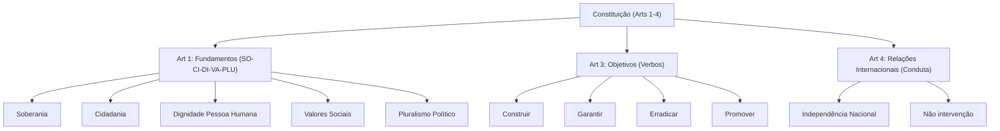

# 🎓 AcademiaIA - Aula Diária de Estudos
**Objetivo Geral:** Passar no cargo de Analista de Desenvolvimento de Sistemas no concurso da FUNDATEC
**Plano do Dia:** Dominar os fundamentos constitucionais da República Federativa do Brasil, com foco nos artigos 1º a 4º da CF/88.
**Tema:** Constituição Federal de 1988: Dos Princípios Fundamentais (Arts. 1° ao 4°)

---

## 📅 Roteiro de Estudos Planejado pelo Diretor
* **Data:** 2026-07-24
* **Tópicos a Estudar:**
    - Constituição Federal de 1988: Dos Princípios Fundamentais (Arts. 1° ao 4°)
* **Justificativa da Escolha:**
  O aluno solicitou especificamente a matéria de Legislação e o tópico dos 'Princípios Fundamentais (Arts. 1º ao 4º)'. Esta escolha é estratégica, pois o histórico do aluno revela dificuldades em matérias que exigem memorização técnica e atenção a detalhes de redação (visto nos erros de ortografia e estrutura de palavras), sendo essencial um acompanhamento guiado para evitar que o aluno se perca em interpretações equivocadas nos textos legais.
* **Professor Responsável:** Professor de Legislação

---

## 🔍 Análise Estratégica da Banca (FUNDATEC)
* **Recorrência do Assunto:** `Alta`
* **Foco da Banca nas Provas:**
  A FUNDATEC possui um foco extremamente literal. Em questões sobre os artigos 1º ao 4º, a banca prioriza a memorização exata dos incisos e parágrafos. É comum a troca de termos (ex: trocar 'fundamentos' por 'objetivos' ou 'princípios das relações internacionais'), a omissão de palavras-chave para criar itens falsos e a exigência de identificação correta de quais são fundamentos, quais são objetivos e quais são princípios regentes da República.
* **Pegadinhas Clássicas Mapeadas:**
    - Armadilha 1: Confusão deliberada entre Fundamentos (Art. 1º - SO-CI-DI-VA-PLU) e Objetivos (Art. 3º - verbos no infinitivo como Construir, Garantir, Erradicar, Promover). A banca costuma colocar um objetivo no meio das alternativas sobre fundamentos.
  - Armadilha 2: Omissão de princípios das Relações Internacionais (Art. 4º). A banca frequentemente inverte o sentido de um princípio, como trocar 'não intervenção' por 'intervenção', ou confundir 'concessão de asilo político' com obrigação de extradição.
  - Armadilha 3: Troca de 'República Federativa do Brasil' por outros entes ou esquecer que o 'Pluralismo Político' é um fundamento, apresentando-o erroneamente como objetivo.
* **Atualizações Importantes:**
  Embora os arts. 1º a 4º não tenham sofrido alterações diretas pelo legislador recente, deve-se estar atento à interpretação do STF sobre a dignidade da pessoa humana e a laicidade do Estado, que fundamentam novas jurisprudências que a FUNDATEC pode utilizar em questões de caso prático para contextualizar o texto seco da norma.

---

### 📝 Questões Reais de Concursos Anteriores (Referência)

#### Questão de Referência 1 (2023 | Prefeitura de Caxias do Sul | Assistente Administrativo)
A República Federativa do Brasil, formada pela união indissolúvel dos Estados e Municípios e do Distrito Federal, constitui-se em Estado Democrático de Direito e tem como fundamentos, EXCETO:

* **Gabarito Oficial:** **Opção (E)**


---

## 📚 Conteúdo Expositivo da Aula: Constituição Federal de 1988: Dos Princípios Fundamentais (Arts. 1° ao 4°)

### 🎯 Objetivos de Aprendizagem
* **Diferenciar com clareza os fundamentos, objetivos e princípios das relações internacionais da República Federativa do Brasil.**
* **Dominar a literalidade dos artigos 1º a 4º da CF/88, identificando os elementos que compõem a estrutura política do Estado brasileiro.**
* **Aplicar técnicas de memorização e identificar as principais pegadinhas da banca FUNDATEC nos temas de Direito Constitucional.**
* **Compreender a natureza jurídica do Pluralismo Político e da Dignidade da Pessoa Humana como pilares do Estado Democrático de Direito.**

### 📝 Teoria Detalhada
## 1. Introdução e a "Analogia de Ouro" (Para Iniciantes)
Os Princípios Fundamentais são a "certidão de nascimento" e o "projeto de vida" da nossa República. Imagine que o Brasil é uma grande empresa chamada "Brasil S.A.".
- **Fundamentos (Art. 1º):** São os pilares da empresa. É o que ela é na sua essência (o nome, o sócio, a sede). É o "Quem somos?".
- **Objetivos (Art. 3º):** É a missão da empresa, o planejamento estratégico. O que queremos alcançar daqui a 5 ou 10 anos? É o "Para onde vamos?".
- **Princípios das Relações Internacionais (Art. 4º):** É o código de conduta comercial da empresa com outras empresas do mundo. Como nos relacionamos com o mercado global? É o "Como nos comportamos lá fora?".

## 2. Nivelamento e Conceituação Progressiva (Do Básico ao Avançado)
- **Fundamentos:** O Art. 1º estabelece que o Brasil é uma República Federativa. Aqui, a soberania não é absoluta, ela é limitada pelos Direitos Humanos e pelas regras internacionais. A cidadania não é apenas votar; é o exercício ativo da vida pública.
- **Objetivos:** O Art. 3º usa verbos de ação. Se a questão tiver um verbo de ação (Erradicar, Construir, Garantir, Promover), quase certamente estamos falando de um objetivo, e não de um fundamento.
- **Princípios das Relações Internacionais:** O Art. 4º define como o Brasil se posiciona. A defesa da paz e a solução pacífica de conflitos são os pilares de nossa diplomacia.

## 3. Aprofundamento Teórico Avançado (Foco em Concursos)
O STF entende que a Dignidade da Pessoa Humana (Art. 1º, III) é o princípio metajurídico: ele ilumina todo o resto. O Pluralismo Político não é só diversidade de partidos, mas o reconhecimento de que a democracia convive com diferentes visões de mundo. A FUNDATEC cobra a literalidade absoluta. Por exemplo, ela trocará "Promoção do bem de todos" por "Promoção do bem do Estado", um erro clássico.

## 4. Quadro Comparativo Visual
| Característica | Fundamentos (Art. 1º) | Objetivos (Art. 3º) | Princípios Int. (Art. 4º) |
| :--- | :--- | :--- | :--- |
| Natureza | Essência / Identidade | Metas / Finalidades | Conduta Externa |
| Estrutura | Substantivos (SO-CI-VA-PLU-RA) | Verbos no Infinitivo | Orientações de Diplomacia |
| Exemplo | Cidadania | Erradicar a pobreza | Não intervenção |

## 5. Mnemônicos e Técnicas de Memorização
Para os Fundamentos (Art. 1º): **SO-CI-DI-VA-PLU**
- **SO**berania
- **CI**dadania
- **DI**gnidade da pessoa humana
- **VA**lores sociais do trabalho e da livre iniciativa
- **PLU**ralismo político

## 6. Radar de Pegadinhas (Foco na Banca FUNDATEC)
1. **Troca de nomes:** A banca substitui "Objetivos Fundamentais" por "Fundamentos da República". Lembre-se: Objetivos = Verbos de Ação.
2. **Omissão:** A banca retira o "Pluralismo Político" dos fundamentos, dizendo que o Brasil é apenas uma democracia representativa.
3. **Inversão:** Inverter "Não intervenção" por "Intervenção". Lembre-se: O Brasil é pacífico e busca a integração latino-americana.

## 7. Perguntas de Auto-Verificação (Recall Ativo)
1. Qual a diferença principal entre fundamentos e objetivos? Resp: Fundamentos definem o que o Estado é (substantivos), enquanto objetivos definem o que ele busca alcançar (verbos de ação).
2. O que é o mnemônico SO-CI-DI-VA-PLU? Resp: É a sigla para memorizar os cinco fundamentos da República Federativa do Brasil.
3. Quais as metas do Art. 3º? Resp: Construir uma sociedade livre, justa e solidária; garantir o desenvolvimento nacional; erradicar a pobreza/marginalização; promover o bem de todos.

### 💡 Exemplos Práticos

#### Exemplo 1: Exemplo de Aplicação: Distinção de Verbos
* **Descrição:** Identificação de objetivos na prova através da análise sintática de verbos no infinitivo.
* **Especificação Técnica:**
```sql
Se a banca afirmar: 'A Soberania é um objetivo da República', a questão está errada pois soberania é fundamento (substantivo). Se a banca afirmar: 'Erradicar a pobreza é um fundamento', está errada pois é um objetivo (verbo).
```


#### Exemplo 2: Exemplo de Aplicação: Soberania
* **Descrição:** Como o princípio da Soberania atua na prática legislativa.
* **Especificação Técnica:**
```sql
Internamente, o Brasil tem poder supremo sobre seu território. Externamente, o Brasil se iguala a outras nações sem subordinação (princípio da igualdade entre os Estados).
```


#### Exemplo 3: Exemplo de Aplicação: Pluralismo Político
* **Descrição:** O Pluralismo como fundamento.
* **Especificação Técnica:**
```sql
O STF utiliza o pluralismo para garantir que associações civis e movimentos sociais possuam voz, impedindo o pensamento único estatal.
```


### 📌 Resumo de Fixação
- Fundamentos (Art. 1º): Identidade do Estado. Mnemônico: SO-CI-DI-VA-PLU.
- Objetivos (Art. 3º): Metas a serem atingidas. Identificadas por verbos como: Construir, Garantir, Erradicar, Promover.
- Princípios Relações Internacionais (Art. 4º): Diretrizes de política externa. Foco em soberania, autodeterminação e solução pacífica.
- Pluralismo Político: Fundamento que garante a coexistência de ideias divergentes no Estado.

---

## 🧠 Mapa Mental (Visualização Gráfica)


---

## 🗂️ Flashcards (Fixação Ativa)
| ❓ Pergunta | 💡 Resposta |
|---|---|
| **O que são os fundamentos da República?** | São os princípios que definem a essência do Estado: Soberania, Cidadania, Dignidade, Valores Sociais e Pluralismo. |
| **Como identificar objetivos na prova?** | Pela presença de verbos no infinitivo, indicando uma ação/meta a ser atingida. |
| **O Brasil pode intervir em outros países?** | Não, o Brasil rege-se pelo princípio da não intervenção, salvo exceções previstas em tratados ou ordem internacional. |

---

## 📝 Simulado de Fixação (Criador de Exercícios)

### ❓ Caderno de Questões

#### Questão 1
* **Dificuldade:** `Fácil` | **Edital:** *Dos Princípios Fundamentais*

A Constituição Federal de 1988 elenca, em seus primeiros artigos, os pilares do Estado brasileiro. Sobre os Fundamentos da República Federativa do Brasil, assinale a alternativa correta:

  - **(A)** A soberania, a cidadania, a dignidade da pessoa humana, os valores sociais do trabalho e da livre iniciativa e o pluralismo político.
  - **(B)** Construir uma sociedade livre, justa e solidária; garantir o desenvolvimento nacional; erradicar a pobreza.
  - **(C)** A independência nacional, a prevalência dos direitos humanos e a autodeterminação dos povos.
  - **(D)** A supremacia do interesse público sobre o privado, a legalidade, a impessoalidade e a moralidade.
  - **(E)** A busca pela paz, a cooperação entre os povos para o progresso da humanidade e a concessão de asilo político.


---
#### Questão 2
* **Dificuldade:** `Médio` | **Edital:** *Dos Princípios Fundamentais*

A FUNDATEC costuma explorar a distinção entre os institutos constitucionais. Analise a assertiva: 'Garantir o desenvolvimento nacional' é um exemplo clássico de:

  - **(A)** Fundamento da República Federativa do Brasil.
  - **(B)** Objetivo Fundamental da República Federativa do Brasil.
  - **(C)** Princípio regente das Relações Internacionais.
  - **(D)** Princípio administrativo da gestão pública.
  - **(E)** Direito fundamental individual inalienável.


---
#### Questão 3
* **Dificuldade:** `Médio` | **Edital:** *Dos Princípios Fundamentais*

Assinale a alternativa que NÃO consta como um princípio nas relações internacionais da República Federativa do Brasil, nos termos do Art. 4º da CF/88:

  - **(A)** Não intervenção.
  - **(B)** Defesa da paz.
  - **(C)** Solução pacífica dos conflitos.
  - **(D)** Igualdade entre os Estados.
  - **(E)** Intervenção humanitária obrigatória.


---
#### Questão 4
* **Dificuldade:** `Médio` | **Edital:** *Dos Princípios Fundamentais*

Considerando o Art. 1º, parágrafo único, da Constituição Federal, o poder emana do povo, que o exerce por meio de representantes eleitos ou diretamente, nos termos desta Constituição. Isso consagra o exercício da:

  - **(A)** Soberania absoluta do Executivo.
  - **(B)** Democracia representativa ou indireta apenas.
  - **(C)** Democracia semidireta ou participativa.
  - **(D)** Autocracia popular centralizada.
  - **(E)** Soberania popular exercida exclusivamente via plebiscito.


---
#### Questão 5
* **Dificuldade:** `Difícil` | **Edital:** *Dos Princípios Fundamentais*

Sobre o pluralismo político, presente no Art. 1º, inciso V, é correto afirmar que:

  - **(A)** Confunde-se com o pluripartidarismo, limitando-se à existência de vários partidos políticos.
  - **(B)** É uma meta de governo a ser atingida pelo Poder Executivo.
  - **(C)** Constitui um valor fundante que abarca a diversidade de ideias, correntes de pensamento e visões de mundo na sociedade.
  - **(D)** É um princípio que obriga o Estado a financiar todas as correntes políticas existentes.
  - **(E)** Refere-se exclusivamente ao sistema eleitoral proporcional.


---
#### Questão 6
* **Dificuldade:** `Fácil` | **Edital:** *Dos Princípios Fundamentais*

Assinale a alternativa que contém apenas verbos que iniciam os incisos dos Objetivos Fundamentais da República (Art. 3º):

  - **(A)** Construir, Garantir, Erradicar, Promover.
  - **(B)** Soberania, Cidadania, Dignidade, Valores.
  - **(C)** Independência, Defesa, Autodeterminação, Cooperação.
  - **(D)** Respeitar, Integrar, Prevalecer, Conceder.
  - **(E)** Constituir, Zelar, Impedir, Fomentar.


---
#### Questão 7
* **Dificuldade:** `Médio` | **Edital:** *Dos Princípios Fundamentais*

A República Federativa do Brasil, em suas relações internacionais, rege-se por diversos princípios. Dentre eles, NÃO figura:

  - **(A)** Concessão de asilo político.
  - **(B)** Defesa da paz.
  - **(C)** Repúdio ao terrorismo e ao racismo.
  - **(D)** Intervenção militar imediata em caso de violação de direitos humanos.
  - **(E)** Autodeterminação dos povos.


---
#### Questão 8
* **Dificuldade:** `Médio` | **Edital:** *Dos Princípios Fundamentais*

Qual dos itens abaixo é um exemplo de 'fundamento' e não de 'objetivo'?

  - **(A)** Erradicar a pobreza e a marginalização.
  - **(B)** Reduzir as desigualdades sociais e regionais.
  - **(C)** Dignidade da pessoa humana.
  - **(D)** Promover o bem de todos, sem preconceitos.
  - **(E)** Garantir o desenvolvimento nacional.


---
#### Questão 9
* **Dificuldade:** `Difícil` | **Edital:** *Dos Princípios Fundamentais*

No que tange aos princípios das relações internacionais, a Constituição Federal prevê que a República Federativa do Brasil buscará a integração econômica, política, social e cultural dos povos da América Latina, visando à formação de:

  - **(A)** Uma moeda única continental.
  - **(B)** Uma confederação de Estados americanos.
  - **(C)** Uma comunidade latino-americana de nações.
  - **(D)** Um bloco econômico fechado e excludente.
  - **(E)** Uma união política subordinada a um parlamento regional.


---
#### Questão 10
* **Dificuldade:** `Médio` | **Edital:** *Dos Princípios Fundamentais*

Assinale a alternativa que apresenta corretamente um fundamento da República Federativa do Brasil que também é reconhecido pelo STF como núcleo basilar do Estado Democrático de Direito:

  - **(A)** O livre mercado irrestrito.
  - **(B)** A dignidade da pessoa humana.
  - **(C)** A submissão do Judiciário ao Executivo.
  - **(D)** A supremacia militar.
  - **(E)** A obrigatoriedade de religião oficial.


---

### 🔑 Gabarito e Resoluções Comentadas

#### Questão 1
* **Gabarito:** **Opção (A)**
* **Resolução e Comentário:**
  Os Fundamentos da República Federativa do Brasil estão expressamente listados no Art. 1º, inciso I a V, da CF/88, sendo sintetizados pelo mnemônico SO-CI-VA-PLU-RA (Soberania, Cidadania, Valores sociais, Pluralismo Político e Dignidade da Pessoa Humana). As alternativas B e E referem-se a Objetivos e Princípios das Relações Internacionais, respectivamente, e a alternativa D traz princípios da administração pública, confundindo o candidato.


---
#### Questão 2
* **Gabarito:** **Opção (B)**
* **Resolução e Comentário:**
  Os Objetivos Fundamentais (Art. 3º) são metas a serem alcançadas pelo Estado, sendo caracterizados por verbos de ação no infinitivo. 'Garantir o desenvolvimento nacional' é o inciso II do Art. 3º. Não são fundamentos (Art. 1º) nem princípios internacionais (Art. 4º).


---
#### Questão 3
* **Gabarito:** **Opção (E)**
* **Resolução e Comentário:**
  A Constituição de 1988 adota o princípio da 'não intervenção' (Art. 4º, IV). A opção 'E' cria um termo inexistente no texto constitucional para testar a atenção do candidato sobre a soberania nacional e a autodeterminação dos povos.


---
#### Questão 4
* **Gabarito:** **Opção (C)**
* **Resolução e Comentário:**
  O Brasil adota um modelo de democracia semidireta (ou participativa), pois, embora existam representantes eleitos (representatividade), a Constituição prevê mecanismos de participação direta como plebiscito, referendo e iniciativa popular. A letra B está incorreta por excluir a forma direta, e a E está incorreta por restringir a apenas um instrumento.


---
#### Questão 5
* **Gabarito:** **Opção (C)**
* **Resolução e Comentário:**
  O pluralismo político (Art. 1º, V) é um fundamento da República e vai muito além do pluripartidarismo. Ele garante a coexistência de diferentes ideias e valores, sendo o cerne do Estado Democrático de Direito, impedindo o pensamento único.


---
#### Questão 6
* **Gabarito:** **Opção (A)**
* **Resolução e Comentário:**
  Os incisos do Art. 3º são iniciados pelos verbos 'Construir' (uma sociedade livre, justa e solidária), 'Garantir' (o desenvolvimento nacional), 'Erradicar' (a pobreza e a marginalização) e 'Promover' (o bem de todos). A banca FUNDATEC costuma misturar verbos de outros dispositivos para confundir o candidato.


---
#### Questão 7
* **Gabarito:** **Opção (D)**
* **Resolução e Comentário:**
  O Art. 4º, IV, da CF/88 estabelece o princípio da 'não intervenção'. Portanto, a alternativa D contradiz expressamente o texto constitucional, sendo uma pegadinha comum para testar o conhecimento do princípio da soberania e não intervenção.


---
#### Questão 8
* **Gabarito:** **Opção (C)**
* **Resolução e Comentário:**
  A dignidade da pessoa humana (Art. 1º, III) é um dos fundamentos. As demais alternativas (A, B, D, E) são objetivos previstos no Art. 3º da CF/88, reconhecíveis pelos verbos no infinitivo.


---
#### Questão 9
* **Gabarito:** **Opção (C)**
* **Resolução e Comentário:**
  O Art. 4º, parágrafo único, dita exatamente que a República buscará a integração visando à formação de uma 'comunidade latino-americana de nações'. As demais alternativas são distratores que criam conceitos supranacionais não previstos literalmente no texto constitucional.


---
#### Questão 10
* **Gabarito:** **Opção (B)**
* **Resolução e Comentário:**
  A dignidade da pessoa humana é o superprincípio que serve de alicerce para todo o ordenamento jurídico e direitos fundamentais, sendo frequentemente referenciada pelo STF como o valor central da República (Art. 1º, III). As outras alternativas contradizem o Estado Democrático de Direito e os princípios constitucionais.

