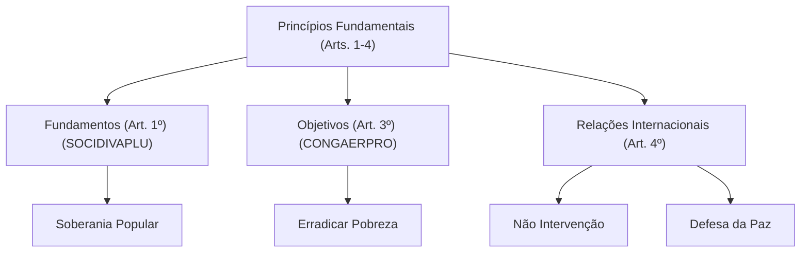

# 🎓 AcademiaIA - Aula Diária de Estudos
**Objetivo Geral:** Passar no cargo de Analista de Desenvolvimento de Sistemas no concurso da FUNDATEC
**Plano do Dia:** Consolidar o domínio sobre os Princípios Fundamentais da CF/88, sanando lacunas em Relações Internacionais e Democracia Participativa.
**Tema:** Constituição Federal de 1988: Dos Princípios Fundamentais (Arts. 1º ao 4º)

---

## 📅 Roteiro de Estudos Planejado pelo Diretor
* **Data:** 2026-07-25
* **Tópicos a Estudar:**
    - Constituição Federal de 1988: Dos Princípios Fundamentais (Arts. 1° ao 4°)
* **Justificativa da Escolha:**
  Apesar do aluno ter sido aprovado anteriormente no tópico, o histórico de desempenho apontou erros críticos em pontos-chave (Relações Internacionais e Democracia Participativa) e uma questão deixada em branco (X). Como o aluno solicitou especificamente este tópico para hoje, esta é a oportunidade ideal para realizar um reforço pedagógico de alta performance e sanar essas lacunas remanescentes antes de avançar para os Direitos Fundamentais.
* **Professor Responsável:** Professor de Legislação

---

## 🔍 Análise Estratégica da Banca (FUNDATEC)
* **Recorrência do Assunto:** `Alta`
* **Foco da Banca nas Provas:**
  A FUNDATEC possui um foco extremamente literal. Em questões sobre os artigos 1° ao 4°, a banca prioriza a 'letra da lei', exigindo que o candidato diferencie com precisão os fundamentos (art. 1°), os objetivos fundamentais (art. 3°) e os princípios das relações internacionais (art. 4°). Não costuma exigir doutrina aprofundada, mas sim a memorização dos incisos, frequentemente trocando palavras-chave (ex: trocar 'soberania' por 'independência' ou inverter verbos nos objetivos).
* **Pegadinhas Clássicas Mapeadas:**
    - Troca de fundamentos por objetivos: A banca coloca um fundamento (ex: Dignidade da pessoa humana) dentro de uma questão que pede um objetivo da República (ex: Erradicar a pobreza).
  - Verbos nos objetivos: A banca altera verbos dos incisos do art. 3° (ex: trocar 'garantir' por 'assegurar' ou mudar a conjugação para induzir erro de leitura técnica).
  - Inversão de princípios internacionais: Misturar princípios que regem as relações internacionais com os fundamentos da República, induzindo o candidato a erro por semelhança terminológica.
* **Atualizações Importantes:**
  Embora o texto constitucional dos artigos 1° ao 4° seja estável, é fundamental observar a recente inclusão da proteção de dados pessoais (EC 115/2022) como um direito fundamental (art. 5°, LXXIX), que, embora fora do escopo inicial, impacta a interpretação dos princípios fundamentais na atualidade, bem como a reafirmação do princípio da separação dos poderes frente a julgamentos recentes do STF sobre a autonomia institucional.

---

### 📝 Questões Reais de Concursos Anteriores (Referência)

#### Questão de Referência 1 (2023 | Prefeitura de Venâncio Aires | Assistente Administrativo)
De acordo com o art. 1º da Constituição Federal de 1988, a República Federativa do Brasil, formada pela união indissolúvel dos Estados e Municípios e do Distrito Federal, constitui-se em Estado Democrático de Direito e tem como um de seus fundamentos: A) A erradicação da pobreza e da marginalização. B) A construção de uma sociedade livre, justa e solidária. C) A dignidade da pessoa humana. D) A promoção do bem de todos. E) A independência nacional.

* **Gabarito Oficial:** **Opção (C)**


---

## 📚 Conteúdo Expositivo da Aula: Constituição Federal de 1988: Dos Princípios Fundamentais (Arts. 1º ao 4º)

### 🎯 Objetivos de Aprendizagem
* **Dominar a diferenciação técnica entre Fundamentos (Art. 1º), Objetivos Fundamentais (Art. 3º) e Princípios das Relações Internacionais (Art. 4º).**
* **Compreender a natureza da Soberania Popular e o funcionamento da Democracia Participativa no Parágrafo Único do Art. 1º.**
* **Internalizar os 10 incisos dos princípios das relações internacionais para não cair em pegadinhas da banca FUNDATEC.**
* **Desmistificar o conceito de Pluralismo Político, superando a visão restrita de 'partidos políticos'.**

### 📝 Teoria Detalhada
## 1. Introdução e a "Analogia de Ouro" (Para Iniciantes)
Os artigos 1º ao 4º da Constituição Federal de 1988 representam o 'DNA' do Estado Brasileiro. Imagine a República como uma grande empresa ou condomínio: o Art. 1º é a Identidade da Empresa (o nome, a marca, o estilo de gestão). O Art. 3º é o Plano de Negócios e as Metas de Longo Prazo (o que queremos construir e onde queremos chegar). O Art. 4º é o Manual de Relações Públicas (como a empresa se comporta com os seus vizinhos, as outras empresas e parceiros internacionais).

## 2. Nivelamento e Conceituação Progressiva
O Art. 1º estabelece os fundamentos. Fundamento é a base, o alicerce. Se um prédio não tem alicerce, cai. Se uma República não tem dignidade humana ou cidadania, ela não é uma democracia plena. O Parágrafo Único do Art. 1º é o coração do sistema: 'Todo poder emana do povo'. Isso significa que o poder não pertence aos governantes, eles apenas o exercem em nome do povo. A democracia participativa (plebiscito, referendo, iniciativa popular) é o exercício direto desse poder, indo além do simples ato de votar.

## 3. Aprofundamento Teórico Avançado
### O Pluralismo Político
Um erro comum é achar que pluralismo político se limita a ter vários partidos. Errado. O Pluralismo Político (Art. 1º, V) é uma garantia de que o Estado deve ser tolerante a correntes de pensamento, filosofias e valores diferentes. É o reconhecimento de que a sociedade é complexa e que o consenso não pode ser imposto.

### O Artigo 4º: Relações Internacionais
O Brasil pauta suas relações por 10 princípios listados no Art. 4º. Exemplo: A 'Não intervenção' significa que o Brasil respeita a soberania de outros países e não se mete nos seus assuntos internos. A 'Defesa da Paz' e a 'Solução pacífica dos conflitos' obrigam o Estado brasileiro a priorizar a diplomacia em vez do uso de força armada.

## 4. Quadro Comparativo Visual
| Categoria | Base Legal | Finalidade | Natureza | 
| :--- | :--- | :--- | :--- | 
| Fundamentos | Art. 1º | Identidade do Estado | Estático / Estrutural |
| Objetivos | Art. 3º | Metas a serem atingidas | Dinâmico / Programático |
| Princípios Int. | Art. 4º | Política Externa | Normativo / Comportamental |

## 5. Mnemônicos e Técnicas de Memorização
*   **Fundamentos (Art. 1º):** SO-CI-DI-VA-PLU (Soberania, Cidadania, Dignidade da pessoa humana, Valores sociais do trabalho e da livre iniciativa, Pluralismo político).
*   **Objetivos (Art. 3º):** CON-GA-ER-PRO (Construir, Garantir, Erradicar, Promover).

## 6. Radar de Pegadinhas (Foco na Banca FUNDATEC)
A FUNDATEC adora inverter os verbos dos Objetivos (Art. 3º). Exemplo: Colocar 'Garantir' onde deveria ser 'Construir'. Outra tática: inserir a 'Soberania' como se fosse um objetivo. Lembre-se: Soberania é fundamento, não objetivo!

## 7. Perguntas de Auto-Verificação
1. Onde está prevista a democracia participativa? Resposta: No Art. 1º, Parágrafo Único (exercício direto ou por representantes).
2. O que é o princípio da não-intervenção? Resposta: O Brasil não interfere nos assuntos internos de outros Estados soberanos.
3. O pluralismo político é o mesmo que multipartidarismo? Resposta: Não, é mais amplo; envolve a diversidade de ideias e valores, não apenas legendas partidárias.

### 💡 Exemplos Práticos

#### Exemplo 1: Exercício da Democracia Participativa
* **Descrição:** Caso prático de como o povo atua além do voto.
* **Especificação Técnica:**
```sql
Um exemplo clássico é o Referendo do Desarmamento (2005), onde a população decidiu diretamente sobre a proibição de comercialização de armas, exercendo a soberania popular prevista no Art. 1º, P.U.
```


#### Exemplo 2: Princípio da Solução Pacífica de Conflitos
* **Descrição:** Aplicação do Art. 4º, VII.
* **Especificação Técnica:**
```sql
O Brasil atua como mediador em disputas territoriais na América do Sul, recusando-se a enviar tropas para resolver problemas internos de vizinhos, mantendo a neutralidade armada.
```


#### Exemplo 3: Diferenciação de Verbos (FUNDATEC)
* **Descrição:** Como a banca altera o texto da lei.
* **Especificação Técnica:**
```sql
Lei: 'Erradicar a marginalização'. Banca: 'Eliminar a marginalização'. O verbo 'Erradicar' é o único correto. Atenção à literalidade absoluta.
```


### 📌 Resumo de Fixação
* Fundamentos (Art. 1º): SO-CI-DI-VA-PLU. A base da estrutura estatal.
* Democracia: Representativa (eleitos) e Participativa (plebiscito, referendo, iniciativa popular).
* Objetivos (Art. 3º): São metas que o Estado deve perseguir (ex: erradicar a pobreza, reduzir desigualdades).
* Relações Internacionais (Art. 4º): Princípios que regem a conduta externa do Brasil, como autodeterminação dos povos e não-intervenção.
* Diferenciação: Fundamentos são fatos, Objetivos são ações, Princípios Internacionais são regras externas.

---

## 🧠 Mapa Mental (Visualização Gráfica)


---

## 🗂️ Flashcards (Fixação Ativa)
| ❓ Pergunta | 💡 Resposta |
|---|---|
| **Quais são os 5 fundamentos da República (Art. 1º)?** | Soberania, Cidadania, Dignidade da pessoa humana, Valores sociais do trabalho/livre iniciativa e Pluralismo político. |
| **Todo poder emana do povo? Como ele é exercido?** | Sim, por meio de representantes eleitos ou diretamente, nos termos da Constituição. |
| **Diferença técnica: Princípio da Não Intervenção vs. Autodeterminação dos Povos?** | Não intervenção é o dever de não agir no Estado alheio; Autodeterminação é o direito do povo de decidir seu próprio destino político. |

---

## 📝 Simulado de Fixação (Criador de Exercícios)

### ❓ Caderno de Questões

#### Questão 1
* **Dificuldade:** `Fácil` | **Edital:** *Dos Princípios Fundamentais - Art. 1º*

Sobre os fundamentos da República Federativa do Brasil, previstos no art. 1º da CF/88, assinale a alternativa correta.

  - **(A)** A soberania, a cidadania, a dignidade da pessoa humana, os valores sociais do trabalho e da livre iniciativa e o pluralismo político são objetivos da República.
  - **(B)** Todo poder emana do povo, que o exerce por meio de representantes eleitos ou diretamente, nos termos da Constituição, sendo o parágrafo único a base da democracia participativa.
  - **(C)** O pluralismo político confunde-se com o pluripartidarismo, sendo vedada a existência de correntes de pensamento que contrariem o governo federal.
  - **(D)** A República Federativa do Brasil é formada pela união indissolúvel dos Estados e Municípios e do Distrito Federal.
  - **(E)** A dignidade da pessoa humana é um objetivo a ser alcançado pela União, não um fundamento imediato da estrutura estatal.


---
#### Questão 2
* **Dificuldade:** `Médio` | **Edital:** *Dos Princípios Fundamentais - Art. 3º*

Conforme a CF/88, identifique qual das opções abaixo NÃO constitui um objetivo fundamental da República Federativa do Brasil.

  - **(A)** Construir uma sociedade livre, justa e solidária.
  - **(B)** Garantir o desenvolvimento nacional.
  - **(C)** Erradicar a pobreza e a marginalização e reduzir as desigualdades sociais e regionais.
  - **(D)** Prevalência dos direitos humanos.
  - **(E)** Promover o bem de todos, sem preconceitos de origem, raça, sexo, cor, idade e quaisquer outras formas de discriminação.


---
#### Questão 3
* **Dificuldade:** `Médio` | **Edital:** *Dos Princípios Fundamentais - Art. 4º*

Analise os itens abaixo e assinale a alternativa que apresenta apenas princípios que regem a República Federativa do Brasil em suas relações internacionais (Art. 4º).

  - **(A)** Soberania, Cidadania e Defesa da Paz.
  - **(B)** Independência nacional, Autodeterminação dos povos e Erradicação da pobreza.
  - **(C)** Não-intervenção, Igualdade entre os Estados e Defesa da paz.
  - **(D)** Pluralismo político, Solução pacífica dos conflitos e Concessão de asilo político.
  - **(E)** Promoção do bem de todos, Cooperação entre os povos e Independência nacional.


---
#### Questão 4
* **Dificuldade:** `Difícil` | **Edital:** *Dos Princípios Fundamentais - Art. 1º*

Sobre o pluralismo político, como fundamento da República, assinale a assertiva correta à luz da jurisprudência e da doutrina constitucional.

  - **(A)** Refere-se exclusivamente à multiplicidade de legendas partidárias no Congresso Nacional.
  - **(B)** Trata-se de um valor que exige do Estado a tolerância apenas com correntes de pensamento alinhadas à Constituição.
  - **(C)** Abrange a tolerância e a convivência de diversas ideias, valores e correntes de pensamento, superando a visão estrita de pluripartidarismo.
  - **(D)** É um objetivo fundamental focado na reforma política do sistema eleitoral brasileiro.
  - **(E)** Garante a liberdade total para que partidos políticos preguem a abolição do regime democrático.


---
#### Questão 5
* **Dificuldade:** `Médio` | **Edital:** *Dos Princípios Fundamentais - Art. 3º*

Em relação aos verbos utilizados nos objetivos fundamentais da República (Art. 3º), assinale a alternativa que apresenta a redação correta de um dos incisos.

  - **(A)** Garantir a erradicação da pobreza e a redução das desigualdades.
  - **(B)** Promover a justiça social sem preconceitos de origem, raça ou sexo.
  - **(C)** Assegurar o desenvolvimento nacional.
  - **(D)** Construir uma sociedade livre, justa e solidária.
  - **(E)** Garantir a autodeterminação dos povos.


---
#### Questão 6
* **Dificuldade:** `Fácil` | **Edital:** *Dos Princípios Fundamentais - Art. 4º*

O princípio da não-intervenção, previsto no art. 4º da Constituição, implica que:

  - **(A)** O Brasil deve intervir militarmente em países onde os direitos humanos são violados.
  - **(B)** O Brasil não deve interferir nos assuntos internos de outros Estados soberanos.
  - **(C)** O Brasil pode intervir em conflitos internos de outros países caso haja interesses econômicos envolvidos.
  - **(D)** O Brasil deve promover a intervenção estrangeira sempre que o governo local for autoritário.
  - **(E)** A soberania nacional permite que o Brasil dite as regras políticas de seus vizinhos continentais.


---
#### Questão 7
* **Dificuldade:** `Médio` | **Edital:** *Dos Princípios Fundamentais - Art. 1º*

Sobre a República Federativa do Brasil, assinale a alternativa correta quanto à sua organização política:

  - **(A)** A República é composta pela União, Estados, Municípios e Distrito Federal, todos dotados de autonomia.
  - **(B)** A soberania é exercida apenas pelos representantes eleitos no Congresso Nacional.
  - **(C)** A separação dos poderes é um fundamento absoluto, sendo vedada qualquer interação entre os órgãos de Estado.
  - **(D)** O Brasil adota a democracia direta como única forma de exercício do poder.
  - **(E)** A cidadania é um objetivo fundamental da República.


---
#### Questão 8
* **Dificuldade:** `Difícil` | **Edital:** *Dos Princípios Fundamentais - Art. 4º*

Dentre os princípios que regem as relações internacionais, o Brasil busca a integração latino-americana. Assinale o complemento correto para esse princípio, conforme o texto constitucional.

  - **(A)** ...visando ao estabelecimento de um bloco econômico único.
  - **(B)** ...visando à formação de uma comunidade latino-americana de nações.
  - **(C)** ...visando à unificação política dos países da América do Sul.
  - **(D)** ...visando à proteção exclusiva do meio ambiente regional.
  - **(E)** ...visando à centralização militar regional.


---
#### Questão 9
* **Dificuldade:** `Médio` | **Edital:** *Dos Princípios Fundamentais - Art. 4º*

Em caso de agressão armada, qual princípio das relações internacionais fundamenta a posição do Brasil?

  - **(A)** Defesa da paz.
  - **(B)** Solução pacífica dos conflitos.
  - **(C)** Repúdio ao terrorismo e ao racismo.
  - **(D)** Cooperação entre os povos para o progresso da humanidade.
  - **(E)** Concessão de asilo político.


---
#### Questão 10
* **Dificuldade:** `Fácil` | **Edital:** *Dos Princípios Fundamentais - Arts. 1º e 3º*

A respeito dos fundamentos e objetivos da República, é correto afirmar que:

  - **(A)** O pluralismo político é um objetivo fundamental.
  - **(B)** A erradicação da pobreza é um fundamento da República.
  - **(C)** A livre iniciativa é um fundamento da República.
  - **(D)** A prevalência dos direitos humanos é um fundamento da República.
  - **(E)** A soberania popular é o único objetivo da República.


---

### 🔑 Gabarito e Resoluções Comentadas

#### Questão 1
* **Gabarito:** **Opção (B)**
* **Resolução e Comentário:**
  A alternativa B descreve corretamente o parágrafo único do art. 1º, que estabelece a soberania popular e a natureza semidireta da nossa democracia. A alternativa A erra ao classificar os fundamentos como objetivos (que estão no art. 3º). A C está errada pois o pluralismo político vai além dos partidos, abarcando ideias e valores. A D erra ao citar Municípios como entes formadores da união indissolúvel (são Estados, Distrito Federal e Municípios, mas a união é dos entes federativos no sentido de Estados-membros). A E erra pois a dignidade é, sim, um fundamento.


---
#### Questão 2
* **Gabarito:** **Opção (D)**
* **Resolução e Comentário:**
  A alternativa D apresenta um princípio que rege as relações internacionais (art. 4º, II), e não um objetivo fundamental (art. 3º). Os objetivos fundamentais são ações programáticas da República. A FUNDATEC costuma misturar os itens dos arts. 1º, 3º e 4º para confundir o candidato.


---
#### Questão 3
* **Gabarito:** **Opção (C)**
* **Resolução e Comentário:**
  A alternativa C contém apenas princípios do art. 4º. As demais contêm elementos do art. 1º (fundamentos) ou art. 3º (objetivos). É essencial memorizar a lista dos 10 incisos do art. 4º para evitar a confusão comum promovida pela banca.


---
#### Questão 4
* **Gabarito:** **Opção (C)**
* **Resolução e Comentário:**
  O pluralismo político é o fundamento que garante que o Brasil não seja um Estado monolítico. A alternativa C é a mais completa, pois explica que o conceito vai além dos partidos, alcançando a tolerância social e intelectual. A alternativa E é incorreta pois a liberdade não é absoluta e não permite a pregação de regimes ditatoriais.


---
#### Questão 5
* **Gabarito:** **Opção (D)**
* **Resolução e Comentário:**
  A alternativa D reproduz exatamente o inciso I do art. 3º. A banca FUNDATEC costuma trocar 'Construir' por 'Garantir' ou 'Assegurar' em outras opções, sendo uma pegadinha clássica de leitura literal.


---
#### Questão 6
* **Gabarito:** **Opção (B)**
* **Resolução e Comentário:**
  A não-intervenção é um pilar da diplomacia brasileira, respeitando a soberania dos Estados. A alternativa B descreve perfeitamente o conceito constitucional, enquanto as demais sugerem ações contrárias ao espírito do inciso IV do art. 4º.


---
#### Questão 7
* **Gabarito:** **Opção (A)**
* **Resolução e Comentário:**
  O art. 1º estabelece que a República é formada pela união indissolúvel dos entes federados (União, Estados, DF e Municípios), todos autônomos. A alternativa B é falsa, pois o poder emana do povo. A C está errada porque o sistema de freios e contrapesos exige interação. A E está errada porque cidadania é fundamento (art. 1º), não objetivo.


---
#### Questão 8
* **Gabarito:** **Opção (B)**
* **Resolução e Comentário:**
  O art. 4º, parágrafo único, dita exatamente a intenção de buscar a integração econômica, política, social e cultural dos povos da América Latina, visando à formação de uma comunidade latino-americana de nações. As outras opções inventam objetivos que não constam no texto constitucional.


---
#### Questão 9
* **Gabarito:** **Opção (A)**
* **Resolução e Comentário:**
  Embora a solução pacífica seja um princípio geral (inciso VII), a 'defesa da paz' é expressamente listada como inciso VI do art. 4º, sendo o princípio que baliza a postura do Estado brasileiro em cenários de beligerância ou agressão armada.


---
#### Questão 10
* **Gabarito:** **Opção (C)**
* **Resolução e Comentário:**
  A 'livre iniciativa' está listada no inciso IV do Art. 1º como fundamento. A alternativa A erra ao citar pluralismo como objetivo (é fundamento). A B erra ao citar erradicação da pobreza como fundamento (é objetivo). A D erra ao citar direitos humanos como fundamento (é princípio das relações internacionais). A E erra ao apontar soberania como objetivo (é fundamento/pilar da democracia).

