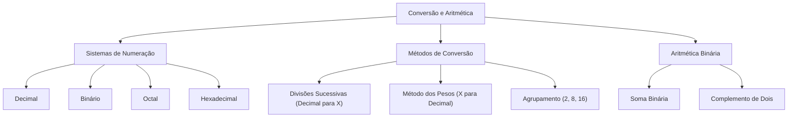

# 🎓 AcademiaIA - Aula Diária de Estudos
**Objetivo Geral:** Passar no cargo de Analista de Desenvolvimento de Sistemas no concurso da FUNDATEC
**Plano do Dia:** Domínio técnico sobre conversão de bases numéricas e aritmética binária para concursos da FUNDATEC
**Tema:** Conversão de Bases e Aritmética Binária

---

## 📅 Roteiro de Estudos Planejado pelo Diretor
* **Data:** 2023-10-27
* **Tópicos a Estudar:**
    - Conversão de bases (Binário, Octal, Decimal, Hexadecimal) e Aritmética Binária
* **Justificativa da Escolha:**
  Atendimento à solicitação explícita do aluno para focar em 'Conversão de bases e Aritmética Binária', tópico essencial para a matéria de TI e Conhecimentos Específicos e frequentemente cobrado em provas de Analista de Desenvolvimento de Sistemas pela FUNDATEC.
* **Professor Responsável:** Professor de TI

---

## 🔍 Análise Estratégica da Banca (FUNDATEC)
* **Recorrência do Assunto:** `Alta`
* **Foco da Banca nas Provas:**
  A FUNDATEC possui um perfil técnico muito tradicional. Para este tema, o foco é a precisão no cálculo manual. Ela raramente cobra conceitos teóricos complexos ou arquitetura profunda, preferindo pedir a conversão direta de números inteiros entre bases (frequentemente decimal para binário ou hexadecimal) e operações básicas de soma e subtração binária. A banca espera que o candidato domine o método de divisões sucessivas e a decomposição de potências, sendo muito rigorosa com a notação de cada sistema.
* **Pegadinhas Clássicas Mapeadas:**
    - Armadilha 1: Confusão entre a base 8 (Octal) e a base 16 (Hexadecimal) ao converter de binário para base superior, esquecendo de agrupar em 3 bits para Octal e 4 bits para Hexadecimal.
  - Armadilha 2: Erros no 'vai um' (carry) durante a aritmética binária, onde o candidato esquece que 1+1=10 na base binária, tratando como decimal.
  - Armadilha 3: Inversão da ordem dos restos na conversão de decimal para bases menores, um erro comum de desatenção que a banca explora nas alternativas.
* **Atualizações Importantes:**
  Não há alterações legislativas para este tema, pois trata-se de matemática pura e lógica digital. O padrão técnico moderno mantido pela banca segue o padrão IEEE 754 para representação de números de ponto flutuante em computadores, embora a FUNDATEC foque quase exclusivamente em números inteiros positivos em editais de nível superior.

---

### 📝 Questões Reais de Concursos Anteriores (Referência)

#### Questão de Referência 1 (2023 | Prefeitura de Caxias do Sul | Analista de Sistemas)
Considere o número binário 101101. Qual é o seu valor correspondente na base decimal?

* **Gabarito Oficial:** **Opção (45)**


---
#### Questão de Referência 2 (2022 | Prefeitura de Bagé | Analista de TI)
Na aritmética binária, a soma dos valores 1011 e 1101 resulta em qual valor binário?

* **Gabarito Oficial:** **Opção (11000)**


---

## 📚 Conteúdo Expositivo da Aula: Conversão de Bases e Aritmética Binária

### 🎯 Objetivos de Aprendizagem
* **Dominar a conversão entre as bases decimal, binária, octal e hexadecimal.**
* **Aplicar o método de divisões sucessivas e o método de pesos de forma precisa.**
* **Executar operações aritméticas binárias (soma e subtração) utilizando o complemento de dois.**
* **Identificar e evitar erros recorrentes cobrados pela banca FUNDATEC.**

### 📝 Teoria Detalhada
## 1. Introdução e a "Analogia de Ouro" (Para Iniciantes)

O computador não compreende o nosso sistema decimal (base 10) porque ele é composto por milhões de transistores que funcionam como chaves: ou estão ligados (1) ou desligados (0). O sistema binário é a linguagem universal dos circuitos digitais. Imagine que o sistema decimal é uma prateleira onde você organiza livros em grupos de 10. No sistema binário, você tem apenas dois compartimentos: ligado ou desligado. As bases octal (8) e hexadecimal (16) funcionam como abreviações convenientes para que humanos não precisem ler cadeias gigantescas de zeros e uns. Pense nelas como 'atalhos' de notação: enquanto o binário escreve '1111' para representar o número 15, o hexadecimal usa apenas 'F'.

## 2. Nivelamento e Conceituação Progressiva (Do Básico ao Avançado)

Um sistema numérico de base B possui B símbolos. O sistema Decimal usa 0-9. O Binário usa 0 e 1. O Octal usa 0-7. O Hexadecimal usa 0-9 e as letras A-F (onde A=10, B=11, C=12, D=13, E=14, F=15). A base de tudo é o 'peso posicional'. Em 452 (decimal), temos 4*10^2 + 5*10^1 + 2*10^0. Em binário, 1011 é 1*2^3 + 0*2^2 + 1*2^1 + 1*2^0 = 8+0+2+1 = 11 decimal.

## 3. Aprofundamento Teórico Avançado (Foco em Concursos)

Conversão Decimal para qualquer base: utiliza-se o método das divisões sucessivas pelo valor da base. O último quociente e os restos lidos de baixo para cima formam o número. Exemplo: 13 em binário. 13/2=6 resto 1; 6/2=3 resto 0; 3/2=1 resto 1; 1/2=0 resto 1. Lendo de baixo para cima: 1101.

Conversão entre bases 2, 8 e 16: O segredo é o agrupamento. Para converter binário para octal, agrupe de 3 em 3 bits da direita para a esquerda. Para hexadecimal, agrupe de 4 em 4 bits. Exemplo: 101111 em binário para hexadecimal: (0010) (1111) = 2F.

Aritmética: A soma binária 1+1 gera um 'carry' (vai um) para a casa seguinte, resultando em 10 (decimal 2). A subtração com números negativos é feita via Complemento de Dois: inverta todos os bits do número e some 1. Isso permite que a CPU realize subtrações usando apenas somadores, otimizando o hardware.

## 4. Quadro Comparativo Visual

| Sistema | Base | Dígitos | Exemplo (Decimal 15) |
| :--- | :--- | :--- | :--- |
| Binário | 2 | 0, 1 | 1111 |
| Octal | 8 | 0-7 | 17 |
| Decimal | 10 | 0-9 | 15 |
| Hexadecimal | 16 | 0-9, A-F | F |

## 5. Mnemônicos e Técnicas de Memorização

Para conversão rápida: 'Octal precisa de 3 (O-3), Hexa precisa de 4 (H-4)'. Para o complemento de dois: 'Inverte tudo e soma um, para ficar negativo nenhum'.

## 6. Radar de Pegadinhas (Foco na Banca FUNDATEC)

1. O 'vai um' (carry): A banca espera que você some 1+1=10. Errar isso é fatal.
2. Ordem dos restos: A banca inverte a ordem nas alternativas. Lembre-se: o último resto é o bit mais significativo (MSB).
3. Erro de agrupamento: Agrupar 4 bits para octal em vez de 3. Mantenha a atenção na base destino.

## 7. Perguntas de Auto-Verificação (Recall Ativo)

1. Como representar 10 em hexadecimal? R: Letra A.
2. Quantos bits são necessários para representar um dígito octal? R: 3 bits.
3. Qual o resultado de 1+1 em binário? R: 10.

### 💡 Exemplos Práticos

#### Exemplo 1: Soma Binária 110 + 011
* **Descrição:** Demonstração da operação bit a bit com carry.
* **Especificação Técnica:**
```sql
  110 (6 decimal)
+ 011 (3 decimal)
-----
 1001 (9 decimal)

Explicação: 0+1=1. 1+1=0 com carry 1. 1+0+carry=10.
```


#### Exemplo 2: Conversão 25 decimal para binário
* **Descrição:** Aplicação de divisões sucessivas.
* **Especificação Técnica:**
```sql
25 / 2 = 12 (resto 1)
12 / 2 = 6 (resto 0)
6 / 2 = 3 (resto 0)
3 / 2 = 1 (resto 1)
1 / 2 = 0 (resto 1)
Resultado: 11001
```


### 📌 Resumo de Fixação
• Sistemas de numeração possuem pesos baseados em potências da base.
• Divisões sucessivas são usadas para converter de decimal para outra base.
• Método de pesos é usado para converter de qualquer base para decimal.
• Conversão binária-octal-hexadecimal utiliza agrupamento (3 bits para octal, 4 bits para hexa).
• Complemento de dois é o padrão de representação de sinal para números negativos em processadores modernos.

---

## 🧠 Mapa Mental (Visualização Gráfica)


---

## 🗂️ Flashcards (Fixação Ativa)
| ❓ Pergunta | 💡 Resposta |
|---|---|
| **Qual a finalidade do complemento de dois?** | Representar números negativos em sistemas computacionais binários. |
| **Para converter binário para hexadecimal, qual o tamanho do agrupamento?** | 4 bits. |
| **Qual o valor da letra F no sistema hexadecimal?** | 15 em decimal. |
| **Qual a base do sistema octal?** | Base 8 (dígitos 0 a 7). |

---

## 📝 Simulado de Fixação (Criador de Exercícios)

### ❓ Caderno de Questões

#### Questão 1
* **Dificuldade:** `Fácil` | **Edital:** *Sistemas de Numeração*

Considere o número decimal 157. Ao convertê-lo para a base binária, qual é a representação correta, considerando a sequência correta dos restos das divisões sucessivas?

  - **(A)** 10011101
  - **(B)** 10111101
  - **(C)** 10011111
  - **(D)** 11011101
  - **(E)** 10101101


---
#### Questão 2
* **Dificuldade:** `Médio` | **Edital:** *Sistemas de Numeração*

Converta o número hexadecimal A3F para a base decimal. Qual o valor correspondente?

  - **(A)** 2623
  - **(B)** 2523
  - **(C)** 2624
  - **(D)** 2615
  - **(E)** 2540


---
#### Questão 3
* **Dificuldade:** `Fácil` | **Edital:** *Aritmética Binária*

Dada a operação aritmética binária: 1011 + 0110, qual é o resultado correto na base binária?

  - **(A)** 10001
  - **(B)** 11001
  - **(C)** 10011
  - **(D)** 10111
  - **(E)** 10000


---
#### Questão 4
* **Dificuldade:** `Médio` | **Edital:** *Sistemas de Numeração*

Converta o número binário 11010111 para a base octal. Qual é a alternativa correta?

  - **(A)** 327
  - **(B)** 657
  - **(C)** 326
  - **(D)** 337
  - **(E)** 227


---
#### Questão 5
* **Dificuldade:** `Difícil` | **Edital:** *Aritmética Binária*

Qual é a representação em complemento de dois de 8 bits para o número decimal -5?

  - **(A)** 11111011
  - **(B)** 10000101
  - **(C)** 00000101
  - **(D)** 11111010
  - **(E)** 11111101


---
#### Questão 6
* **Dificuldade:** `Fácil` | **Edital:** *Sistemas de Numeração*

Converta o número 4A (hexadecimal) para binário.

  - **(A)** 01001010
  - **(B)** 01001011
  - **(C)** 10001010
  - **(D)** 01011010
  - **(E)** 01001100


---
#### Questão 7
* **Dificuldade:** `Médio` | **Edital:** *Aritmética Binária*

Realize a subtração binária: 1100 - 0101. Qual o resultado?

  - **(A)** 0111
  - **(B)** 1001
  - **(C)** 0110
  - **(D)** 0101
  - **(E)** 1000


---
#### Questão 8
* **Dificuldade:** `Fácil` | **Edital:** *Sistemas de Numeração*

Qual o valor decimal do número binário 101101?

  - **(A)** 45
  - **(B)** 43
  - **(C)** 47
  - **(D)** 37
  - **(E)** 53


---
#### Questão 9
* **Dificuldade:** `Médio` | **Edital:** *Sistemas de Numeração*

Converta o decimal 123 para hexadecimal.

  - **(A)** 7B
  - **(B)** 7C
  - **(C)** 8B
  - **(D)** 6B
  - **(E)** 7A


---
#### Questão 10
* **Dificuldade:** `Difícil` | **Edital:** *Aritmética Binária*

Se um sistema utiliza 4 bits para representar números inteiros, qual é o valor representado por '1001' em complemento de dois?

  - **(A)** -7
  - **(B)** -8
  - **(C)** -6
  - **(D)** 9
  - **(E)** -1


---

### 🔑 Gabarito e Resoluções Comentadas

#### Questão 1
* **Gabarito:** **Opção (A)**
* **Resolução e Comentário:**
  Para converter 157 para binário, dividimos sucessivamente por 2: 157/2 = 78 (resto 1), 78/2 = 39 (resto 0), 39/2 = 19 (resto 1), 19/2 = 9 (resto 1), 9/2 = 4 (resto 1), 4/2 = 2 (resto 0), 2/2 = 1 (resto 0), 1/2 = 0 (resto 1). Lendo os restos de baixo para cima, obtemos 10011101. As outras alternativas erram ao inverter a ordem ou calcular os restos incorretamente.


---
#### Questão 2
* **Gabarito:** **Opção (A)**
* **Resolução e Comentário:**
  O valor A3F (hex) equivale a (10 * 16^2) + (3 * 16^1) + (15 * 16^0). Calculando: 10 * 256 = 2560; 3 * 16 = 48; 15 * 1 = 15. Somando: 2560 + 48 + 15 = 2623. Alternativas incorretas resultam de erros de posicionamento de potências ou conversão errada dos dígitos A e F.


---
#### Questão 3
* **Gabarito:** **Opção (A)**
* **Resolução e Comentário:**
  Somando bit a bit da direita para a esquerda: 1+0=1; 1+1=10 (fica 0, vai 1); 0+1+1 (carry)=10 (fica 0, vai 1); 1+0+1 (carry)=10 (fica 0, vai 1). Resultado: 10001. A principal pegadinha aqui é o erro no 'vai um' (carry), comum em somas binárias.


---
#### Questão 4
* **Gabarito:** **Opção (A)**
* **Resolução e Comentário:**
  Para converter binário para octal, agrupamos em trios a partir da direita: 011 010 111. 011 = 3; 010 = 2; 111 = 7. Resultado: 327. O erro comum é tentar converter para hexadecimal agrupando em quartetos ou esquecer de preencher com zero à esquerda o primeiro grupo.


---
#### Questão 5
* **Gabarito:** **Opção (A)**
* **Resolução e Comentário:**
  Para achar o complemento de 2 de -5: 1) Binário de 5 em 8 bits: 00000101. 2) Inverte os bits: 11111010. 3) Soma 1: 11111011. A alternativa D é apenas o complemento de 1, enquanto B ignora a regra e apenas troca o bit de sinal.


---
#### Questão 6
* **Gabarito:** **Opção (A)**
* **Resolução e Comentário:**
  Transformamos cada dígito hexadecimal em 4 bits: 4 = 0100 e A (10) = 1010. Juntando, temos 01001010. Erros surgem ao confundir o valor de A (que é 10, não 11 ou 12) ou usar o agrupamento de 3 bits (octal).


---
#### Questão 7
* **Gabarito:** **Opção (A)**
* **Resolução e Comentário:**
  Operação: 1100 - 0101. Pedindo emprestado: no primeiro bit, 0-1 pede emprestado ao segundo 0, que pede ao 1. O resultado é 0111 (7 decimal, pois 12-5=7). Alternativas erradas derivam de erro no processo de 'empréstimo' binário.


---
#### Questão 8
* **Gabarito:** **Opção (A)**
* **Resolução e Comentário:**
  Método dos pesos: (1*2^5) + (0*2^4) + (1*2^3) + (1*2^2) + (0*2^1) + (1*2^0) = 32 + 0 + 8 + 4 + 0 + 1 = 45. Erros comuns ocorrem ao esquecer alguma potência de 2 ou errar a soma final.


---
#### Questão 9
* **Gabarito:** **Opção (A)**
* **Resolução e Comentário:**
  123 / 16 = 7, resto 11 (que em hexadecimal é B). Logo, o resultado é 7B. Alternativas incorretas surgem ao errar o valor do resto ou converter para 711, ignorando a convenção de letras.


---
#### Questão 10
* **Gabarito:** **Opção (A)**
* **Resolução e Comentário:**
  Para encontrar o decimal de 1001 em complemento de 2 (4 bits): Como o MSB é 1, é negativo. Inverte: 0110. Soma 1: 0111 (que é 7). Logo, 1001 é -7. O maior erro é interpretar 1001 apenas como 9 decimal, esquecendo a lógica do complemento de dois em sistemas binários.

