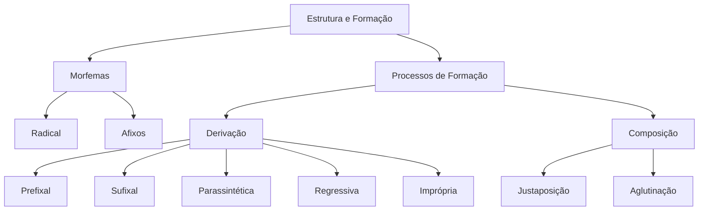

# 🎓 AcademiaIA - Aula Diária de Estudos
**Objetivo Geral:** Passar no cargo de Analista de Desenvolvimento de Sistemas no concurso da FUNDATEC
**Plano do Dia:** Dominar os processos de derivação e composição de palavras, compreendendo a estrutura morfossintática fundamental para a prova de Português da FUNDATEC.
**Tema:** Estrutura e Formação de Palavras

---

## 📅 Roteiro de Estudos Planejado pelo Diretor
* **Data:** 2026-07-23
* **Tópicos a Estudar:**
    - Estrutura e formação de palavras (derivação e composição)
* **Justificativa da Escolha:**
  O aluno escolheu especificamente este tema, que é fundamental para sanar dificuldades recorrentes observadas no histórico de desempenho em 'Ortografia' (especialmente o uso de hífen e prefixos). Como o aluno teve um histórico de questões erradas e até uma questão deixada em branco em simulados de ortografia, este tópico servirá como um 'reforço estrutural' necessário para que ele entenda a lógica por trás da escrita das palavras, baseando-se na morfologia antes de aplicar as regras de ortografia pura.
* **Professor Responsável:** Professor de Português

---

## 🔍 Análise Estratégica da Banca (FUNDATEC)
* **Recorrência do Assunto:** `Alta`
* **Foco da Banca nas Provas:**
  A FUNDATEC possui um perfil técnico muito marcado em Língua Portuguesa. No tema de formação de palavras, a banca evita teorias abstratas e foca na identificação prática dos processos de derivação (prefixal, sufixal, parassintética, regressiva e imprópria) e composição (justaposição e aglutinação). É comum exigir que o candidato identifique o radical, os afixos e o processo morfológico dentro de frases curtas, cobrando a capacidade de análise segmentada da palavra.
* **Pegadinhas Clássicas Mapeadas:**
    - Armadilha 1: Confusão entre derivação parassintética e derivação prefixal+sufixal. A banca costuma colocar palavras onde o prefixo ou sufixo podem ser retirados mantendo a existência da palavra (prefixal+sufixal) contra palavras onde a retirada de um dos elementos torna a palavra inexistente (parassintética).
  - Armadilha 2: Identificação da derivação regressiva. A banca frequentemente apresenta substantivos deverbais e testa se o aluno consegue identificar que a palavra derivou do verbo, e não o contrário (ex: o ataque derivar de atacar).
  - Armadilha 3: Diferenciação entre composição por aglutinação e justaposição, especialmente em casos de palavras que sofreram alterações fonéticas históricas que o candidato possa ignorar.
* **Atualizações Importantes:**
  Não há alterações legais, contudo, a banca tem intensificado a cobrança de neologismos técnicos e o uso de hifenização conforme o atual Acordo Ortográfico, muitas vezes integrando a formação de palavras à regra de acentuação e uso do hífen, exigindo domínio da norma culta atualizada.

---

### 📝 Questões Reais de Concursos Anteriores (Referência)

#### Questão de Referência 1 (2023 | Prefeitura de Caxias do Sul | Analista de Processos)
A palavra 'infelizmente' é formada por qual processo de derivação?

* **Gabarito Oficial:** **Opção (Derivação prefixal e sufixal)**


---
#### Questão de Referência 2 (2022 | Câmara Municipal de Esteio | Analista Legislativo)
Assinale a alternativa que apresenta uma palavra formada por composição por aglutinação.

* **Gabarito Oficial:** **Opção (Planalto)**


---

## 📚 Conteúdo Expositivo da Aula: Estrutura e Formação de Palavras

### 🎯 Objetivos de Aprendizagem
* **Identificar os elementos mórficos (radical, prefixo, sufixo, desinência) em palavras variadas.**
* **Diferenciar com precisão os processos de derivação e composição.**
* **Aplicar a lógica morfológica para resolver questões de ortografia e hífen exigidas pela banca FUNDATEC.**

### 📝 Teoria Detalhada
## 1. Introdução e a "Analogia de Ouro" (Para Iniciantes)
A formação de palavras é como montar um conjunto de peças de um brinquedo. Imagine o Radical (ex: 'pedra') como o chassi de um carro. O Prefixos e Sufixos são as 'peças extras' que adicionamos: um aerofólio ou rodas novas. Se eu adicionar '-ada' a 'pedra', tenho 'pedrada' (algo que sofreu a ação). Se eu adicionar 'a-' antes, tenho 'apedrejar'. O problema que isso resolve é a economia da língua: com poucos radicais, criamos milhares de palavras sem precisar inventar sons novos. Entender a estrutura é entender o DNA da palavra, o que evita erros ortográficos básicos.

## 2. Nivelamento e Conceituação Progressiva (Do Básico ao Avançado)
As palavras são formadas por unidades mínimas de significado chamadas Morfemas. O **Radical** é a base inalterável que dá o sentido principal. **Afixos** são elementos secundários: **Prefixos** (vêm antes) e **Sufixos** (vêm depois). A **Desinência** indica flexões gramaticais (gênero, número, tempo verbal). Exemplo: em 'meninas', temos 'menin' (radical), '-a' (vogal temática), '-s' (desinência de número).

## 3. Aprofundamento Teórico Avançado (Foco em Concursos)
- **Derivação Prefixal:** Acréscimo de prefixo ao radical (ex: 'sub-humano'). A regra do hífen diz: prefixo termina em vogal, palavra começa com consoante diferente? Junta tudo. Se terminam iguais? Hífen obrigatório.
- **Derivação Sufixal:** Acréscimo de sufixo (ex: 'lealdade').
- **Derivação Parassintética:** Prefixo e sufixo entram simultaneamente. O segredo da FUNDATEC: se você retirar um dos elementos, a palavra perde o sentido (ex: 'en-tard-ecer'). Se tirar 'en' sobra 'tardecer' (não existe). Se tirar 'ecer' sobra 'entarde' (não existe). Isso a diferencia da **Prefixal+Sufixal**, onde a retirada de um dos afixos permite a existência da base (ex: 'infelizmente' -> existe 'infeliz' e 'felizmente').
- **Derivação Regressiva:** Substantivos que surgem de verbos pela retirada da terminação (ex: 'o debate' vem de 'debater').
- **Derivação Imprópria:** Mudança de classe gramatical sem alteração morfológica (ex: 'O jantar estava bom' - jantar aqui é substantivo, embora derive de verbo).
- **Composição:** União de dois ou mais radicais.
  - **Justaposição:** Os radicais se unem sem alteração sonora (ex: 'guarda-chuva').
  - **Aglutinação:** Ocorre perda de sons/letras (ex: 'embora' de 'em boa hora').

## 4. Quadro Comparativo Visual
| Processo | Exemplo | Diferencial Chave |
| :--- | :--- | :--- |
| Parassintética | Amanhecer | A retirada de qualquer afixo destrói a palavra. |
| Prefixo+Sufixo | Infelizmente | A retirada de um afixo permite a existência da palavra. |
| Justaposição | Couve-flor | Não há perda de fonemas (elementos mantidos). |
| Aglutinação | Planalto | Há alteração fonética (plano + alto). |

## 5. Mnemônicos e Técnicas de Memorização
Para Parassintética, lembre-se: 'A-T-E'. Ela é **A**ssimétrica, **T**otalitária e **E**xigente. Não deixa retirar nada. Para a Regressiva, pense em 'AÇÃO': o substantivo sempre indica a AÇÃO do verbo (ex: o ataque, o debate, o corte).

## 6. Radar de Pegadinhas (Foco na Banca FUNDATEC)
A FUNDATEC adora cobrar palavras como 'entristecer'. O aluno desatento marca Parassintética. Cuidado: existe 'triste' e 'tristeza'. Se a base é o adjetivo, e não o radical verbal puro, a banca pode considerar prefixal+sufixal. Analise sempre: 'Posso remover e sobra algo com sentido?' Se sim, é prefixal+sufixal.

## 7. Perguntas de Auto-Verificação (Recall Ativo)
1. Qual a diferença principal entre justaposição e aglutinação? R: Justaposição mantém os sons; aglutinação funde e altera sons.
2. Como identificar a derivação parassintética? R: A palavra exige a presença do prefixo e sufixo simultâneos; sem um, a base não se sustenta.
3. O que é derivação imprópria? R: Quando um termo muda de classe gramatical (ex: um verbo virando substantivo) sem mudar a forma.

### 💡 Exemplos Práticos

#### Exemplo 1: Regra do Hífen: Prefixo 'Sub-'
* **Descrição:** O prefixo 'sub-' exige hífen apenas antes de 'h', 'r' e 'b'.
* **Especificação Técnica:**
```sql
sub-humano (com h); sub-raça (com r); sub-base (com b). Em outros casos, escreve-se junto: suboficial, subdiretor.
```


#### Exemplo 2: Análise de Derivação Regressiva
* **Descrição:** Transformação de verbos em substantivos de ação.
* **Especificação Técnica:**
```sql
Verbo: ATACAR -> Substantivo: O ATAQUE (perdeu o '-ar'); Verbo: DEBATER -> Substantivo: O DEBATE (perdeu o '-r').
```


#### Exemplo 3: Estrutura e Hífen: 'Auto-'
* **Descrição:** Aplicação prática da ortografia com prefixo.
* **Especificação Técnica:**
```sql
Autoescola (voga-vogal diferente, junta); Auto-observação (vogais iguais, hífen); Autoconhecimento (vogal-consoante, junta).
```


### 📌 Resumo de Fixação
Radical: Base da palavra que contém o significado central.,Afixos: Elementos anexados ao radical (prefixos antes, sufixos depois).,Parassíntese: Sufixo e prefixo entram juntos; a palavra 'morre' sem um deles.,Regressiva: Criação de substantivo a partir de verbo (geralmente deverbal).,Composição por Justaposição: Junção de termos sem perda sonora (ex: guarda-chuva).,Composição por Aglutinação: Junção de termos com supressão de letras (ex: vinagre = vinho + acre).

---

## 🧠 Mapa Mental (Visualização Gráfica)


---

## 🗂️ Flashcards (Fixação Ativa)
| ❓ Pergunta | 💡 Resposta |
|---|---|
| **Qual a diferença entre prefixal+sufixal e parassintética?** | Na prefixal+sufixal a retirada de um dos afixos permite a existência da palavra; na parassintética, a palavra torna-se inexistente. |
| **Como identificar a derivação imprópria?** | Ocorre a mudança da classe gramatical (ex: um adjetivo passando a funcionar como substantivo) sem mudar a grafia. |
| **O que ocorre na composição por aglutinação?** | Os elementos se unem e há perda ou alteração de fonemas (ex: vinagre < vinho + acre). |

---

## 📝 Simulado de Fixação (Criador de Exercícios)

### ❓ Caderno de Questões

#### Questão 1
* **Dificuldade:** `Difícil` | **Edital:** *Estrutura e formação de palavras*

A palavra 'envelhecer' é classificada como um exemplo de derivação parassintética. Assinale a alternativa que justifica essa classificação, seguindo a lógica da FUNDATEC sobre a distinção entre parassíntese e derivação prefixal e sufixal.

  - **(A)** É parassintética porque possui um prefixo 'en-' e um sufixo '-ecer' adicionados ao radical.
  - **(B)** É parassintética pois a retirada de qualquer um dos afixos, simultaneamente ou não, resulta em uma forma inexistente na língua.
  - **(C)** É parassintética porque o radical sofre alteração fonética obrigatória durante o processo.
  - **(D)** Trata-se de derivação sufixal, pois 'velho' é o radical e 'en-ecer' são apenas morfemas gramaticais opcionais.
  - **(E)** É parassintética devido à junção de dois radicais autônomos, configurando composição.


---
#### Questão 2
* **Dificuldade:** `Médio` | **Edital:** *Processos de derivação*

Considere o vocábulo 'pesca' (substantivo) originado do verbo 'pescar'. Esse processo de formação denomina-se derivação:

  - **(A)** Sufixal.
  - **(B)** Parassintética.
  - **(C)** Regressiva (ou deverbal).
  - **(D)** Imprópria.
  - **(E)** Prefixal.


---
#### Questão 3
* **Dificuldade:** `Difícil` | **Edital:** *Ortografia oficial e hífen*

Analise as palavras 'autoescola' e 'micro-ondas' à luz do Novo Acordo Ortográfico. Assinale a alternativa que justifica corretamente a presença ou ausência do hífen.

  - **(A)** Autoescola mantém-se junta porque o prefixo termina em vogal diferente da vogal que inicia o segundo elemento.
  - **(B)** Micro-ondas utiliza hífen porque o prefixo termina em vogal e o segundo elemento inicia com a mesma vogal.
  - **(C)** Ambas estão corretas: o prefixo 'auto' e 'micro' sempre exigem hífen antes de vogal.
  - **(D)** O hífen em 'micro-ondas' é opcional segundo as novas regras de ortografia.
  - **(E)** A forma 'autoescola' está incorreta, deveria ser 'auto-escola'.


---
#### Questão 4
* **Dificuldade:** `Fácil` | **Edital:** *Processos de derivação*

Na oração 'O jantar foi excelente', a palavra 'jantar' exemplifica qual processo de formação?

  - **(A)** Derivação parassintética.
  - **(B)** Derivação prefixal.
  - **(C)** Derivação imprópria (conversão).
  - **(D)** Composição por aglutinação.
  - **(E)** Derivação regressiva.


---
#### Questão 5
* **Dificuldade:** `Médio` | **Edital:** *Processos de composição*

Assinale a alternativa que apresenta, exclusivamente, palavras formadas por composição por aglutinação.

  - **(A)** Pernilongo, aguardente, embora.
  - **(B)** Couve-flor, pontapé, guarda-chuva.
  - **(C)** Infiel, desleal, antebraço.
  - **(D)** Girassol, passatempo, madrugar.
  - **(E)** Anoitecer, amanhecer, entardecer.


---
#### Questão 6
* **Dificuldade:** `Médio` | **Edital:** *Processos de derivação*

A palavra 'infelizmente' é um exemplo clássico de:

  - **(A)** Derivação parassintética.
  - **(B)** Derivação prefixal e sufixal.
  - **(C)** Composição por aglutinação.
  - **(D)** Derivação imprópria.
  - **(E)** Derivação regressiva.


---
#### Questão 7
* **Dificuldade:** `Fácil` | **Edital:** *Processos de derivação*

Qual dos termos abaixo é formado pelo processo de derivação prefixal?

  - **(A)** Subnutrido.
  - **(B)** Felizmente.
  - **(C)** Anoitecer.
  - **(D)** Planalto.
  - **(E)** Beija-flor.


---
#### Questão 8
* **Dificuldade:** `Médio` | **Edital:** *Estrutura das palavras (prefixos)*

Assinale a alternativa em que a palavra apresenta um prefixo grego corretamente identificado quanto ao seu sentido:

  - **(A)** Microbiologia: prefixo 'micro' que significa grande.
  - **(B)** Antiaéreo: prefixo 'anti' que significa favorável.
  - **(C)** Epílogo: prefixo 'epi' que indica posição superior ou sobre.
  - **(D)** Simbiose: prefixo 'sim' que indica separação.
  - **(E)** Panteão: prefixo 'pan' que indica parte.


---
#### Questão 9
* **Dificuldade:** `Difícil` | **Edital:** *Ortografia oficial e hífen*

O termo 'sub-base', conforme o Acordo Ortográfico vigente, utiliza hífen porque:

  - **(A)** Prefixos terminados em consoante sempre exigem hífen.
  - **(B)** O prefixo 'sub-' exige hífen quando o segundo elemento inicia com 'b' ou 'r'.
  - **(C)** É um caso de exceção de aglutinação.
  - **(D)** O prefixo 'sub-' é monossilábico tônico.
  - **(E)** Houve derivação regressiva.


---
#### Questão 10
* **Dificuldade:** `Médio` | **Edital:** *Processos de composição*

Aponte a alternativa que não apresenta um processo de formação de palavras por composição.

  - **(A)** Passatempo.
  - **(B)** Girassol.
  - **(C)** Vaivém.
  - **(D)** Deslealdade.
  - **(E)** Fidalgo.


---

### 🔑 Gabarito e Resoluções Comentadas

#### Questão 1
* **Gabarito:** **Opção (B)**
* **Resolução e Comentário:**
  A parassíntese ocorre quando o prefixo e o sufixo são acrescentados simultaneamente ao radical de modo que, se isolarmos apenas um deles (prefixo ou sufixo), a palavra resultante não existe na língua. No caso de 'envelhecer', não existem os vocábulos 'envelho' nem 'velhecer' com o sentido do verbo original. A alternativa A é incompleta ao omitir o teste da inexistência das partes isoladas, enquanto as demais alternativas incorrem em erro conceitual sobre a estrutura da palavra.


---
#### Questão 2
* **Gabarito:** **Opção (C)**
* **Resolução e Comentário:**
  A derivação regressiva ocorre quando se reduz a palavra primitiva (neste caso, o verbo 'pescar') para formar um substantivo abstrato ou deverbal ('pesca'). O nome 'regressiva' vem justamente da redução (perda da desinência infinitiva). As outras alternativas estão incorretas porque não houve acréscimo de afixos (A, B, E) nem mudança de classe gramatical sem alteração de forma (D - derivação imprópria).


---
#### Questão 3
* **Gabarito:** **Opção (B)**
* **Resolução e Comentário:**
  Segundo o Acordo Ortográfico, o hífen é obrigatório quando o prefixo termina em vogal e o segundo elemento começa com a mesma vogal (micro + ondas = micro-ondas). Quando terminam em vogais diferentes, o hífen é eliminado e as palavras são unidas (auto + escola = autoescola). A alternativa A complementa B, mas a alternativa B é a que justifica especificamente a regra do hífen solicitada.


---
#### Questão 4
* **Gabarito:** **Opção (C)**
* **Resolução e Comentário:**
  A derivação imprópria ocorre quando uma palavra muda de classe gramatical sem sofrer alteração na sua estrutura (sem acréscimo ou supressão de morfemas). O verbo 'jantar', quando precedido de artigo ('O jantar'), passa a funcionar como substantivo. Não é derivação regressiva, pois não houve redução da forma original.


---
#### Questão 5
* **Gabarito:** **Opção (A)**
* **Resolução e Comentário:**
  Na composição por aglutinação, os elementos se unem e há perda ou alteração fonética de um ou mais fonemas (perna + longo = pernilongo; água + ardente = aguardente; em + boa + hora = embora). Na alternativa B, temos casos de justaposição (sem alteração fonética). A alternativa C traz derivação prefixal. A D traz justaposição e derivação. A E traz parassíntese.


---
#### Questão 6
* **Gabarito:** **Opção (B)**
* **Resolução e Comentário:**
  É derivação prefixal e sufixal porque o prefixo 'in-' e o sufixo '-mente' foram adicionados ao radical 'feliz' em tempos diferentes ou de forma independente. Podemos ter 'infeliz' ou 'felizmente' como palavras válidas antes da junção completa. Por isso, difere da parassíntese (onde a retirada de um dos afixos invalidaria a palavra).


---
#### Questão 7
* **Gabarito:** **Opção (A)**
* **Resolução e Comentário:**
  A palavra 'subnutrido' é formada pelo prefixo 'sub-' (posição inferior/insuficiência) adicionado ao radical 'nutrido'. 'Felizmente' é sufixal; 'Anoitecer' é parassintética; 'Planalto' é composição por aglutinação (plano + alto); 'Beija-flor' é composição por justaposição.


---
#### Questão 8
* **Gabarito:** **Opção (C)**
* **Resolução e Comentário:**
  O prefixo grego 'epi-' tem o sentido de 'sobre', 'depois' ou 'posição superior'. As outras estão incorretas: 'micro' significa pequeno; 'anti' significa oposição; 'sim' significa com/junto; 'pan' significa tudo/todos.


---
#### Questão 9
* **Gabarito:** **Opção (B)**
* **Resolução e Comentário:**
  De acordo com as regras de hífen, o prefixo 'sub-' deve ser separado por hífen quando o segundo elemento inicia com 'b', 'r' ou 'h'. Portanto, 'sub-base', 'sub-reitor', 'sub-humano'. As outras opções ignoram a especificidade da regra para esse prefixo.


---
#### Questão 10
* **Gabarito:** **Opção (D)**
* **Resolução e Comentário:**
  A palavra 'deslealdade' é formada por derivação sufixal (leal -> lealdade) e prefixal (des- + lealdade). Todas as outras (Passatempo, Girassol, Vaivém, Fidalgo) são formadas pela junção de dois ou mais radicais (composição).

