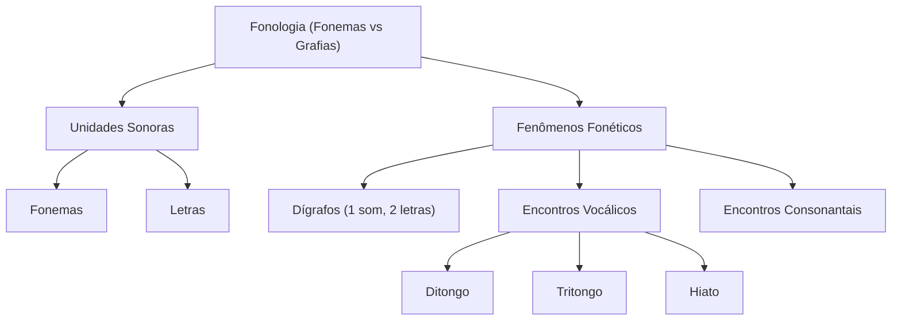

# 🎓 AcademiaIA - Aula Diária de Estudos
**Objetivo Geral:** Passar no cargo de Analista de Desenvolvimento de Sistemas no concurso da FUNDATEC
**Plano do Dia:** Dominar a Fonologia: diferenciação entre fonemas e letras, e relações entre vogais e consoantes conforme a gramática normativa.
**Tema:** Fonologia: Relações entre Fonemas e Grafias

---

## 📅 Roteiro de Estudos Planejado pelo Diretor
* **Data:** 2026-07-22
* **Tópicos a Estudar:**
    - Fonologia: relações entre fonemas e grafias; relações entre vogais e consoantes (Bechara, Cegalla, Cunha & Cintra)
* **Justificativa da Escolha:**
  O aluno selecionou obrigatoriamente a matéria 'Português' e o tópico 'Fonologia', que consta como o primeiro item pendente do edital. Como não há histórico de erros em Português no momento, a prioridade é construir uma base sólida na introdução da disciplina.
* **Professor Responsável:** Professor de Português

---

## 🔍 Análise Estratégica da Banca (FUNDATEC)
* **Recorrência do Assunto:** `Alta`
* **Foco da Banca nas Provas:**
  A FUNDATEC possui um perfil técnico e tradicional. Em questões de fonologia, a banca ignora interpretações subjetivas e exige o conhecimento estrito da gramática normativa de autores como Bechara e Cegalla. O foco principal recai sobre a contagem de fonemas (ex: dígrafos consonantais versus encontros consonantais), a distinção entre som e letra (especialmente o valor fonético de letras como 'x', 'h', 'g', 'j') e a acentuação gráfica vinculada à divisão silábica.
* **Pegadinhas Clássicas Mapeadas:**
    - Armadilha 1: Contagem de fonemas em palavras com dígrafos 'qu' e 'gu'. A banca frequentemente induz ao erro ao incluir palavras onde o 'u' é pronunciado, fazendo com que o candidato conte erroneamente como um dígrafo.
  - Armadilha 2: Confusão entre dígrafo e encontro consonantal. A FUNDATEC utiliza palavras com 'sc', 'sç' ou 'xc' para testar se o candidato identifica que formam um único fonema, contrastando com encontros onde todas as letras são pronunciadas.
  - Armadilha 3: O valor fonético da letra 'X'. A banca adora cobrar palavras em que o 'x' possui som de /z/, /s/, /ks/ ou /ʃ/, exigindo atenção do candidato na transcrição fonética mental.
* **Atualizações Importantes:**
  Embora a Fonologia seja um campo da linguística de base estável, a referência técnica obrigatória permanece o Novo Acordo Ortográfico da Língua Portuguesa. A FUNDATEC exige pleno domínio das alterações na acentuação de ditongos abertos (éi, ói, éu) e da eliminação do trema, sendo que a manutenção da grafia correta pós-acordo é pré-requisito para o acerto em questões que envolvem fonemas.

---

### 📝 Questões Reais de Concursos Anteriores (Referência)

#### Questão de Referência 1 (2023 | Prefeitura de Esteio | Analista de Processos)
Sobre a palavra 'EXCEÇÃO', assinale a alternativa que apresenta, correta e respectivamente, o número de letras e o número de fonemas.

* **Gabarito Oficial:** **Opção (C)**


---
#### Questão de Referência 2 (2022 | Câmara Municipal de Novo Hamburgo | Analista Legislativo)
Na palavra 'GUERRA', o número de fonemas é: A) 6, B) 5, C) 4, D) 3, E) 2.

* **Gabarito Oficial:** **Opção (C)**


---

## 📚 Conteúdo Expositivo da Aula: Fonologia: Relações entre Fonemas e Grafias

### 🎯 Objetivos de Aprendizagem
* **Diferenciar fonemas (unidade sonora) de letras (unidade gráfica).**
* **Dominar a contagem correta de fonemas em palavras com dígrafos e encontros consonantais.**
* **Classificar corretamente os encontros vocálicos (ditongo, tritongo, hiato).**
* **Identificar os valores fonéticos das letras polifônicas (especialmente o 'x').**
* **Aplicar as normas da gramática normativa (Bechara, Cegalla, Cunha & Cintra) no contexto da banca FUNDATEC.**

### 📝 Teoria Detalhada
## 1. Introdução e a 'Analogia de Ouro' (Para Iniciantes)
A fonologia estuda o som das palavras. Para entender a diferença entre fonema e letra, pense na 'Cozinha de um Restaurante'. O fonema é o 'sabor' real da comida (o que você sente ao comer), enquanto a letra é o 'nome' do prato escrito no cardápio. Às vezes, o cardápio (grafia) pode ser confuso: você lê 'churrasco' (letras), mas o sabor (fonema) é uma mistura única de temperos. Diferente de outras línguas, no português a relação nem sempre é 1 para 1. O fonema é a unidade mínima capaz de distinguir significados, como em 'pato' e 'bato' (a troca de 'p' por 'b' altera o significado).

## 2. Nivelamento e Conceituação Progressiva
*   **Letra:** É o sinal gráfico (o desenho). É o que escrevemos no papel.
*   **Fonema:** É a unidade sonora mínima. É o som que produzimos.
*   **Dígrafo:** Ocorre quando duas letras representam um único fonema (som). Exemplo: 'Chave' tem 5 letras, mas o 'ch' produz um único som (/ʃ/). Logo, temos 4 fonemas.
*   **Encontro Consonantal:** Ocorre quando duas consoantes estão juntas, mas ambas são pronunciadas. Exemplo: 'Prato' (/p/ /r/ /a/ /t/ /o/).

## 3. Aprofuntamento Teórico Avançado (Foco em Concursos)
A teoria de Bechara e Cegalla enfatiza que o fonema não tem existência física isolada, mas funcional. O Novo Acordo Ortográfico consolidou a ortografia, mas a fonologia permaneceu estruturalmente a mesma. 

*   **Dígrafos:** Atenção máxima! Dividem-se em consonantais (ch, lh, nh, rr, ss, sc, sç, xc, qu, gu - quando não se pronuncia o 'u') e vocálicos (am, an, em, en, im, in, om, on, um, un - quando seguidos de consoante ou em final de palavra, representando sons nasais).
*   **A Pegadinha do 'QU' e 'GU':** Para ser dígrafo, o 'u' não pode ser pronunciado. Em 'Quilo', o 'u' é mudo (dígrafo). Em 'Quanto', o 'u' é pronunciado (não é dígrafo, é encontro vocálico).
*   **Valor fonético do X:** O 'x' é um camaleão. Pode soar como /ʃ/ (ex: xícara), /z/ (ex: exame), /s/ (ex: auxílio) ou /ks/ (ex: táxi).

## 4. Quadro Comparativo Visual
| Conceito | Definição | Exemplo | Contagem | 
| :--- | :--- | :--- | :--- |
| Dígrafo | 2 letras, 1 som | Passo | P-A-SS-O (4 letras, 3 fonemas) |
| Encontro Consonantal | 2 letras, 2 sons | Prato | P-R-A-T-O (5 letras, 5 fonemas) |
| Ditongo | Vogal + Semivogal | Pai | P-AI (3 letras, 3 fonemas) |
| Hiato | Vogal + Vogal (sílabas distintas) | Saída | S-A-I-D-A (5 letras, 5 fonemas) |

## 5. Mnemônicos e Técnicas de Memorização
Para lembrar os fonemas nasais, use: 'NEM AMAR O UM'. (Tudo que termina com 'm' ou 'n' antes de consoante gera um som nasal/dígrafo vocálico). 

## 6. Radar de Pegadinhas (Foco na Banca FUNDATEC)
1. **A 'Armadilha do QU/GU':** A FUNDATEC adora colocar a palavra 'aguentar'. Muitos contam como dígrafo, mas o 'u' é pronunciado (trema ou não, ele soa). Portanto, é encontro vocálico, não dígrafo.
2. **A 'Armadilha do Dígrafo Oculto':** Palavras com 'xc' (ex: exceção). O 'xc' funciona como dígrafo consonantal. Não se pronuncia o 'x' e o 'c' separadamente, apenas um som de /s/.
3. **Valor do X:** A banca costuma pedir a transcrição fonética. Estude 'exame' (som de /z/) versus 'excesso' (som de /s/).

## 7. Perguntas de Auto-Verificação
1. O que define um dígrafo? R: Duas letras que representam um único som.
2. A palavra 'guarda' possui dígrafo? R: Não, pois o 'u' é pronunciado.
3. Quantos fonemas tem 'táxi'? R: 5 fonemas (/t/ /a/ /k/ /s/ /i/), pois o 'x' tem som de 'ks'.

### 💡 Exemplos Práticos

#### Exemplo 1: Análise da palavra 'Exceção'
* **Descrição:** Demonstração de como identificar dígrafos consonantais e vocálicos.
* **Especificação Técnica:**
```sql
Palavra: Exceção | Letras: E-X-C-E-Ç-Ã-O (7 letras) | Fonemas: E-S-E-S-Ã-O (6 fonemas) | Observação: 'XC' = Dígrafo (som de /s/), 'Ç' = fonema /s/, 'ÃO' = dígrafo vocálico.
```


### 📌 Resumo de Fixação
Fonema é a unidade sonora (som); Letra é a unidade gráfica (sinal).,Dígrafos diminuem a contagem de fonemas em relação às letras.,Encontros consonantais mantêm a contagem de fonemas (todas as letras soam).,Ditongo (vogal+semivogal na mesma sílaba), Tritongo (semivogal+vogal+semivogal), Hiato (vogais em sílabas distintas).,O 'x' possui quatro sons principais: /ʃ/, /z/, /s/, /ks/.,Gramáticos como Bechara reforçam a importância de separar sílabas para identificar hiatos corretamente.

---

## 🧠 Mapa Mental (Visualização Gráfica)


---

## 🗂️ Flashcards (Fixação Ativa)
| ❓ Pergunta | 💡 Resposta |
|---|---|
| **Qual a diferença entre dígrafo e encontro consonantal?** | No dígrafo, duas letras produzem um som só. No encontro consonantal, duas letras produzem dois sons distintos. |
| **A palavra 'queijo' possui dígrafo?** | Sim, o 'qu' forma dígrafo porque o 'u' não é pronunciado. |
| **Como se define foneticamente o dígrafo vocálico?** | Pelo som nasal produzido por vogal seguida de 'm' ou 'n' em final de sílaba. |

---

## 📝 Simulado de Fixação (Criador de Exercícios)

### ❓ Caderno de Questões

#### Questão 1
* **Dificuldade:** `Fácil` | **Edital:** *Fonologia: relações entre fonemas e grafias*

A contagem de fonemas em uma palavra exige a distinção rigorosa entre grafemas (letras) e fonemas (sons). Assinale a alternativa em que a palavra apresenta o mesmo número de letras e fonemas.

  - **(A)** Chave
  - **(B)** Fixo
  - **(C)** Guerra
  - **(D)** Perto
  - **(E)** Homicídio


---
#### Questão 2
* **Dificuldade:** `Médio` | **Edital:** *Encontros vocálicos: ditongo, tritongo e hiato*

Sobre a classificação dos encontros vocálicos, assinale a alternativa que contém, respectivamente, um ditongo e um hiato.

  - **(A)** Saúde e Poeta
  - **(B)** Pai e Ruim
  - **(C)** Mãe e Rainha
  - **(D)** História e Paraguai
  - **(E)** Pão e Magoa


---
#### Questão 3
* **Dificuldade:** `Difícil` | **Edital:** *Dígrafos consonantais*

Na palavra 'quilo', ocorre um dígrafo. Assinale a alternativa em que, diferentemente de 'quilo', o 'u' é pronunciado e NÃO forma dígrafo.

  - **(A)** Queijo
  - **(B)** Quase
  - **(C)** Quitar
  - **(D)** Frequência
  - **(E)** Equipe


---
#### Questão 4
* **Dificuldade:** `Médio` | **Edital:** *Valor fonético das letras*

A letra 'X' pode representar diferentes fonemas na língua portuguesa. Em qual das palavras abaixo o 'x' possui som de /z/?

  - **(A)** Exame
  - **(B)** Próximo
  - **(C)** Explicar
  - **(D)** Auxílio
  - **(E)** Xícara


---
#### Questão 5
* **Dificuldade:** `Difícil` | **Edital:** *Fonemas e grafemas*

Considere as palavras: 'escola', 'nascemos' e 'exceto'. Quantos fonemas cada uma possui, respectivamente?

  - **(A)** 6, 8, 6
  - **(B)** 6, 7, 6
  - **(C)** 5, 7, 5
  - **(D)** 6, 7, 5
  - **(E)** 5, 8, 6


---
#### Questão 6
* **Dificuldade:** `Fácil` | **Edital:** *Encontros vocálicos*

Assinale a alternativa que apresenta um tritongo.

  - **(A)** Saguão
  - **(B)** História
  - **(C)** Jóia
  - **(D)** Saída
  - **(E)** Pai


---
#### Questão 7
* **Dificuldade:** `Médio` | **Edital:** *Encontro consonantal*

Dentre as palavras abaixo, assinale aquela que apresenta um encontro consonantal inseparável.

  - **(A)** Porta
  - **(B)** Advogado
  - **(C)** Braço
  - **(D)** Ritmo
  - **(E)** Apto


---
#### Questão 8
* **Dificuldade:** `Médio` | **Edital:** *Fonemas e grafemas*

Sobre a palavra 'homicídio', é correto afirmar que:

  - **(A)** Possui 9 fonemas.
  - **(B)** A letra 'h' representa um fonema aspirado.
  - **(C)** Possui 8 letras e 8 fonemas.
  - **(D)** O 'h' não é fonema, restando 8 fonemas.
  - **(E)** A palavra contém um dígrafo consonantal.


---
#### Questão 9
* **Dificuldade:** `Difícil` | **Edital:** *Dígrafos vs Encontros Consonantais*

Assinale a alternativa em que a palavra apresenta um dígrafo e um encontro consonantal.

  - **(A)** Chave
  - **(B)** Passarinho
  - **(C)** Crescente
  - **(D)** Guerra
  - **(E)** Toco


---
#### Questão 10
* **Dificuldade:** `Difícil` | **Edital:** *Vogais e semivogais*

A respeito das vogais e semivogais, analise: em qual das palavras o 'i' é classificado como semivogal?

  - **(A)** Ímã
  - **(B)** País
  - **(C)** História
  - **(D)** Dito
  - **(E)** Saída


---

### 🔑 Gabarito e Resoluções Comentadas

#### Questão 1
* **Gabarito:** **Opção (D)**
* **Resolução e Comentário:**
  A palavra 'perto' possui 5 letras (p-e-r-t-o) e 5 fonemas /p/ /e/ /r/ /t/ /o/. A alternativa A possui o dígrafo 'ch', reduzindo a contagem. B possui o 'x' com som de /ks/, gerando 5 fonemas. C possui os dígrafos 'gu' e 'rr'. E possui o 'h' que não é fonema, além do dígrafo 'ch'.


---
#### Questão 2
* **Gabarito:** **Opção (C)**
* **Resolução e Comentário:**
  Em 'mãe', temos um ditongo decrescente (vogal + semivogal). Em 'rainha', a separação silábica ra-i-nha coloca o 'a' e o 'i' em sílabas diferentes, configurando um hiato. As outras alternativas apresentam erros de classificação conforme a gramática de Bechara.


---
#### Questão 3
* **Gabarito:** **Opção (B)**
* **Resolução e Comentário:**
  O dígrafo ocorre quando duas letras representam um único fonema. Em 'quase', o 'u' é pronunciado claramente, logo é um encontro vocálico (ditongo), não um dígrafo. Nas demais opções (A, C, D, E), o 'u' não é pronunciado, caracterizando dígrafo com o 'q'.


---
#### Questão 4
* **Gabarito:** **Opção (A)**
* **Resolução e Comentário:**
  Em 'exame', o 'x' assume o fonema /z/. Em 'próximo', tem som de /s/; em 'explicar', som de /ks/; em 'auxílio', som de /s/; e em 'xícara', som de /ʃ/ (chiado).


---
#### Questão 5
* **Gabarito:** **Opção (B)**
* **Resolução e Comentário:**
  Escola: 6 letras, 6 fonemas. Nascemos: 8 letras, 7 fonemas (dígrafo 'sc'). Exceto: 6 letras, 6 fonemas ('xc' representa o dígrafo /ks/). A contagem correta é 6, 7 e 6.


---
#### Questão 6
* **Gabarito:** **Opção (A)**
* **Resolução e Comentário:**
  Tritongo é o encontro de semivogal + vogal + semivogal na mesma sílaba. Em 'sa-guão', o 'uão' cumpre essa regra. História é ditongo; Jóia é hiato; Saída é hiato; Pai é ditongo.


---
#### Questão 7
* **Gabarito:** **Opção (C)**
* **Resolução e Comentário:**
  O encontro consonantal inseparável (geralmente consoante + 'l' ou 'r') ocorre na mesma sílaba, como em 'bra-ço'. Porta (por-ta), Advogado (ad-vo-ga-do), Ritmo (rit-mo) e Apto (ap-to) possuem encontros separáveis em sílabas distintas.


---
#### Questão 8
* **Gabarito:** **Opção (D)**
* **Resolução e Comentário:**
  A palavra tem 9 letras. O 'h' inicial é átono e não possui valor fonético (não é fonema). Portanto, 9 letras - 1 letra sem som = 8 fonemas. A opção D descreve corretamente a relação fonológica.


---
#### Questão 9
* **Gabarito:** **Opção (C)**
* **Resolução e Comentário:**
  Em 'crescente', temos o encontro 'cr' (encontro consonantal) e o dígrafo 'sc' (som de /s/). 'Chave' e 'guerra' possuem apenas dígrafos. 'Passarinho' possui apenas dígrafos. 'Toco' não possui nenhum dos dois.


---
#### Questão 10
* **Gabarito:** **Opção (C)**
* **Resolução e Comentário:**
  Semivogal é o som vocálico mais fraco em um ditongo. Em 'História' (his-tó-ria), o 'i' final é um som fraco de /j/ junto ao 'a', configurando semivogal. Nas outras opções, 'i' é a base da sílaba (vogal) ou faz parte de hiato (vogal).

