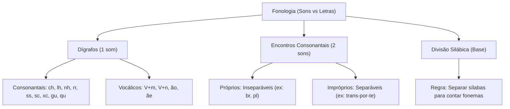

# 🎓 AcademiaIA - Aula Diária de Estudos
**Objetivo Geral:** Passar no cargo de Analista de Desenvolvimento de Sistemas no concurso da FUNDATEC
**Plano do Dia:** Dominar a relação entre fonemas e grafias, focando em dígrafos, encontros consonantais e divisão silábica para a banca FUNDATEC.
**Tema:** Fonologia: relações entre fonemas e grafias

---

## 📅 Roteiro de Estudos Planejado pelo Diretor
* **Data:** 2026-07-23
* **Tópicos a Estudar:**
    - Fonologia: relações entre fonemas e grafias; relações entre vogais e consoantes (Bechara, Cegalla, Cunha & Cintra)
* **Justificativa da Escolha:**
  O tópico é mandatório conforme solicitação do aluno e essencial dada a recorrência de erros no histórico de simulados e dúvidas persistentes registradas no chat, indicando uma lacuna crítica na compreensão dos fenômenos fonológicos que a banca FUNDATEC explora frequentemente.
* **Professor Responsável:** Professor de Português

---

## 🔍 Análise Estratégica da Banca (FUNDATEC)
* **Recorrência do Assunto:** `Alta`
* **Foco da Banca nas Provas:**
  A FUNDATEC possui um perfil técnico e tradicionalista, alinhado aos gramáticos normativos citados. A banca exige distinção clara entre letras (grafemas) e sons (fonemas), com foco frequente na contagem de fonemas em palavras com dígrafos e encontros consonantais. É comum a cobrança de classificação de vogais, semivogais e encontros vocálicos (ditongos, tritongos e hiatos), exigindo que o candidato identifique a estrutura silábica correta.
* **Pegadinhas Clássicas Mapeadas:**
    - Armadilha 1: Confusão entre dígrafo e encontro consonantal. A banca costuma colocar palavras com 'nh', 'ch', 'lh' ou 'ss' para testar se o candidato entende que, apesar de duas letras, há apenas um som.
  - Armadilha 2: Contagem de fonemas em letras como 'X' (que pode ter som de 'cs', 'z', 's' ou 'ch') ou a letra 'H' inicial (que não possui valor fonético, não sendo contada como fonema).
  - Armadilha 3: Identificação de semivogais em ditongos crescentes e decrescentes, onde a banca altera a posição para induzir erro na classificação.
* **Atualizações Importantes:**
  Não há atualizações legislativas, porém, mantém-se a vigência plena do Acordo Ortográfico de 1990. O foco técnico reside na observação da pronúncia padrão (norma culta), sendo que a banca ignora variações dialetais regionais, exigindo o rigor da fonética teórica descrita nos manuais de Bechara e Cegalla.

---

### 📝 Questões Reais de Concursos Anteriores (Referência)

#### Questão de Referência 1 (2023 | Prefeitura de Bagé | Professor)
Sobre a palavra 'churrasco', analise as assertivas abaixo: I. Possui 9 letras e 7 fonemas. II. Apresenta dois dígrafos consonantais. III. O encontro 'ch' representa um único fonema. Quais estão corretas?

* **Gabarito Oficial:** **Opção (Todas estão corretas)**


---
#### Questão de Referência 2 (2022 | Prefeitura de São Leopoldo | Assistente Administrativo)
Assinale a alternativa em que a palavra apresenta um hiato.

* **Gabarito Oficial:** **Opção (Saída)**


---

## 📚 Conteúdo Expositivo da Aula: Fonologia: relações entre fonemas e grafias

### 🎯 Objetivos de Aprendizagem
* **Distinguir com precisão fonemas de grafemas (letras).**
* **Dominar a divisão silábica como base fundamental para a análise fonológica.**
* **Identificar dígrafos (consonantais e vocálicos) e encontros consonantais.**
* **Classificar corretamente vogais, semivogais e encontros vocálicos.**
* **Aplicar as regras da banca FUNDATEC em casos críticos como X (valor de /ks/), XC e grupos como NS.**

### 📝 Teoria Detalhada
## 1. Introdução e a 'Analogia de Ouro' (Para Iniciantes)
A fonologia é o estudo dos sons (fonemas) da língua, enquanto a ortografia é o estudo da escrita (grafemas). Imagine que uma palavra é uma **Orquestra**. As letras são as **partituras** (o que está no papel), e os fonemas são o **som** que sai dos instrumentos. Às vezes, dois músicos (duas letras) tocam uma nota só (dígrafo); às vezes, um instrumento complexo produz dois sons diferentes de uma vez (como o X em 'táxi'). A regra de ouro é: nunca analise o som da partitura olhando apenas o papel; você deve ouvir a música. Se você pular a etapa da divisão silábica, você estará 'tocando fora do tempo'.

## 2. Nivelamento e Conceituação Progressiva (Do Básico ao Avançado)
- **Fonema:** Unidade mínima de som que distingue significados (ex: /p/ em pato vs /m/ em mato).
- **Grafema:** A letra propriamente dita.
- **Dígrafo:** Duas letras representando um único fonema (ch, lh, nh, rr, ss, sc, sç, xc, gu, qu). Atenção: 'gu' e 'qu' só são dígrafos se seguidos de 'e' ou 'i' e o 'u' não for pronunciado.
- **Encontro Consonantal:** Duas consoantes juntas, cada uma com seu próprio som (ex: bl, cr, pr, tr). Divide-se em: *próprio* (na mesma sílaba, ex: 'bloco') e *impróprio* (sílabas distintas, ex: 'trans-por-te').
- **Vogal vs. Semivogal:** A vogal é o núcleo da sílaba (som forte). A semivogal (i, u) é um som fraco que se apoia na vogal.

## 3. Aprofundamento Teórico Avançado (Foco em Concursos)
A FUNDATEC exige rigor. O 'H' inicial não é fonema (ex: 'hoje' tem 4 letras, mas 3 fonemas). O 'XC' em 'exceção' é um dígrafo, pois o 'x' e o 'c' se fundem para criar o som de /s/. O 'NS' em 'transporte' não é encontro consonantal clássico: o 'n' é apenas sinal de nasalidade (dígrafo vocálico), e o 's' fecha a sílaba. Para a banca, a divisão silábica é o filtro: 'trans-por-te'. Note que o encontro de letras na grafia não garante o encontro de sons na fala.

## 4. Quadro Comparativo Visual
| Conceito | Estrutura | Som | Exemplo |
| :--- | :--- | :--- | :--- |
| Dígrafo | Duas letras | Um som | Chave (ch = /x/) |
| Encontro Consonantal | Duas letras | Dois sons | Prato (pr = /p/+/r/) |
| Dígrafo Vocálico | Vogal + M/N | Som nasal | Campo (am = /ã/) |
| Hiato | Duas vogais | Duas sílabas | Saída (a-i) |

## 5. Mnemônicos e Técnicas de Memorização
Para não esquecer: **'Dígrafos são Camaleões'**: Eles se disfarçam de duas letras para parecerem mais fortes, mas na verdade são apenas um som. Use o 'Teste do Risco': Se você riscar uma das letras e o som da palavra mudar completamente ou deixar de existir, provavelmente é um dígrafo.

## 6. Radar de Pegadinhas (Foco na Banca FUNDATEC)
1. **A Armadilha do X:** O X pode ser /s/ (ex: auxílio), /z/ (ex: exame), /ks/ (ex: táxi) ou /ch/ (ex: xícara). Nunca ignore a transcrição fonética.
2. **A Armadilha do H:** O 'H' em 'chave' é parte do dígrafo. O 'H' inicial é sempre ignorado na contagem de fonemas.
3. **A Armadilha do GU/QU:** Apenas são dígrafos se não soarem. Em 'quase', o 'u' soa (não é dígrafo). Em 'queijo', o 'u' não soa (é dígrafo).

## 7. Perguntas de Auto-Verificação (Recall Ativo)
1. Qual a diferença fundamental entre dígrafo e encontro consonantal? (R: O dígrafo possui 2 letras/1 som; o encontro consonantal possui 2 letras/2 sons).
2. Por que o H inicial não é contado? (R: Porque o fonema é uma unidade de som, e o H em posição inicial não emite som algum na norma culta).
3. Qual a regra de ouro para a divisão silábica? (R: Separar sílabas antes de analisar fonemas para identificar corretamente o que está na mesma sílaba e o que está separado).

### 💡 Exemplos Práticos

#### Exemplo 1: Análise fonética da palavra EXCEÇÃO
* **Descrição:** Demonstração de como dígrafos alteram a contagem final de fonemas.
* **Especificação Técnica:**
```sql
Divisão silábica: EX-CE-ÇÃO. Letras: 7. Fonemas: 6. /e/ /s/ /e/ /s/ /ã/ /o/. O 'XC' vira um som /s/. O 'CE' vira outro som /s/. O 'ÃO' é um dígrafo vocálico.
```


#### Exemplo 2: Teste de fonemas em TÁXI
* **Descrição:** Ocorrência do X com valor fonético expandido.
* **Especificação Técnica:**
```sql
T-Á-X-I (4 letras). Fonemas: T /t/, Á /a/, X /k/+/s/, I /i/. Total = 5 fonemas.
```


### 📌 Resumo de Fixação
• Fonema é som, letra é grafema. Nem sempre o número de letras coincide com o de fonemas.
• Dígrafos (ch, lh, nh, rr, ss, sc, xc, gu/qu) reduzem o número de fonemas em relação às letras.
• O X com valor de /ks/ (táxi) aumenta o número de fonemas, agindo como um fonema complexo.
• Vogais são o núcleo da sílaba. A semivogal (i, u) é foneticamente fraca e nunca forma sílaba sozinha.
• A divisão silábica correta é a única forma de garantir a classificação de encontros consonantais e hiatos.

---

## 🧠 Mapa Mental (Visualização Gráfica)


---

## 🗂️ Flashcards (Fixação Ativa)
| ❓ Pergunta | 💡 Resposta |
|---|---|
| **O que é um dígrafo?** | Duas letras que representam um único fonema (som). |
| **Como identificar uma semivogal?** | É o som fraco (i, u) que se apoia em uma vogal forte na mesma sílaba. |
| **Por que o número de fonemas em 'táxi' é maior que o de letras?** | Porque a letra 'X' representa dois fonemas distintos: /k/ e /s/. |
| **O 'H' inicial é contado como fonema?** | Não, pois não possui valor fonético na norma culta. |

---

## 📝 Simulado de Fixação (Criador de Exercícios)

### ❓ Caderno de Questões

#### Questão 1
* **Dificuldade:** `Difícil` | **Edital:** *Fonologia: relações entre fonemas e grafias*

A palavra 'EXCEÇÃO' apresenta uma estrutura complexa para a contagem fonética. Considerando a norma culta e a fonética normativa, assinale a alternativa que indica corretamente o número de fonemas desta palavra.

  - **(A)** 7 fonemas
  - **(B)** 6 fonemas
  - **(C)** 5 fonemas
  - **(D)** 8 fonemas
  - **(E)** 4 fonemas


---
#### Questão 2
* **Dificuldade:** `Médio` | **Edital:** *Fonologia: divisão silábica e encontros consonantais*

Sobre a palavra 'TRANSPORTE', analise a divisão silábica e a natureza dos encontros consonantais. Qual das afirmativas abaixo é correta?

  - **(A)** Possui um encontro consonantal inseparável em 'NS'.
  - **(B)** O 'TR' é um encontro consonantal separável.
  - **(C)** Possui encontros consonantais separáveis em 'NS', 'SP' e 'RT'.
  - **(D)** O 'S' em 'TRANS' é um fonema que não conta para o total da palavra.
  - **(E)** Não há encontros consonantais na palavra.


---
#### Questão 3
* **Dificuldade:** `Fácil` | **Edital:** *Fonologia: relações entre fonemas e grafias*

A letra 'X' pode assumir diversos valores fonéticos. Assinale a alternativa em que o 'X' possui o mesmo valor fonético (/ks/) que em 'TÁXI'.

  - **(A)** Exame
  - **(B)** Xícara
  - **(C)** Auxílio
  - **(D)** Fixo
  - **(E)** Exagerado


---
#### Questão 4
* **Dificuldade:** `Médio` | **Edital:** *Fonologia: dígrafos e encontros consonantais*

Identifique a alternativa em que todas as palavras contêm dígrafos consonantais.

  - **(A)** Crescente, chave, carro
  - **(B)** Prato, braço, plano
  - **(C)** Clima, treino, bloco
  - **(D)** Livro, gnomo, tarde
  - **(E)** Pneu, ato, rua


---
#### Questão 5
* **Dificuldade:** `Médio` | **Edital:** *Fonologia: vogais e semivogais*

Em qual das palavras abaixo o 'i' deve ser classificado como semivogal?

  - **(A)** Saída
  - **(B)** História
  - **(C)** País
  - **(D)** Frio
  - **(E)** Vazio


---
#### Questão 6
* **Dificuldade:** `Difícil` | **Edital:** *Fonologia: dígrafos (QU/GU)*

Sobre o dígrafo 'QU', assinale a alternativa correta quanto à sua ocorrência.

  - **(A)** Em 'aquático', o 'qu' não é dígrafo.
  - **(B)** Em 'queijo', o 'u' é pronunciado.
  - **(C)** Em 'quilo', o 'u' é vogal.
  - **(D)** Em 'qualidade', o 'qu' é dígrafo.
  - **(E)** Em todas as palavras citadas, o 'qu' é dígrafo.


---
#### Questão 7
* **Dificuldade:** `Médio` | **Edital:** *Fonologia: dígrafos*

Analise a palavra 'GUERRA'. Assinale a alternativa que apresenta o número correto de fonemas.

  - **(A)** 6 fonemas
  - **(B)** 5 fonemas
  - **(C)** 4 fonemas
  - **(D)** 7 fonemas
  - **(E)** 3 fonemas


---
#### Questão 8
* **Dificuldade:** `Difícil` | **Edital:** *Fonologia: encontros consonantais*

Em 'PNEU', ocorre um encontro de consoantes. Como ele é classificado fonologicamente?

  - **(A)** Encontro consonantal inseparável.
  - **(B)** Dígrafo vocálico.
  - **(C)** Dígrafo consonantal.
  - **(D)** Não é considerado encontro consonantal, pois o P é mudo.
  - **(E)** Ditongo decrescente.


---
#### Questão 9
* **Dificuldade:** `Fácil` | **Edital:** *Fonologia: dígrafos vocálicos*

Qual das palavras abaixo apresenta um dígrafo vocálico?

  - **(A)** Casa
  - **(B)** Lâmpada
  - **(C)** Rato
  - **(D)** Mato
  - **(E)** Pata


---
#### Questão 10
* **Dificuldade:** `Médio` | **Edital:** *Fonologia: relações entre fonemas e grafias*

Sobre a contagem de fonemas em 'EXAME', assinale a alternativa correta.

  - **(A)** 5 fonemas
  - **(B)** 4 fonemas
  - **(C)** 6 fonemas
  - **(D)** 3 fonemas
  - **(E)** 2 fonemas


---

### 🔑 Gabarito e Resoluções Comentadas

#### Questão 1
* **Gabarito:** **Opção (B)**
* **Resolução e Comentário:**
  Na palavra 'EXCEÇÃO', temos 7 letras. Contudo, o 'XC' forma um dígrafo com som de /s/, e o 'Ç' tem som de /s/. O 'ÃO' é um dígrafo vocálico onde o 'Ã' é a base fonética e o 'O' (neste contexto) atua como semivogal nasal. A transcrição fonética é /e-s-e-s-ã-w/. Portanto, temos 6 fonemas (e, s, e, s, ã, w).


---
#### Questão 2
* **Gabarito:** **Opção (C)**
* **Resolução e Comentário:**
  A divisão correta é TRANS-POR-TE. O 'TR' (inseparável) forma encontro consonantal. O 'NS', 'SP' e 'RT' são encontros consonantais separáveis, pois, na divisão silábica, as consoantes ficam em sílabas distintas, exigindo articulação separada de cada fonema.


---
#### Questão 3
* **Gabarito:** **Opção (D)**
* **Resolução e Comentário:**
  Em 'TÁXI', o X soa como /ks/. Em 'FIXO', o X também soa como /ks/. Nas outras opções: 'Exame' e 'Exagerado' o X tem som de /z/; 'Xícara' tem som de /ch/; 'Auxílio' tem som de /s/.


---
#### Questão 4
* **Gabarito:** **Opção (A)**
* **Resolução e Comentário:**
  Em 'Crescente' (SC), 'Chave' (CH) e 'Carro' (RR), temos dígrafos. As alternativas B e C apresentam apenas encontros consonantais (onde duas consoantes soam distintamente).


---
#### Questão 5
* **Gabarito:** **Opção (B)**
* **Resolução e Comentário:**
  Na palavra 'história' (his-tó-ria), o 'i' compõe um ditongo crescente com o 'a' final, sendo o elemento fraco (semivogal). Nas demais (Saída, País, Frio, Vazio), o 'i' forma hiato, estando isolado na sílaba, o que o torna a vogal daquela sílaba.


---
#### Questão 6
* **Gabarito:** **Opção (A)**
* **Resolução e Comentário:**
  O 'qu' é dígrafo apenas quando o 'u' não é pronunciado (como em 'queijo' e 'quilo'). Em 'aquático', o 'u' é pronunciado (fonema /w/), logo trata-se de um ditongo, não de dígrafo.


---
#### Questão 7
* **Gabarito:** **Opção (C)**
* **Resolução e Comentário:**
  Em 'GUERRA', o 'GU' é dígrafo (som de /g/) e 'RR' é dígrafo (som de /r/ forte). Portanto: G-E-R-A. Total: 4 fonemas.


---
#### Questão 8
* **Gabarito:** **Opção (D)**
* **Resolução e Comentário:**
  Tecnicamente, para ser encontro consonantal, ambas as consoantes devem ser pronunciadas. Em 'pneu', o 'p' é praticamente mudo na pronúncia culta, não formando um encontro consonantal típico de duas consoantes audíveis.


---
#### Questão 9
* **Gabarito:** **Opção (B)**
* **Resolução e Comentário:**
  Dígrafos vocálicos ocorrem quando uma vogal é seguida de 'm' ou 'n' na mesma sílaba, indicando nasalização. Em 'Lâmpada', o 'âm' forma um dígrafo vocálico.


---
#### Questão 10
* **Gabarito:** **Opção (A)**
* **Resolução e Comentário:**
  A palavra 'EXAME' possui 5 letras. O 'X' tem som de /z/. A transcrição fonética é /e-z-a-m-e/. Portanto, há 5 fonemas.

