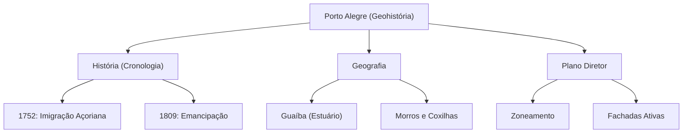

# 🎓 AcademiaIA - Aula Diária de Estudos
**Objetivo Geral:** Passar no cargo de Analista de Desenvolvimento de Sistemas no concurso da FUNDATEC
**Plano do Dia:** Estudar a história e geografia do Município e da região para consolidar o conhecimento da disciplina de Conhecimentos Gerais.
**Tema:** História e Geografia de Porto Alegre e Região Metropolitana

---

## 📅 Roteiro de Estudos Planejado pelo Diretor
* **Data:** 2026-07-28
* **Tópicos a Estudar:**
    - História e geografia do Município e da região que o cerca
* **Justificativa da Escolha:**
  O aluno solicitou especificamente estudar 'Conhecimentos Gerais' e o tópico 'História e geografia do Município e da região que o cerca', conforme sua diretriz obrigatória de foco no edital para o cargo de Analista de Desenvolvimento de Sistemas.
* **Professor Responsável:** Professor de Conhecimentos Gerais

---

## 🔍 Análise Estratégica da Banca (FUNDATEC)
* **Recorrência do Assunto:** `Alta`
* **Foco da Banca nas Provas:**
  A FUNDATEC possui um perfil extremamente regionalista. Em provas municipais, a banca foca na literalidade de leis orgânicas, datas de fundação, nomes de personalidades históricas que nomeiam logradouros, e a composição geográfica (limites territoriais, relevo, hidrografia e clima). Exige memorização de fatos específicos contidos em cartilhas oficiais das prefeituras.
* **Pegadinhas Clássicas Mapeadas:**
    - Troca de datas históricas: A banca altera pequenas datas (aniversário do município ou data de emancipação) para confundir o candidato que estudou superficialmente.
  - Confusão de limites territoriais: A banca costuma listar municípios vizinhos que não fazem divisa real com a cidade objeto da prova, ou trocar o ponto cardeal (ex: afirmar que o rio X limita o norte, quando na verdade limita o sul).
  - Associação errada de personalidades: Criar nomes fictícios ou associar feitos históricos de figuras públicas da região a pessoas erradas.
* **Atualizações Importantes:**
  É crucial verificar a Lei Orgânica do Município mais recente e o Plano Diretor atualizado. Muitos municípios gaúchos revisaram seus planos diretores entre 2022-2024, alterando zoneamento e símbolos municipais. A FUNDATEC cobra o texto vigente na data do edital.

---

### 📝 Questões Reais de Concursos Anteriores (Referência)

#### Questão de Referência 1 (2023 | Prefeitura de Gramado | Agente Administrativo)
Sobre a história e geografia do Município de Gramado, assinale a alternativa correta: A) O Município de Gramado foi emancipado no ano de 1960. B) O relevo do município é predominantemente de planícies aluviais. C) O Município de Gramado limita-se ao norte com o município de Nova Petrópolis. D) O clima de Gramado é classificado como subtropical úmido com verões amenos. E) A principal etnia colonizadora do município foi a espanhola.

* **Gabarito Oficial:** **Opção (D)**


---

## 📚 Conteúdo Expositivo da Aula: História e Geografia de Porto Alegre e Região Metropolitana

### 🎯 Objetivos de Aprendizagem
* **Dominar a linha do tempo histórica, desde o povoamento açoriano até a atualidade metropolitana.**
* **Identificar com precisão os limites territoriais, hidrografia e zonas geográficas da capital gaúcha.**
* **Compreender os pilares do Plano Diretor de Porto Alegre e seu impacto no desenvolvimento urbano.**
* **Memorizar datas, nomes de personalidades e marcos geográficos recorrentes nas provas da FUNDATEC.**

### 📝 Teoria Detalhada
## 1. Introdução e a "Analogia de Ouro"
Entender a história e geografia de um município é como montar um quebra-cabeça de um organismo vivo. A história é a "biografia" (os eventos que moldaram o caráter da cidade) e a geografia é a "anatomia" (o esqueleto de rios, morros e ruas que define o movimento). Imagine a cidade como um grande Condomínio Residencial: O 'Terreno' é a Geografia (onde ele foi construído), as 'Assembleias' são a História (as decisões tomadas ao longo do tempo pelos síndicos/prefeitos) e o 'Regimento Interno' é o Plano Diretor. Se você não sabe onde termina o seu pátio (limites territoriais) ou quem foi o síndico que construiu a piscina (história), você perde o controle sobre a gestão desse espaço.

## 2. Nivelamento e Conceituação Progressiva
Começamos pela fundação: Porto Alegre não nasceu como capital, mas como um ancoradouro. O povoamento açoriano (1752) trouxe a base demográfica. A 'Emancipação' é o ato jurídico que separa a administração do município de uma esfera superior (a Freguesia de São Francisco das Chagas do Porto dos Casais elevou-se a Vila em 1809). A Região Metropolitana é o conceito geográfico de interdependência funcional, onde os municípios satélites (Canoas, Gravataí, Alvorada, etc.) dependem da infraestrutura central, mas possuem autonomia política própria.

## 3. Aprofundamento Teórico Avançado
Porto Alegre possui uma geografia singular: a cidade é um 'istmo' cercado por água (Guaíba) e morros (Escudo Sul-Riograndense). O relevo é composto por coxilhas e morros cristalinos. A hidrografia é centrada no Lago Guaíba, que na verdade é um estuário que recebe o Rio Jacuí. O Plano Diretor (Lei Complementar 434/99, revisada) define o 'Zoneamento'. A FUNDATEC ama cobrar o impacto das 'Fachadas Ativas' (térreos comerciais voltados para a rua), que visam aumentar a segurança e a vitalidade urbana.

## 4. Quadro Comparativo Visual
| Conceito | Definição | Exemplo Prático |
| :--- | :--- | :--- |
| Limite Territorial | Fronteira física entre municípios | Porto Alegre faz divisa com Canoas ao Norte |
| Plano Diretor | Lei que regula o crescimento urbano | Incentivo de ocupação na orla do Guaíba |
| Emancipação | Ato de tornar-se município autônomo | 26 de março de 1809 |

## 5. Mnemônicos e Técnicas de Memorização
Para as datas: '26 de Março de 1809' (A Vila do Porto dos Casais). Use a frase: 'Em 1809, 26 casais no porto emanciparam-se'. Para os vizinhos da zona norte: 'Canoas e Cachoeirinha são os vizinhos da 'CC' que cercam o acesso à capital'.

## 6. Radar de Pegadinhas (FUNDATEC)
A banca costuma afirmar que o Rio Gravataí é o limite OESTE de Porto Alegre (Falso! É a divisa leste/norte). Outra pegadinha clássica: trocar o nome de fundadores. Lembre-se: os casais açorianos são a base, mas o nome 'Porto Alegre' foi oficializado pela elevação da vila.

## 7. Perguntas de Auto-Verificação
1. Qual o marco de emancipação de Porto Alegre? R: 26 de março de 1809.
2. O que é o Guaíba em termos geográficos? R: Um estuário (não é rio, nem lago).
3. Qual a principal característica de uma fachada ativa no Plano Diretor? R: Uso comercial no térreo voltado para o passeio público.

### 💡 Exemplos Práticos

#### Exemplo 1: Exemplo Prático: Deslocamento e Limites
* **Descrição:** Ao dirigir do centro de Porto Alegre em direção ao Aeroporto Salgado Filho (Zona Norte), você trafega pela Avenida Farrapos ou BR-116. Ao cruzar o limite municipal, você entra no município de Canoas, que é o vizinho imediato ao norte.
* **Especificação Técnica:**
```sql
Divisa Norte: Porto Alegre / Canoas (Ponto de transição: Rio Gravataí / Av. Guilherme Schell)
```


#### Exemplo 2: Exemplo Prático: Plano Diretor e Fachadas Ativas
* **Descrição:** O Plano Diretor incentiva a ocupação de 'fachadas ativas' na orla. Isso significa que, ao construir um prédio, o térreo deve ter lojas de frente para a calçada, retirando muros altos para garantir vigilância natural.
* **Especificação Técnica:**
```sql
Zoneamento: Área de Orla; Regra: Permissão de maior índice construtivo em troca de fruição pública no térreo.
```


#### Exemplo 3: Exemplo Prático: Análise da Hidrografia
* **Descrição:** A FUNDATEC pode cobrar a confusão entre rio e estuário. O Guaíba é um sistema onde o Rio Jacuí deságua. O fluxo das águas dita a infraestrutura de contenção (muro da Mauá).
* **Especificação Técnica:**
```sql
Fluxo Hídrico: Rio Jacuí -> Delta do Jacuí -> Lago Guaíba -> Laguna dos Patos.
```


### 📌 Resumo de Fixação
* O povoamento inicial foi fortemente influenciado pelos imigrantes açorianos a partir de 1752.
* A emancipação política ocorreu em 1809, elevando a Freguesia à categoria de Vila.
* Geografia: A cidade situa-se entre o Guaíba (estuário) e os morros do Escudo Sul-Riograndense.
* Hidrografia: O Guaíba recebe o Jacuí e é o principal eixo logístico e ambiental.
* Plano Diretor: Instrumento de gestão que regula o zoneamento e a ocupação do solo, como a orla do Guaíba.
* Limites: Porto Alegre confina ao norte com Canoas e Cachoeirinha, e a leste com Viamão.

---

## 🧠 Mapa Mental (Visualização Gráfica)


---

## 🗂️ Flashcards (Fixação Ativa)
| ❓ Pergunta | 💡 Resposta |
|---|---|
| **Qual a data oficial da emancipação de Porto Alegre?** | 26 de março de 1809. |
| **O Guaíba é classificado como rio ou lago?** | Geograficamente é um estuário. |
| **Qual município limita Porto Alegre ao norte?** | Canoas. |
| **O que são fachadas ativas no Plano Diretor?** | Térreos comerciais voltados para a rua para promover segurança e vida urbana. |

---

## 📝 Simulado de Fixação (Criador de Exercícios)

### ❓ Caderno de Questões

#### Questão 1
* **Dificuldade:** `Difícil` | **Edital:** *História de Porto Alegre: Datas de fundação e marcos históricos*

A fundação de Porto Alegre, originalmente denominada Porto dos Casais, possui uma data oficial de fundação ligada à chegada de casais açorianos. Assinale a alternativa que apresenta corretamente essa data oficial utilizada pela administração municipal.

  - **(A)** 26 de março de 1772
  - **(B)** 20 de setembro de 1835
  - **(C)** 15 de novembro de 1889
  - **(D)** 05 de novembro de 1740
  - **(E)** 02 de fevereiro de 1809


---
#### Questão 2
* **Dificuldade:** `Médio` | **Edital:** *Geografia: Relevo e formações geomorfológicas*

O relevo de Porto Alegre é caracterizado por uma configuração singular no contexto do Rio Grande do Sul. Sobre as formações geomorfológicas da capital, é correto afirmar:

  - **(A)** A cidade é composta exclusivamente por planícies aluviais, sem presença de elevações.
  - **(B)** O Escudo Sul-rio-grandense atravessa o município, formando morros graníticos como o Morro Santana.
  - **(C)** O Morro da Polícia é o ponto culminante do estado, situado na zona norte.
  - **(D)** A Serra Geral é a principal formação de relevo que define o zoneamento urbano da zona sul.
  - **(E)** O relevo é definido por tabuleiros sedimentares sem qualquer influência de rochas ígneas.


---
#### Questão 3
* **Dificuldade:** `Difícil` | **Edital:** *Geografia: Hidrografia e bacia hidrográfica*

O Lago Guaíba é o principal corpo hídrico de Porto Alegre. Sobre sua hidrografia e limites, assinale a opção que indica o fluxo correto das águas.

  - **(A)** O Guaíba é um rio que deságua exclusivamente na Lagoa dos Patos, sem influência de contribuições fluviais.
  - **(B)** O Guaíba recebe as águas de cinco rios (Jacuí, Caí, Gravataí, Sinos e Taquari) antes de seguir para a laguna.
  - **(C)** O fluxo das águas do Guaíba é do oceano para o continente, devido à maré astronômica.
  - **(D)** O Guaíba limita Porto Alegre ao leste, separando a capital do município de Viamão.
  - **(E)** A nascente do Guaíba situa-se na Serra do Sudeste, dentro dos limites urbanos de Porto Alegre.


---
#### Questão 4
* **Dificuldade:** `Médio` | **Edital:** *História de Porto Alegre: Personalidades e fundadores*

Historicamente, Porto Alegre foi palco de eventos importantes. Qual das personalidades abaixo está corretamente associada a um fato relevante para a história da capital gaúcha?

  - **(A)** Bento Gonçalves: Foi o primeiro prefeito eleito de Porto Alegre após a Proclamação da República.
  - **(B)** Jerônimo de Ornelas: É considerado o primeiro sesmeiro da região que viria a ser Porto Alegre.
  - **(C)** Getúlio Vargas: Fundou a cidade em 1772 durante a expedição açoriana.
  - **(D)** Júlio de Castilhos: Foi o arquiteto da fundação do Mercado Público Municipal.
  - **(E)** José Montaury: Liderou a Revolução Farroupilha na capital contra o Império.


---
#### Questão 5
* **Dificuldade:** `Fácil` | **Edital:** *Organização Política: Estrutura administrativa e Lei Orgânica*

A organização política atual de Porto Alegre, regida pela sua Lei Orgânica, estabelece que o município possui:

  - **(A)** Um sistema parlamentarista com eleição indireta para prefeito.
  - **(B)** Uma estrutura autônoma que não precisa seguir as determinações da Constituição Estadual.
  - **(C)** O Poder Legislativo exercido pela Câmara Municipal, composta por vereadores eleitos pelo sistema proporcional.
  - **(D)** Um limite de 25 vereadores, número imutável definido na Constituição Federal para capitais.
  - **(E)** O mandato de prefeito com duração de 5 anos, conforme atualização do Plano Diretor de 2023.


---
#### Questão 6
* **Dificuldade:** `Médio` | **Edital:** *Geografia: Divisas e Região Metropolitana*

Sobre a rede de municípios que circunda Porto Alegre (Região Metropolitana), assinale a alternativa que indica corretamente um município que faz divisa territorial direta com a capital.

  - **(A)** Novo Hamburgo
  - **(B)** Sapiranga
  - **(C)** Viamão
  - **(D)** São Leopoldo
  - **(E)** Novo Hamburgo


---
#### Questão 7
* **Dificuldade:** `Médio` | **Edital:** *Geografia: Clima e fenômenos atmosféricos*

O clima de Porto Alegre, classificado como Subtropical, apresenta características típicas de sua localização latitudinal. Assinale a alternativa correta sobre as variações climáticas da capital.

  - **(A)** A umidade é reduzida durante todo o ano, configurando um clima semiárido.
  - **(B)** O clima é marcado por verões amenos e invernos com precipitação nula.
  - **(C)** As estações do ano são bem definidas, com influência de massas de ar polar no inverno.
  - **(D)** Não há incidência de geadas devido à proximidade com o Guaíba que mantém a temperatura constante.
  - **(E)** O clima é tropical equatorial, com chuvas abundantes e temperaturas elevadas o ano todo.


---
#### Questão 8
* **Dificuldade:** `Fácil` | **Edital:** *Patrimônio Histórico e Cultural*

A cultura de Porto Alegre é marcada pelo patrimônio histórico. Qual dos locais abaixo é um dos marcos mais importantes da fundação da cidade e do seu desenvolvimento urbano?

  - **(A)** Arena do Grêmio, construída em 1772.
  - **(B)** Mercado Público Central, inaugurado no século XIX e símbolo do comércio local.
  - **(C)** Parque da Redenção, projeto original de fundação de Jerônimo de Ornelas.
  - **(D)** Usina do Gasômetro, construída para servir de sede da primeira Câmara Municipal.
  - **(E)** Beira-Rio, fundado antes da emancipação do estado.


---
#### Questão 9
* **Dificuldade:** `Difícil` | **Edital:** *Organização Política: Gestão Municipal*

Em relação à divisão administrativa atual, como Porto Alegre é dividida para fins de gestão urbana e atendimento ao cidadão?

  - **(A)** Em 10 regiões políticas independentes.
  - **(B)** Em regiões de Orçamento Participativo, que auxiliam na gestão administrativa e prioridades de investimento.
  - **(C)** Em distritos estaduais subordinados ao governo do estado.
  - **(D)** Em bairros, sendo proibida a criação de novos após o Plano Diretor de 1999.
  - **(E)** Em províncias capitanias hereditárias.


---
#### Questão 10
* **Dificuldade:** `Médio` | **Edital:** *Organização Política: Plano Diretor e Planejamento Urbano*

O Plano Diretor de Porto Alegre é um instrumento estratégico. Sobre a sua aplicação, é correto afirmar:

  - **(A)** Ele define as normas de ocupação do solo, zoneamento e crescimento urbano da capital.
  - **(B)** Ele é um documento estático que não pode ser revisado após sua publicação.
  - **(C)** Ele tem jurisdição sobre todos os municípios do Rio Grande do Sul.
  - **(D)** Ele regula exclusivamente o tráfego de navios no Guaíba.
  - **(E)** Ele substitui a Lei Orgânica do Município em todas as suas instâncias.


---

### 🔑 Gabarito e Resoluções Comentadas

#### Questão 1
* **Gabarito:** **Opção (A)**
* **Resolução e Comentário:**
  A data oficial de fundação de Porto Alegre, amplamente cobrada em concursos da banca, é 26 de março de 1772, quando foi elevada à categoria de freguesia de Nossa Senhora Madre de Deus de Porto Alegre. Muitos candidatos confundem com a data de instalação da Câmara (1809).


---
#### Questão 2
* **Gabarito:** **Opção (B)**
* **Resolução e Comentário:**
  Porto Alegre está situada no limite do Escudo Sul-rio-grandense, o que explica a presença marcante de morros (como o Santana, o ponto mais alto da cidade). As demais alternativas erram ao descrever a geologia ou a localização dos acidentes geográficos.


---
#### Questão 3
* **Gabarito:** **Opção (B)**
* **Resolução e Comentário:**
  O Guaíba é um complexo estuarino que recebe a drenagem de uma vasta bacia hidrográfica (os cinco rios citados). A alternativa D está errada pois o Guaíba limita a cidade a oeste; a E erra pois o Guaíba não tem 'nascente' própria, sendo um receptor de afluentes.


---
#### Questão 4
* **Gabarito:** **Opção (B)**
* **Resolução e Comentário:**
  Jerônimo de Ornelas recebeu a sesmaria em 1732, estabelecendo a base da ocupação inicial da região. Bento Gonçalves era líder farroupilha e não prefeito. Getúlio Vargas não tem relação com a fundação colonial.


---
#### Questão 5
* **Gabarito:** **Opção (C)**
* **Resolução e Comentário:**
  A estrutura de Porto Alegre segue a regra geral das capitais brasileiras: Poder Executivo (Prefeito) e Legislativo (Câmara de Vereadores). O sistema eleitoral de vereadores é o proporcional (quociente eleitoral). As demais alternativas violam conceitos básicos da LOM e da CF.


---
#### Questão 6
* **Gabarito:** **Opção (C)**
* **Resolução e Comentário:**
  Viamão, Canoas, Alvorada e Eldorado do Sul são municípios que fazem divisa direta com Porto Alegre. Novo Hamburgo e Sapiranga pertencem à região metropolitana, mas não possuem contiguidade territorial com a capital.


---
#### Questão 7
* **Gabarito:** **Opção (C)**
* **Resolução e Comentário:**
  Porto Alegre possui clima Subtropical Cfa (na classificação de Köppen), com estações bem definidas. A atuação da Massa Polar Atlântica (mPa) no inverno causa quedas bruscas de temperatura, sendo um fenômeno comum na região.


---
#### Questão 8
* **Gabarito:** **Opção (B)**
* **Resolução e Comentário:**
  O Mercado Público Central é um dos marcos históricos mais importantes de Porto Alegre, preservando o patrimônio comercial desde o século XIX. As demais alternativas apresentam anacronismos ou erros de função histórica.


---
#### Questão 9
* **Gabarito:** **Opção (B)**
* **Resolução e Comentário:**
  Porto Alegre é referência mundial no modelo de Orçamento Participativo (OP), sendo dividida em regiões para a consulta popular na definição das prioridades do orçamento municipal.


---
#### Questão 10
* **Gabarito:** **Opção (A)**
* **Resolução e Comentário:**
  O Plano Diretor é a lei municipal que organiza o crescimento da cidade, determinando o que pode ser construído e onde, garantindo o planejamento urbano sustentável. A alternativa B é falsa pois o plano é revisto periodicamente; C, D e E descrevem funções incorretas ou hierarquicamente erradas.

