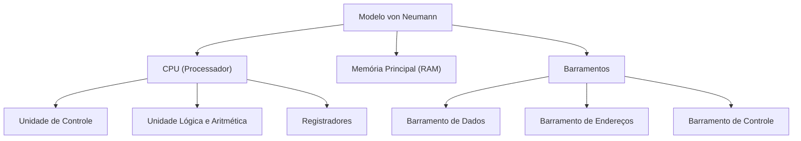

# 🎓 AcademiaIA - Aula Diária de Estudos
**Objetivo Geral:** Passar no cargo de Analista de Desenvolvimento de Sistemas no concurso da FUNDATEC
**Plano do Dia:** Dominar a arquitetura fundamental de computadores: Modelo de von Neumann.
**Tema:** Modelo de von Neumann: Arquitetura e Componentes

---

## 📅 Roteiro de Estudos Planejado pelo Diretor
* **Data:** 2023-10-27
* **Tópicos a Estudar:**
    - Modelo de von Neumann (CPU, Memória, Entrada/Saída)
* **Justificativa da Escolha:**
  O aluno selecionou especificamente a matéria de TI e o tópico 'Modelo de von Neumann' como prioridade máxima para o seu plano de estudos visando o concurso da FUNDATEC, sendo essencial para a base de conhecimentos em Arquitetura de Computadores.
* **Professor Responsável:** Professor de TI

---

## 🔍 Análise Estratégica da Banca (FUNDATEC)
* **Recorrência do Assunto:** `Média`
* **Foco da Banca nas Provas:**
  A FUNDATEC foca na compreensão funcional dos componentes. É comum exigir o conhecimento da hierarquia de memória, a função da Unidade de Controle (UC) e da Unidade Lógica e Aritmética (ULA) dentro da CPU, e o conceito de que, no modelo de von Neumann, programa e dados residem na mesma memória, utilizando o mesmo barramento.
* **Pegadinhas Clássicas Mapeadas:**
    - Armadilha 1: Confundir o modelo de von Neumann com a arquitetura Harvard. A banca tenta induzir o erro afirmando que von Neumann possui memórias separadas para dados e instruções.
  - Armadilha 2: Atribuir funções de armazenamento permanente (como HD ou SSD) à Memória Principal (RAM). A banca troca os conceitos de memória volátil e não volátil para confundir o candidato.
  - Armadilha 3: Inverter as funções da ULA e da Unidade de Controle, sugerindo que a ULA realiza o controle de fluxo de dados.
* **Atualizações Importantes:**
  Não há alterações legais, mas o foco técnico atual da banca tem se voltado para a distinção de arquiteturas modernas (como ARM vs x86) e a evolução do Ciclo de Instrução (Busca-Decodificação-Execução) aplicada a processadores multicore, embora mantendo os princípios base de von Neumann.

---

### 📝 Questões Reais de Concursos Anteriores (Referência)

#### Questão de Referência 1 (2022 | Prefeitura de Caxias do Sul | Analista de Sistemas)
Sobre a arquitetura de von Neumann, assinale a alternativa correta. A) Possui unidades de memória separadas para dados e instruções. B) A CPU é composta apenas pela Unidade de Controle e registradores. C) Programa e dados são armazenados na mesma memória. D) O barramento de dados é exclusivo para a entrada de dispositivos periféricos. E) Não permite a execução de programas em sequência lógica.

* **Gabarito Oficial:** **Opção (C)**


---

## 📚 Conteúdo Expositivo da Aula: Modelo de von Neumann: Arquitetura e Componentes

### 🎯 Objetivos de Aprendizagem
* **Compreender a arquitetura de von Neumann e sua premissa de programa armazenado.**
* **Diferenciar os componentes internos da CPU: ULA, Unidade de Controle e Registradores.**
* **Entender o papel fundamental dos barramentos (dados, endereços e controle) na comunicação.**
* **Identificar as limitações do modelo, especificamente o Gargalo de von Neumann.**
* **Diferenciar a arquitetura de von Neumann da arquitetura Harvard para fins de prova.**

### 📝 Teoria Detalhada
## 1. Introdução e a "Analogia de Ouro" (Para Iniciantes)
O modelo de von Neumann, proposto pelo físico John von Neumann em 1945, é a base arquitetural de quase todos os computadores modernos. O problema que ele resolve é simples: como fazer uma máquina que não precise ser 'reconstruída' (física ou eletronicamente) toda vez que quisermos mudar sua tarefa? A solução foi o conceito de 'programa armazenado'.

**Analogia da Cozinha:** Imagine uma cozinha profissional. 
- **CPU (Chef):** É quem executa as tarefas. Ele pensa, decide e manipula os ingredientes.
- **Memória (Bancada de Preparo):** É onde os ingredientes e a receita (instruções) ficam dispostos. O chef só consegue cozinhar o que está na bancada.
- **Entrada (Entrega de insumos):** O recebimento de novos pedidos ou ingredientes frescos.
- **Saída (Prato pronto):** A entrega do resultado final ao cliente.
- **Barramento (Corredores da cozinha):** É o espaço físico por onde o chef se desloca para buscar ingredientes ou entregar o prato. Se o corredor for estreito, o chef fica ocioso esperando o tráfego fluir (Gargalo).

## 2. Nivelamento e Conceituação Progressiva (Do Básico ao Avançado)

### Componentes da CPU (Unidade Central de Processamento)
1. **ULA (Unidade Lógica e Aritmética):** O 'músculo' da CPU. Realiza cálculos matemáticos (soma, subtração) e operações lógicas (AND, OR, NOT).
2. **Unidade de Controle (UC):** O 'cérebro' da CPU. Ela decodifica as instruções vindas da memória, coordena a ULA e gerencia os sinais de controle para os demais dispositivos.
3. **Registradores:** Memórias ultra rápidas e minúsculas dentro da CPU (ex: PC - Program Counter, IR - Instruction Register). Eles armazenam os dados de uso imediato.

### Memória Principal (RAM)
No modelo de von Neumann, a memória é um array de células endereçáveis. O ponto crucial: **dados e instruções ocupam o mesmo espaço e compartilham o mesmo caminho de acesso.**

## 3. Aprofundamento Teórico Avançado (Foco em Concursos)

O modelo se baseia em uma estrutura linear onde o processador busca uma instrução na memória, decodifica-a e a executa. 
- **Barramento de Dados:** Transporta o conteúdo real (os dados).
- **Barramento de Endereços:** Transporta a localização (onde o dado está).
- **Barramento de Controle:** Transporta sinais de sincronismo (ex: 'Ler' ou 'Escrever').

**O Gargalo de von Neumann:** Como dados e instruções compartilham o mesmo barramento, a CPU muitas vezes fica ociosa esperando a memória lenta entregar dados, limitando o desempenho total do sistema.

## 4. Quadro Comparativo Visual

| Recurso | Arquitetura von Neumann | Arquitetura Harvard |
| :--- | :--- | :--- |
| Memória de Programa/Dados | Unificada | Separada |
| Caminho de Acesso | Barramento Único | Barramentos Independentes |
| Complexidade | Simples (hardware reduzido) | Alta (dois barramentos) |
| Uso Típico | PCs, Servidores (x86) | Microcontroladores, DSPs |

## 5. Mnemônicos e Técnicas de Memorização
- **"UC faz, ULA calcula":** A Unidade de Controle comanda o fluxo; a ULA faz a conta.
- **"V de von Neumann = Vazio de Canais":** Lembre-se que o gargalo ocorre pelo barramento único, como se o caminho estivesse vazio/congestionado pelo excesso de tráfego de dados e instruções juntos.

## 6. Radar de Pegadinhas (Foco na Banca FUNDATEC)
- **Armadilha 1 (Harvard vs. von Neumann):** A FUNDATEC adora afirmar que processadores de PCs modernos usam arquitetura Harvard puramente. Embora usem caches separadas (L1), a estrutura base do sistema (RAM) segue o modelo von Neumann.
- **Armadilha 2 (Memória Volátil):** Nunca confunda memória principal (RAM) com armazenamento secundário (HD/SSD). O modelo de von Neumann trata a RAM como o local de execução imediata.
- **Armadilha 3 (Função da ULA):** A ULA nunca toma decisões de controle de fluxo (ex: desvios ou jumps). Isso é função exclusiva da Unidade de Controle.

## 7. Perguntas de Auto-Verificação
1. O que é o gargalo de von Neumann?
*Resposta: É a limitação de desempenho causada pelo compartilhamento do barramento de dados para buscar instruções e dados simultaneamente.*
2. Qual a principal diferença entre von Neumann e Harvard?
*Resposta: Harvard possui caminhos físicos separados para dados e instruções, enquanto von Neumann utiliza os mesmos.*
3. Quem é responsável pela decodificação de uma instrução?
*Resposta: A Unidade de Controle (UC).*

### 💡 Exemplos Práticos

#### Exemplo 1: Ciclo de Instrução Simplificado (Fetch-Decode-Execute)
* **Descrição:** O processo de execução de uma instrução em um modelo de von Neumann.
* **Especificação Técnica:**
```sql
1. Fetch: A UC busca o endereço no barramento e traz o dado da RAM para o Registro de Instrução (IR).
2. Decode: A UC traduz o código de operação (ex: ADD) e identifica os operandos.
3. Execute: A ULA recebe os operandos e realiza a soma lógica. O resultado é armazenado em um registrador ou devolvido à memória.
```


### 📌 Resumo de Fixação
O modelo de von Neumann é definido pelo conceito de programa armazenado em memória unificada. Seus componentes fundamentais são a CPU (composta por UC, ULA e Registradores), a Memória Principal e o Sistema de E/S. O gargalo do modelo advém do uso de um barramento único para acesso a dados e instruções. Em provas, é essencial diferenciar este modelo do Harvard, que utiliza memórias separadas para dados e instruções, aumentando a vazão de processamento.

---

## 🧠 Mapa Mental (Visualização Gráfica)


---

## 🗂️ Flashcards (Fixação Ativa)
| ❓ Pergunta | 💡 Resposta |
|---|---|
| **Qual componente da CPU realiza operações lógicas como AND e OR?** | A ULA (Unidade Lógica e Aritmética). |
| **Qual é o principal fator que causa o 'Gargalo de von Neumann'?** | O compartilhamento do barramento de dados para buscar tanto instruções quanto operandos. |
| **Memória RAM é um componente de arquitetura Harvard ou von Neumann?** | O modelo de von Neumann caracteriza-se por manter o programa na memória principal unificada. |

---

## 📝 Simulado de Fixação (Criador de Exercícios)

### ❓ Caderno de Questões

#### Questão 1
* **Dificuldade:** `Fácil` | **Edital:** *Organização e Arquitetura de Computadores*

Sobre o modelo de arquitetura de von Neumann, assinale a alternativa que apresenta corretamente a característica fundamental que o diferencia da arquitetura de Harvard.

  - **(A)** A arquitetura de von Neumann utiliza barramentos distintos para dados e instruções.
  - **(B)** Ambas as arquiteturas utilizam cache L1 unificado, tornando-as idênticas na prática moderna.
  - **(C)** O modelo de von Neumann armazena instruções e dados na mesma memória, compartilhando o mesmo barramento.
  - **(D)** A arquitetura de von Neumann é exclusivamente utilizada em processadores de baixo consumo, como os baseados em ARM.
  - **(E)** A arquitetura de Harvard impede o acesso direto da CPU à memória principal, exigindo controladores externos.


---
#### Questão 2
* **Dificuldade:** `Médio` | **Edital:** *Componentes da CPU*

Dentro da Unidade Central de Processamento (CPU), a Unidade Lógica e Aritmética (ULA) e a Unidade de Controle (UC) desempenham papéis distintos. Qual das alternativas descreve corretamente a função primária da Unidade de Controle (UC)?

  - **(A)** Realizar operações matemáticas complexas, como cálculos de ponto flutuante.
  - **(B)** Armazenar temporariamente os resultados intermediários de cálculos lógicos.
  - **(C)** Coordenar o fluxo de dados entre os componentes e interpretar as instruções lidas da memória.
  - **(D)** Gerenciar o acesso direto à memória (DMA) sem intervenção da CPU.
  - **(E)** Executar o processo de tradução de endereços lógicos para físicos em sistemas com paginação.


---
#### Questão 3
* **Dificuldade:** `Médio` | **Edital:** *Arquitetura e Desempenho*

No contexto da hierarquia e do funcionamento do modelo de von Neumann, considere o 'Gargalo de von Neumann'. O que este termo descreve?

  - **(A)** A limitação de velocidade na transferência de dados entre a CPU e a memória principal devido ao barramento compartilhado.
  - **(B)** A incapacidade da memória RAM de reter dados após o desligamento do computador.
  - **(C)** O superaquecimento da ULA quando processa instruções de ponto flutuante em alta frequência.
  - **(D)** A defasagem entre o processamento interno da CPU e a velocidade de rotação de dispositivos de armazenamento magnético.
  - **(E)** A sobrecarga causada pelo uso excessivo de interrupções de hardware por dispositivos de E/S lentos.


---
#### Questão 4
* **Dificuldade:** `Fácil` | **Edital:** *Barramentos e Comunicação*

Sobre os barramentos no modelo de von Neumann, a comunicação entre CPU, memória e periféricos ocorre através de três tipos principais. Assinale a alternativa que indica corretamente o papel do 'Barramento de Endereços'.

  - **(A)** Transportar os dados efetivos que serão processados pela CPU.
  - **(B)** Enviar sinais de temporização e de leitura/escrita para controlar o hardware.
  - **(C)** Determinar a localização específica (endereço) na memória ou dispositivo que será acessado.
  - **(D)** Armazenar temporariamente o endereço da próxima instrução a ser executada pelo sistema.
  - **(E)** Conectar diretamente a ULA à memória para realizar operações de busca de operandos.


---
#### Questão 5
* **Dificuldade:** `Fácil` | **Edital:** *Hierarquia de Memória*

A FUNDATEC frequentemente testa o conhecimento sobre os tipos de memória. Assinale a alternativa que diferencia corretamente a Memória Principal da Memória Secundária.

  - **(A)** A memória principal é não-volátil e possui maior capacidade de armazenamento que a secundária.
  - **(B)** A memória secundária é volátil e acessada diretamente pela CPU através dos barramentos internos.
  - **(C)** A memória principal (RAM) é volátil e é onde residem os programas e dados em execução no modelo de von Neumann.
  - **(D)** Não há distinção funcional entre memória principal e secundária no modelo teórico de von Neumann.
  - **(E)** A memória principal armazena apenas instruções, enquanto a secundária armazena apenas dados.


---
#### Questão 6
* **Dificuldade:** `Médio` | **Edital:** *Ciclo de Instrução*

Considere o Ciclo de Instrução (Busca-Decodificação-Execução). Qual componente da CPU é diretamente responsável por incrementar o registrador Program Counter (PC) logo após a busca de uma instrução?

  - **(A)** Unidade Lógica e Aritmética (ULA).
  - **(B)** Unidade de Controle (UC).
  - **(C)** Barramento de Dados.
  - **(D)** Memória Cache.
  - **(E)** Controlador de Entrada e Saída (I/O Controller).


---
#### Questão 7
* **Dificuldade:** `Difícil` | **Edital:** *Funcionamento da CPU e Barramentos*

Em um sistema baseado no modelo de von Neumann, o que ocorre quando o processador precisa realizar uma operação de 'Escrita' na memória?

  - **(A)** O processador coloca o endereço no barramento de endereços e o dado no barramento de dados, ativando o sinal de 'Write' no barramento de controle.
  - **(B)** O processador lê o dado da memória e o armazena na ULA para, em seguida, gravar de volta no barramento de endereços.
  - **(C)** A Unidade de Controle envia um sinal de interrupção para o dispositivo de entrada para bloquear o barramento de dados.
  - **(D)** O sistema utiliza obrigatoriamente a Memória Cache para realizar a escrita, ignorando a memória principal.
  - **(E)** A ULA calcula o endereço final e envia o dado diretamente para o dispositivo de E/S sem consultar o barramento de controle.


---
#### Questão 8
* **Dificuldade:** `Médio` | **Edital:** *Evolução das Arquiteturas*

Analise a afirmação: 'Em sistemas modernos, a arquitetura von Neumann foi abandonada em favor de arquiteturas mais rápidas'. Com base na teoria da computação e na prática da indústria de hardware, a afirmação está correta?

  - **(A)** Sim, pois processadores x86 e ARM atuais utilizam exclusivamente o modelo Harvard modificado, não sendo von Neumann.
  - **(B)** Não, pois embora existam melhorias como caches divididas (L1), a estrutura central de execução de programas ainda segue o paradigma de von Neumann.
  - **(C)** Sim, pois a introdução da memória cache eliminou o gargalo de von Neumann, tornando o modelo obsoleto.
  - **(D)** Não, porque a arquitetura von Neumann só é utilizada em microcontroladores simples, não em CPUs de alto desempenho.
  - **(E)** Sim, porque a existência de dispositivos de E/S impede que uma arquitetura baseada em von Neumann funcione.


---
#### Questão 9
* **Dificuldade:** `Fácil` | **Edital:** *Componentes da CPU*

Qual das alternativas abaixo melhor descreve o papel da Unidade Lógica e Aritmética (ULA) dentro de uma instrução de 'Soma' (ADD)?

  - **(A)** Ela decodifica o código da instrução ADD enviada pela memória.
  - **(B)** Ela busca os operandos diretamente do barramento de controle.
  - **(C)** Ela recebe dois valores de entrada, realiza a adição e envia o resultado para um registrador de saída ou acumulador.
  - **(D)** Ela gerencia os sinais de temporização para que a soma ocorra no tempo correto do clock.
  - **(E)** Ela verifica se há espaço livre na memória principal para armazenar o resultado da operação.


---
#### Questão 10
* **Dificuldade:** `Médio` | **Edital:** *Entrada e Saída (E/S)*

Em um cenário de prova, a banca descreve um computador onde o dispositivo de E/S (como uma placa de rede) escreve diretamente na memória sem passar pela CPU. Que conceito de arquitetura está sendo aplicado?

  - **(A)** Ciclo de Instrução (Fetch-Decode-Execute).
  - **(B)** Processamento Serial de Dados.
  - **(C)** Acesso Direto à Memória (DMA).
  - **(D)** Arquitetura de Harvard Pura.
  - **(E)** Registradores de Propósito Geral.


---

### 🔑 Gabarito e Resoluções Comentadas

#### Questão 1
* **Gabarito:** **Opção (C)**
* **Resolução e Comentário:**
  A característica definidora do modelo de von Neumann é o armazenamento comum de instruções e dados na mesma unidade de memória, utilizando o mesmo sistema de barramentos. A alternativa A descreve a arquitetura de Harvard. B está incorreta pois a distinção estrutural permanece no projeto dos processadores. D é falsa pois von Neumann é um modelo teórico, não restrito a uma ISA. E está incorreta pois Harvard refere-se à separação de caminhos e não à restrição de acesso.


---
#### Questão 2
* **Gabarito:** **Opção (C)**
* **Resolução e Comentário:**
  A Unidade de Controle é o 'cérebro' dentro da CPU, responsável por decodificar instruções, emitir sinais de controle e orquestrar as demais partes. A alternativa A descreve a ULA. B descreve o papel de registradores ou acumuladores. D é função de um controlador de E/S especializado. E é uma função da MMU (Memory Management Unit).


---
#### Questão 3
* **Gabarito:** **Opção (A)**
* **Resolução e Comentário:**
  O 'Gargalo de von Neumann' refere-se ao limite de desempenho imposto pela taxa de transferência (largura de banda) entre a memória e a CPU, uma vez que o barramento de dados é compartilhado. As outras alternativas descrevem problemas técnicos (volatilidade, superaquecimento, latência de disco, overhead de interrupções), mas não definem o conceito do gargalo da arquitetura em si.


---
#### Questão 4
* **Gabarito:** **Opção (C)**
* **Resolução e Comentário:**
  O barramento de endereços é unidirecional em relação à CPU e define qual posição de memória ou porta de E/S será acessada. A alternativa A define o barramento de dados. B define o barramento de controle. D descreve o registrador PC (Program Counter), não um barramento. E não é a definição de um barramento.


---
#### Questão 5
* **Gabarito:** **Opção (C)**
* **Resolução e Comentário:**
  No modelo de von Neumann, a memória principal (RAM) é a área de trabalho onde instruções e dados ativos residem; é volátil. A memória secundária (HD, SSD) é não-volátil e serve para armazenamento persistente. As alternativas A e B estão incorretas pois invertem os conceitos de volatilidade. D é incorreta pois a distinção é vital. E é incorreta pois viola a premissa de memória unificada.


---
#### Questão 6
* **Gabarito:** **Opção (B)**
* **Resolução e Comentário:**
  A Unidade de Controle (UC) gerencia o ciclo de instrução. Após buscar a instrução atual na memória, a UC garante que o Program Counter (PC) seja atualizado para apontar para o endereço da próxima instrução. A ULA realiza cálculos, o barramento transporta informações e a cache apenas acelera o acesso, não possuindo a lógica de controle do PC.


---
#### Questão 7
* **Gabarito:** **Opção (A)**
* **Resolução e Comentário:**
  Para uma operação de escrita, o processador deve especificar onde escrever (barramento de endereços), o que escrever (barramento de dados) e sinalizar a intenção de escrita (barramento de controle). A alternativa B inverte a lógica de escrita. C descreve um erro de operação. D é incorreta pois a escrita deve ser eventualmente refletida na RAM. E ignora o papel do barramento de controle.


---
#### Questão 8
* **Gabarito:** **Opção (B)**
* **Resolução e Comentário:**
  Os processadores modernos aplicam conceitos híbridos. Embora internamente possuam caches separadas para instruções e dados (semelhante a Harvard) para contornar o gargalo de von Neumann, a visão lógica externa e a arquitetura geral de carga de programas na RAM seguem o modelo de von Neumann. As outras alternativas estão incorretas ao afirmar que o modelo foi abandonado ou que a cache resolveu definitivamente o gargalo.


---
#### Questão 9
* **Gabarito:** **Opção (C)**
* **Resolução e Comentário:**
  A função da ULA é exclusivamente computacional. Ela executa operações lógicas e aritméticas (como ADD, SUB, AND, OR) sobre os dados fornecidos. Decodificar instruções (A) e gerenciar temporização (D) são tarefas da Unidade de Controle. A busca de operandos (B) e a gestão de memória (E) não são responsabilidades diretas da ULA.


---
#### Questão 10
* **Gabarito:** **Opção (C)**
* **Resolução e Comentário:**
  O Acesso Direto à Memória (DMA) é uma técnica que permite que periféricos transfiram dados diretamente para a memória principal (ou de lá os retirem), liberando a CPU para outras tarefas. Isso otimiza o uso do barramento no modelo de von Neumann. As demais alternativas referem-se a conceitos diferentes de operação da CPU ou arquitetura.

