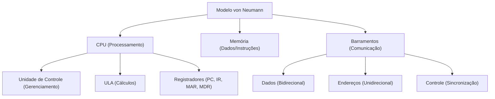

# 🎓 AcademiaIA - Aula Diária de Estudos
**Objetivo Geral:** Passar no cargo de Analista de Desenvolvimento de Sistemas no concurso da FUNDATEC
**Plano do Dia:** Revisão profunda da Arquitetura de von Neumann focada em correção de erros conceituais
**Tema:** Modelo de von Neumann: CPU, Memória e Barramentos

---

## 📅 Roteiro de Estudos Planejado pelo Diretor
* **Data:** 2026-07-16
* **Tópicos a Estudar:**
    - Modelo de von Neumann (CPU, Memória, Entrada/Saída)
* **Justificativa da Escolha:**
  O aluno teve um desempenho muito baixo (10% de acertos) no simulado anterior sobre este tópico, apresentando falhas estruturais na compreensão da arquitetura. Como o conteúdo é base fundamental para toda a disciplina de TI, a priorização visa garantir que ele não carregue lacunas para tópicos mais complexos, conforme recomendado na análise de desempenho anterior.
* **Professor Responsável:** Professor de TI

---

## 🔍 Análise Estratégica da Banca (FUNDATEC)
* **Recorrência do Assunto:** `Média`
* **Foco da Banca nas Provas:**
  A FUNDATEC foca na compreensão teórica do funcionamento da arquitetura, especificamente no ciclo de instrução (busca, decodificação e execução) e na distinção entre memória principal e secundária. A banca evita cálculos complexos de arquitetura, preferindo questões conceituais sobre o papel da ULA (Unidade Lógica e Aritmética), da Unidade de Controle e a natureza de armazenamento comum de programas e dados no mesmo espaço de memória.
* **Pegadinhas Clássicas Mapeadas:**
    - Armadilha 1: Confundir o barramento de dados com o barramento de endereços, sendo que a banca costuma inverter o fluxo de comunicação entre a CPU e a memória.
  - Armadilha 2: Afirmar que dispositivos de entrada e saída são unidades de processamento, ignorando que, no modelo de von Neumann, eles são periféricos que interagem via controladores com a CPU.
  - Armadilha 3: Sugerir que a memória principal (RAM) é não volátil, quando a característica de armazenamento temporário é um pilar da arquitetura para execução de programas.
* **Atualizações Importantes:**
  Embora o modelo de von Neumann seja um conceito clássico de computação, a atualização técnica recente envolve a transição para arquiteturas de memórias heterogêneas e processadores multicore, onde o gargalo de von Neumann (o limite de velocidade na transferência de dados entre CPU e memória) é mitigado por hierarquias complexas de cache (L1, L2, L3) e barramentos de alta velocidade, conceitos que a banca tem começado a cobrar como extensões do modelo básico.

---

### 📝 Questões Reais de Concursos Anteriores (Referência)

#### Questão de Referência 1 (2022 | Prefeitura de Caxias do Sul | Técnico em Informática)
No contexto da Arquitetura de Computadores, o modelo de Von Neumann descreve um computador digital com quatro seções principais: a unidade lógica e aritmética, a unidade de controle, a memória e os dispositivos de entrada e saída. Sobre esse modelo, é correto afirmar:

* **Gabarito Oficial:** **Opção (A memória é utilizada tanto para armazenar os dados quanto para armazenar as instruções do programa.)**


---

## 📚 Conteúdo Expositivo da Aula: Modelo de von Neumann: CPU, Memória e Barramentos

### 🎯 Objetivos de Aprendizagem
* **Compreender a arquitetura de von Neumann e o conceito de programa armazenado.**
* **Distinguir as funções da Unidade de Controle (UC) e da Unidade Lógica e Aritmética (ULA).**
* **Dominar o ciclo de instrução: Busca, Decodificação e Execução.**
* **Diferenciar barramentos de dados, endereços e controle em termos de fluxo de tráfego.**
* **Identificar o papel dos registradores especializados (PC, IR, MAR, MDR).**

### 📝 Teoria Detalhada
## 1. Introdução e a "Analogia de Ouro"
O Modelo de von Neumann é a base de quase todos os computadores modernos. Ele resolve o problema fundamental de como processar dados de forma flexível: em vez de reconstruir o hardware para cada tarefa, criamos uma máquina que lê instruções (software) e dados do mesmo lugar (memória).

**A Analogia da Cozinha:** Imagine uma cozinha de restaurante:
- **CPU (Chef):** Quem executa o trabalho.
- **Memória RAM (Bancada de trabalho):** Onde ficam os ingredientes (dados) e a receita (instruções) que estão sendo usados agora.
- **Memória Secundária (Despensa):** Onde tudo fica guardado a longo prazo.
- **Barramentos (Corredores):** O caminho pelo qual o Chef busca os ingredientes na bancada e leva as ordens aos ajudantes.
- **Unidade de Controle (Gerente):** Aquele que dita o ritmo, lendo a receita e ordenando o que o Chef deve fazer.

## 2. Nivelamento e Conceituação Progressiva
A arquitetura baseia-se no conceito de "Stored Program" (Programa Armazenado). Diferente da arquitetura Harvard, von Neumann utiliza a mesma memória para dados e instruções.
- **UC (Unidade de Controle):** O cérebro do processador. Decodifica as instruções e gerencia o tráfego interno.
- **ULA (Unidade Lógica e Aritmética):** O músculo matemático. Realiza operações aritméticas (+, -, *, /) e lógicas (AND, OR, NOT, XOR).
- **Registradores:** Memórias ultra-rápidas dentro da CPU. Os principais são:
  - **PC (Program Counter):** Aponta para o endereço da próxima instrução.
  - **IR (Instruction Register):** Armazena a instrução que está sendo decodificada.
  - **MAR (Memory Address Register):** Guarda o endereço que a CPU quer acessar na RAM.
  - **MDR (Memory Data Register):** Guarda o dado que acabou de vir da RAM ou que será enviado para ela.

## 3. Aprofundamento Teórico Avançado
O ciclo de instrução (Fetch-Decode-Execute) é o motor da máquina. 
1. **Busca (Fetch):** A UC coloca o valor do PC no MAR. O dado na memória é enviado para o MDR.
2. **Decodificação:** A instrução no MDR passa para o IR. A UC interpreta o comando.
3. **Execução:** A ULA realiza a operação ou um desvio de fluxo ocorre no PC.

**O Gargalo de von Neumann:** Como a CPU é muito rápida e o barramento para a RAM é único, a CPU frequentemente fica ociosa aguardando dados (limitação de largura de banda). Hoje, isso é atenuado pelo uso de memórias cache (L1/L2/L3) que ficam entre a CPU e a RAM.

## 4. Quadro Comparativo Visual
| Componente | Função Principal | Fluxo de Informação |
| :--- | :--- | :--- |
| Barramento de Endereços | Indica onde buscar (RAM) | Unidirecional (CPU -> RAM) |
| Barramento de Dados | Transporta o conteúdo/instrução | Bidirecional (CPU <-> RAM) |
| Barramento de Controle | Sinais de leitura/escrita/clock | Bidirecional (Sincronização) |
| RAM | Armazenamento temporário | Volátil (perde dados sem energia) |
| Registradores | Armazenamento imediato | Interno da CPU (ultrarrápido) |

## 5. Mnemônicos e Técnicas de Memorização
Para os Registradores: **PIM M**aduro
- **P**C: Próximo endereço.
- **I**R: Instrução atual.
- **M**AR: Memoriza o endereço para buscar.
- **M**DR: Memoriza o dado que chegou.

## 6. Radar de Pegadinhas (Foco na FUNDATEC)
1. **Pegadinha do Barramento:** A banca ama trocar o papel do Barramento de Endereços pelo de Dados. Lembre-se: O Endereço diz "onde", os Dados dizem "o que". A CPU sempre precisa dizer "onde" ela quer buscar.
2. **Pegadinha da RAM:** Afirmar que a RAM é memória de armazenamento permanente (Não volátil). Isso é falso! A RAM é volátil.
3. **Pegadinha da Periferia:** Dizer que Entrada/Saída são partes da CPU. Errado! São periféricos mediados por controladores (ex: controlador de vídeo, controlador de disco).

## 7. Perguntas de Auto-Verificação
1. Qual registrador aponta a próxima instrução? R: O Program Counter (PC).
2. O Barramento de Dados é unidirecional? R: Não, ele é bidirecional para permitir leitura e escrita.
3. A RAM é volátil ou não volátil? R: Volátil, perde os dados ao desligar.

### 💡 Exemplos Práticos

#### Exemplo 1: Ciclo de Instrução: Execução de uma soma
* **Descrição:** Passo a passo da movimentação de dados em um processador von Neumann.
* **Especificação Técnica:**
```sql
1. PC envia o endereço 0x10 para o MAR. 2. Barramento de Endereços sinaliza 0x10. 3. Memória coloca o dado do endereço 0x10 no Barramento de Dados. 4. Dado é copiado para o MDR. 5. Instrução movida para o IR. 6. UC decodifica a instrução 'ADD'. 7. ULA realiza a soma usando registradores internos.
```


### 📌 Resumo de Fixação
O Modelo de von Neumann define a arquitetura básica com CPU, Memória única e I/O. A CPU executa o ciclo de instrução através da UC e ULA. Os barramentos de endereços, dados e controle são os meios de comunicação. O gargalo clássico é a limitação de velocidade entre memória e CPU.

---

## 🧠 Mapa Mental (Visualização Gráfica)


---

## 🗂️ Flashcards (Fixação Ativa)
| ❓ Pergunta | 💡 Resposta |
|---|---|
| **Qual a principal diferença entre os barramentos de dados e endereços?** | O de endereços é unidirecional (indica o local) e o de dados é bidirecional (transfere a informação). |
| **O que a Unidade de Controle faz no ciclo de instrução?** | Ela decodifica a instrução no IR e coordena os sinais de controle para as demais unidades. |
| **Por que a memória RAM é considerada volátil?** | Porque ela perde todo o seu conteúdo assim que a energia elétrica é cortada. |
| **Qual é a função do registrador MAR (Memory Address Register)?** | Armazenar o endereço da posição de memória que a CPU deseja ler ou gravar. |

---

## 📝 Simulado de Fixação (Criador de Exercícios)

### ❓ Caderno de Questões

#### Questão 1
* **Dificuldade:** `Fácil` | **Edital:** *Arquitetura de Computadores - Componentes da CPU*

No modelo de arquitetura de von Neumann, a unidade responsável por coordenar as atividades do processador, decodificando instruções e gerenciando o fluxo de dados entre os componentes, é denominada:

  - **(A)** Unidade Lógica e Aritmética (ULA)
  - **(B)** Unidade de Controle (UC)
  - **(C)** Registrador de Instruções (IR)
  - **(D)** Contador de Programa (PC)
  - **(E)** Barramento de Sistema


---
#### Questão 2
* **Dificuldade:** `Médio` | **Edital:** *Arquitetura de Computadores - Barramentos*

Sobre os barramentos na arquitetura de von Neumann, assinale a alternativa que descreve corretamente a função do barramento de endereços:

  - **(A)** Transporta as informações que serão processadas pela ULA.
  - **(B)** Define a localização na memória ou no dispositivo de E/S que a CPU deseja acessar.
  - **(C)** Transmite sinais de sincronização entre a CPU e a memória principal.
  - **(D)** É um barramento bidirecional que permite a escrita de dados na memória.
  - **(E)** Controla a velocidade do clock do processador para evitar gargalos.


---
#### Questão 3
* **Dificuldade:** `Difícil` | **Edital:** *Arquitetura de Computadores - Evolução e limitações do modelo*

Qual das seguintes características define o 'Gargalo de von Neumann'?

  - **(A)** A incapacidade de processadores multicore executarem threads em paralelo.
  - **(B)** A latência causada pelo uso de memória RAM volátil.
  - **(C)** A limitação de velocidade na transferência de dados entre a CPU e a memória, devido ao compartilhamento de barramentos.
  - **(D)** O uso de discos rígidos (HDD) com baixa taxa de transferência de dados.
  - **(E)** A falta de dispositivos de entrada e saída eficientes para interagir com o usuário.


---
#### Questão 4
* **Dificuldade:** `Médio` | **Edital:** *Arquitetura de Computadores - Registradores*

Considere o ciclo de instrução. Qual componente é responsável por armazenar o endereço da próxima instrução a ser executada?

  - **(A)** Registrador de Status
  - **(B)** Unidade de Controle
  - **(C)** Instruction Register (IR)
  - **(D)** Program Counter (PC)
  - **(E)** Memória Cache L1


---
#### Questão 5
* **Dificuldade:** `Médio` | **Edital:** *Arquitetura de Computadores - Conceitos de Memória*

Em relação à memória na arquitetura de von Neumann, é correto afirmar que:

  - **(A)** A memória principal deve ser, obrigatoriamente, do tipo não volátil para não perder dados.
  - **(B)** Programas e dados são armazenados em espaços de memória distintos e fisicamente separados.
  - **(C)** A CPU acessa os periféricos de E/S diretamente sem o auxílio de controladores.
  - **(D)** A memória principal armazena tanto as instruções do programa quanto os dados que serão processados.
  - **(E)** A memória Cache substitui completamente a necessidade de memória RAM no modelo básico.


---
#### Questão 6
* **Dificuldade:** `Fácil` | **Edital:** *Arquitetura de Computadores - Unidade Lógica e Aritmética*

Sobre a Unidade Lógica e Aritmética (ULA), assinale a alternativa correta:

  - **(A)** Ela é responsável por decidir qual instrução deve ser executada em seguida.
  - **(B)** É a parte do processador que executa operações matemáticas e comparações lógicas.
  - **(C)** Ela armazena temporariamente os endereços de memória durante um acesso.
  - **(D)** A ULA é considerada um periférico de entrada e saída de alta velocidade.
  - **(E)** A ULA gerencia diretamente a comunicação entre o disco rígido e a memória RAM.


---
#### Questão 7
* **Dificuldade:** `Difícil` | **Edital:** *Arquitetura de Computadores - Barramentos*

Qual a função do barramento de controle no modelo de von Neumann?

  - **(A)** Transferir os dados lidos da memória para a ULA.
  - **(B)** Indicar o endereço onde os dados serão lidos ou escritos.
  - **(C)** Gerar sinais de sincronização (leitura/escrita, interrupções) entre os componentes do sistema.
  - **(D)** Armazenar o código do programa que está sendo carregado da memória secundária.
  - **(E)** Gerenciar a temperatura interna do processador e o funcionamento dos coolers.


---
#### Questão 8
* **Dificuldade:** `Difícil` | **Edital:** *Arquitetura de Computadores - Hierarquia de memória*

Na hierarquia de memória, o uso de Memória Cache (L1, L2, L3) visa mitigar qual problema fundamental da arquitetura de von Neumann?

  - **(A)** A falta de espaço para armazenamento permanente de arquivos.
  - **(B)** A volatilidade da memória principal.
  - **(C)** A disparidade de velocidade entre a CPU (rápida) e a memória RAM (lenta).
  - **(D)** A limitação de barramentos de 32 bits em processadores modernos.
  - **(E)** O erro de sincronização entre periféricos de entrada e saída.


---
#### Questão 9
* **Dificuldade:** `Médio` | **Edital:** *Arquitetura de Computadores - Entrada e Saída*

Os dispositivos de Entrada e Saída (E/S) no modelo de von Neumann:

  - **(A)** São considerados componentes essenciais da unidade central de processamento.
  - **(B)** Comunicam-se com a CPU através de controladores, que traduzem sinais do barramento para o dispositivo.
  - **(C)** Possuem memória própria integrada, sendo independentes do barramento da CPU.
  - **(D)** São ignorados no ciclo de instrução, sendo tratados apenas pelo sistema operacional.
  - **(E)** Executam instruções de cálculo complexo, auxiliando a ULA em tarefas de processamento.


---
#### Questão 10
* **Dificuldade:** `Médio` | **Edital:** *Arquitetura de Computadores - Ciclo de Instrução*

Qual etapa do ciclo de instrução é responsável por obter a instrução do endereço apontado pelo Program Counter e colocá-la no Registrador de Instrução (IR)?

  - **(A)** Execução
  - **(B)** Decodificação
  - **(C)** Busca (Fetch)
  - **(D)** Escrita de Resultado
  - **(E)** Interrupção


---

### 🔑 Gabarito e Resoluções Comentadas

#### Questão 1
* **Gabarito:** **Opção (B)**
* **Resolução e Comentário:**
  A Unidade de Controle (UC) é o componente central da CPU que interpreta as instruções e envia sinais de controle para todos os outros componentes. A ULA realiza cálculos, o IR armazena a instrução atual e o PC guarda o endereço da próxima instrução, sendo todos gerenciados pela UC.


---
#### Questão 2
* **Gabarito:** **Opção (B)**
* **Resolução e Comentário:**
  O barramento de endereços é unidirecional, saindo da CPU para a memória/periféricos, para indicar qual endereço deve ser lido ou escrito. O barramento de dados é o que transporta as informações propriamente ditas. Confundir essas funções é uma pegadinha clássica da FUNDATEC.


---
#### Questão 3
* **Gabarito:** **Opção (C)**
* **Resolução e Comentário:**
  O gargalo de von Neumann refere-se ao fato de que a CPU é muito mais rápida que o barramento que a conecta à memória. Como dados e instruções compartilham o mesmo caminho, a velocidade final do sistema é limitada por essa taxa de transferência, mesmo com processadores de alta frequência.


---
#### Questão 4
* **Gabarito:** **Opção (D)**
* **Resolução e Comentário:**
  O Program Counter (PC), ou Contador de Programa, é um registrador que mantém o endereço da próxima instrução a ser buscada na memória. O IR, por outro lado, armazena a instrução que está sendo executada no momento.


---
#### Questão 5
* **Gabarito:** **Opção (D)**
* **Resolução e Comentário:**
  O pilar do modelo de von Neumann é justamente a arquitetura de programa armazenado, onde código e dados residem na mesma memória. A RAM é volátil por definição no modelo clássico, e periféricos sempre utilizam controladores para se comunicar via barramentos.


---
#### Questão 6
* **Gabarito:** **Opção (B)**
* **Resolução e Comentário:**
  A ULA (Unidade Lógica e Aritmética) é o coração funcional da CPU, onde o trabalho pesado (soma, subtração, AND, OR, NOT) ocorre. A tomada de decisão (fluxo) é função da Unidade de Controle.


---
#### Questão 7
* **Gabarito:** **Opção (C)**
* **Resolução e Comentário:**
  O barramento de controle carrega os sinais que coordenam as operações, como 'leitura de memória', 'escrita de memória' ou sinais de interrupção enviados por periféricos. Ele garante que a CPU e os outros componentes 'entendam' o que está sendo transmitido nos outros barramentos.


---
#### Questão 8
* **Gabarito:** **Opção (C)**
* **Resolução e Comentário:**
  A cache atua como um buffer ultrarrápido para os dados mais utilizados pela CPU, reduzindo drasticamente o número de acessos à memória RAM principal, que é muito mais lenta, atenuando o gargalo de von Neumann.


---
#### Questão 9
* **Gabarito:** **Opção (B)**
* **Resolução e Comentário:**
  Dispositivos de E/S são periféricos. Eles precisam de controladores de entrada/saída para se conectar aos barramentos do sistema, pois a CPU não se comunica com teclado, mouse ou rede diretamente sem essa mediação lógica.


---
#### Questão 10
* **Gabarito:** **Opção (C)**
* **Resolução e Comentário:**
  O ciclo básico de von Neumann é composto por: Busca (Fetch), Decodificação e Execução. A 'Busca' consiste exatamente em ir até o endereço na memória indicado pelo PC e trazer a instrução para dentro da CPU para posterior decodificação.

