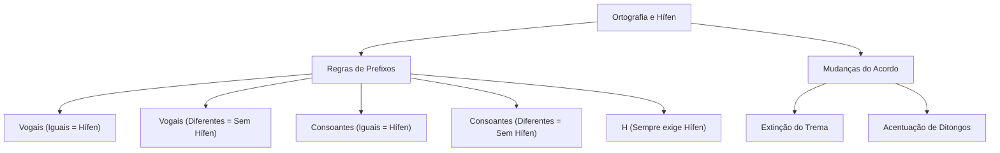

# 🎓 AcademiaIA - Aula Diária de Estudos
**Objetivo Geral:** Passar no cargo de Analista de Desenvolvimento de Sistemas no concurso da FUNDATEC
**Plano do Dia:** Dominar as regras de ortografia e o emprego do hífen conforme o Acordo Ortográfico vigente.
**Tema:** Ortografia: Emprego de Letras e Hífen conforme o Novo Acordo Ortográfico

---

## 📅 Roteiro de Estudos Planejado pelo Diretor
* **Data:** 2026-07-23
* **Tópicos a Estudar:**
    - Ortografia: emprego de letras e do hífen conforme Acordo Ortográfico vigente (VOLP, Aulete)
* **Justificativa da Escolha:**
  O aluno selecionou obrigatoriamente o tópico de 'Ortografia' e este tema é fundamental após o ciclo de fonologia. A escolha justifica-se pela necessidade de consolidar a escrita correta após o aluno ter enfrentado dificuldades conceituais em fonética nos simulados anteriores, prevenindo lacunas de conhecimento e garantindo que ele não deixe questões em branco por falta de base teórica.
* **Professor Responsável:** Professor de Português

---

## 🔍 Análise Estratégica da Banca (FUNDATEC)
* **Recorrência do Assunto:** `Alta`
* **Foco da Banca nas Provas:**
  A FUNDATEC possui um perfil extremamente pragmático e literal. Em questões de ortografia, a banca foca predominantemente na aplicação das regras do Novo Acordo Ortográfico, especialmente as mudanças no uso do hífen em prefixos. Ela costuma apresentar listas de palavras e solicitar que o candidato identifique qual alternativa está correta ou incorreta de acordo com o VOLP, exigindo memorização das regras de junção (vogais iguais/diferentes, prefixos terminados em consoante ou vogal). Não costuma explorar exceções arcaicas, mantendo-se fiel ao uso normativo atual.
* **Pegadinhas Clássicas Mapeadas:**
    - Armadilha 1: O uso de prefixos terminados em vogal que se encontram com vogais diferentes (ex: autoescola, infraestrutura). A banca costuma colocar o hífen para induzir o erro de que a regra do encontro de vogais iguais se aplicaria aqui.
  - Armadilha 2: A regra do 'h' inicial. A banca testa frequentemente o uso do hífen com prefixos como 'anti', 'bio', 'geo' e 'mini' diante de palavras iniciadas por 'h', onde o hífen é obrigatório, confundindo o candidato com a regra geral de prefixos.
  - Armadilha 3: A grafia de palavras que perderam o acento diferencial (como 'para' verbo vs preposição) ou o trema, frequentemente usadas em textos longos para distrair o candidato e fazê-lo focar no contexto gramatical e esquecer a grafia da palavra isolada.
* **Atualizações Importantes:**
  A principal atualização é a consolidação absoluta do Novo Acordo Ortográfico da Língua Portuguesa. A banca não aceita mais qualquer vacilação quanto ao uso de trema (extinto em palavras portuguesas), a acentuação de ditongos abertos (éi, ói, éu) em palavras paroxítonas (ex: ideia, joia - não têm mais acento), e a regra da duplicidade de consoantes (ex: antissocial, micro-ondas).

---

### 📝 Questões Reais de Concursos Anteriores (Referência)

#### Questão de Referência 1 (2023 | Prefeitura de Caxias do Sul | Analista)
Assinale a alternativa que apresenta uma palavra grafada INCORRETAMENTE segundo o atual Acordo Ortográfico.

* **Gabarito Oficial:** **Opção (C)**


---
#### Questão de Referência 2 (2022 | Estado do Rio Grande do Sul | Assistente Administrativo)
Assinale a alternativa correta quanto à grafia da palavra, de acordo com o Novo Acordo Ortográfico.

* **Gabarito Oficial:** **Opção (B)**


---

## 📚 Conteúdo Expositivo da Aula: Ortografia: Emprego de Letras e Hífen conforme o Novo Acordo Ortográfico

### 🎯 Objetivos de Aprendizagem
* **Diferenciar fonemas de grafemas para compreender a base da escrita normativa.**
* **Dominar as regras de uso do hífen com prefixos conforme o Acordo Ortográfico vigente.**
* **Identificar e evitar as armadilhas comuns nas provas da banca FUNDATEC.**
* **Internalizar as alterações ortográficas consolidadas, como a eliminação do trema e a acentuação de ditongos.**

### 📝 Teoria Detalhada
## 1. Introdução e a "Analogia de Ouro" (Para Iniciantes)

A ortografia não é um conjunto arbitrário de regras, mas um sistema de mapeamento entre sons (fonemas) e sinais gráficos (grafemas). Imagine que a língua portuguesa é uma enorme orquestra: os fonemas são as notas musicais que você ouve, e a ortografia é a partitura que dita como essas notas devem ser escritas no papel. Se você escreve 'casa' com 's', você está errando a 'partitura', ainda que o som (a melodia) seja o mesmo.

A analogia do nosso estudo hoje é a 'Alfândega das Palavras'. O hífen é o passaporte. Quando um prefixo (um pequeno viajante) encontra uma palavra (o destino), ele precisa de um visto (o hífen) para entrar? O Novo Acordo Ortográfico criou novas regras de alfândega para simplificar esse fluxo, mas, como em toda fronteira, o desrespeito às normas gera 'multas' (erros na prova).

## 2. Nivelamento e Conceituação Progressiva (Do Básico ao Avançado)

Antes de aplicar o hífen, precisamos entender a estrutura: 
* **Fonema:** A unidade sonora mínima (o som /z/ em 'casa').
* **Grafema:** A letra que representa o fonema (a letra 's' em 'casa').
* **Prefixo:** Elemento que se junta ao início de uma base (ex: anti-, super-, auto-).

A regra de ouro do hífen é: **Sons iguais se repelem, sons diferentes se atraem.**
1. Vogal + Vogal Igual = Hífen (ex: anti-inflamatório).
2. Vogal + Vogal Diferente = Junta tudo (ex: autoescola).
3. Consoante + Consoante Igual = Hífen (ex: super-resistente).

## 3. Aprofundamento Teórico Avançado (Foco em Concursos)

O Acordo Ortográfico trouxe a regra da 'consonância'. Quando o prefixo termina em consoante e a palavra começa com a mesma consoante, usamos o hífen. Exemplo: 'inter-regional'. Se as consoantes forem diferentes, junta-se tudo: 'intermunicipal'.

**O Problema do 'H':** O 'h' é uma letra fantasma que não tem som. Por isso, ele atrai o hífen. Quando um prefixo termina em vogal ou consoante e a palavra seguinte começa com 'h', o hífen é obrigatório: 'anti-higiênico', 'super-homem'.

**Atenção aos Ditongos:** Palavras como 'ideia' e 'heroico' perderam o acento, pois são paroxítonas com ditongo aberto. A FUNDATEC adora cobrar isso em listas de palavras.

## 4. Quadro Comparativo Visual

| Regra | Exemplo (Certo) | Por que?
| --- | --- | ---
| Vogais Iguais | Contra-ataque | Separa para manter os sons
| Vogais Diferentes | Autoescola | Junta pois são sons distintos
| Consoantes Iguais | Sub-base | Separa para evitar geminação confusa
| Com 'H' | Mini-hotel | O 'h' sempre exige o uso do hífen

## 5. Mnemônicos e Técnicas de Memorização

Use o mnemônico **"Vogais Diferentes se Abraçam, Iguais se Afastam"**. 
Para o 'H': **"O H é um Hífen-Imã"**. Onde você vir um H após prefixo, coloque o hífen. 
Para memorizar o hífen com consoantes: **"Consoante igual, sinal de pontuação (hífen). Consoante diferente, junta no pente (tudo junto)."**

## 6. Radar de Pegadinhas (Foco na Banca FUNDATEC)

1. **A pegadinha do 'auto':** A FUNDATEC adora colocar 'auto-escola' com hífen. Lembre-se: 'auto' (prefixo) + 'e' (vogal diferente) = 'autoescola' (tudo junto).
2. **A regra do 'h':** Ela coloca 'antihigiênico'. Errado! É 'anti-higiênico'.
3. **Trema:** Se aparecer em qualquer alternativa, risque-a imediatamente. Ele não existe mais em palavras da língua portuguesa.

## 7. Perguntas de Auto-Verificação (Recall Ativo)

1. Como se escreve a união de 'anti' + 'inflamatório'? 
Resposta: Anti-inflamatório (vogais iguais exigem hífen).
2. Por que 'autoescola' não tem hífen? 
Resposta: Porque as vogais são diferentes (o e a), logo, elas se atraem e fundem.
3. O que acontece com o trema na ortografia atual? 
Resposta: Foi totalmente extinto em palavras portuguesas.

### 💡 Exemplos Práticos

#### Exemplo 1: Uso de Prefixos com Vogais
* **Descrição:** Análise da junção de prefixos terminados em vogal com palavras iniciadas por vogal.
* **Especificação Técnica:**
```sql
auto + escola = autoescola (vogais diferentes) | contra + ataque = contra-ataque (vogais iguais)
```


#### Exemplo 2: O Caso do 'H' e Consoantes
* **Descrição:** Regras para prefixos diante de consoantes ou a letra H.
* **Especificação Técnica:**
```sql
super + homem = super-homem (presença de H) | sub + base = sub-base (consoantes iguais) | inter + municipal = intermunicipal (consoantes diferentes)
```


### 📌 Resumo de Fixação
O Novo Acordo eliminou o trema e mudou regras de acentuação (ditongos abertos em paroxítonas). O hífen em prefixos segue a lógica da afinidade fonética: vogais iguais e consoantes iguais exigem o hífen; vogais diferentes e consoantes diferentes eliminam o hífen. O uso do 'h' em palavras iniciadas por prefixo sempre exige o uso do hífen.

---

## 🧠 Mapa Mental (Visualização Gráfica)


---

## 🗂️ Flashcards (Fixação Ativa)
| ❓ Pergunta | 💡 Resposta |
|---|---|
| **Como se escreve: contra + indicacao?** | Contraindicação (vogais diferentes, junta-se). |
| **Como se escreve: sub + humano?** | Sub-humano (o H exige o hífen). |
| **A palavra 'ideia' tem acento?** | Não, perdeu o acento por ser paroxítona com ditongo aberto. |
| **Como se escreve: inter + regional?** | Inter-regional (consoantes iguais se repelem). |

---

## 📝 Simulado de Fixação (Criador de Exercícios)

### ❓ Caderno de Questões

#### Questão 1
* **Dificuldade:** `Fácil` | **Edital:** *Ortografia: Hifenização e prefixos*

Considerando as regras do Novo Acordo Ortográfico vigentes para o uso do hífen em palavras formadas por prefixos, assinale a alternativa que apresenta a grafia CORRETA, segundo o VOLP.

  - **(A)** Auto-escola e Infra-estrutura.
  - **(B)** Autoescola e infraestrutura.
  - **(C)** Autoescola e infra-estrutura.
  - **(D)** Auto-escola e infraestrutura.
  - **(E)** Auto-escola e infra-estrutura.


---
#### Questão 2
* **Dificuldade:** `Médio` | **Edital:** *Ortografia: Uso do hífen e consoante 'h'*

A respeito do uso do hífen com prefixos terminados em vogal diante de palavras iniciadas pela letra 'h', assinale a alternativa cuja grafia está em conformidade com a norma culta.

  - **(A)** Anti-higiênico e super-homem.
  - **(B)** Antihigiênico e superhomem.
  - **(C)** Anti-higiênico e superhomem.
  - **(D)** Antihigiênico e super-homem.
  - **(E)** Anti-higiênico e superhomen.


---
#### Questão 3
* **Dificuldade:** `Médio` | **Edital:** *Ortografia: Hifenização e duplicação de letras*

Assinale a alternativa que apresenta todas as palavras grafadas corretamente conforme a regra de duplicação de consoantes (prefixo terminado em consoante seguido de palavra iniciada pela mesma consoante).

  - **(A)** Antissocial e microondas.
  - **(B)** Anti-social e micro-ondas.
  - **(C)** Antissocial e micro-ondas.
  - **(D)** Antissocial e microondas.
  - **(E)** Anti-social e microondas.


---
#### Questão 4
* **Dificuldade:** `Fácil` | **Edital:** *Acentuação gráfica*

Sobre a acentuação gráfica e a grafia correta de termos derivados, assinale a opção correta.

  - **(A)** Ideia, joia e plateia mantêm o acento por serem ditongos abertos.
  - **(B)** Ideia, joia e plateia não possuem mais acento conforme o Acordo.
  - **(C)** A palavra 'para' (verbo) deve ser acentuada como 'pára' para diferenciar da preposição.
  - **(D)** A palavra 'para' (preposição) deve ser acentuada para evitar ambiguidade.
  - **(E)** O trema permanece apenas em nomes próprios estrangeiros.


---
#### Questão 5
* **Dificuldade:** `Difícil` | **Edital:** *Ortografia: Hifenização com prefixos terminados em vogal e palavras com 'r' ou 's'*

Qual das alternativas apresenta uma grafia INCORRETA segundo o Novo Acordo Ortográfico?

  - **(A)** Autoanálise.
  - **(B)** Antirreligioso.
  - **(C)** Contra-regra.
  - **(D)** Micro-ônibus.
  - **(E)** Extraoficial.


---
#### Questão 6
* **Dificuldade:** `Difícil` | **Edital:** *Ortografia: Hifenização e prefixos*

Assinale a alternativa em que todas as palavras estão corretamente grafadas.

  - **(A)** Co-herdeiro, autoestrada, hiper-requintado.
  - **(B)** Co-herdeiro, auto-estrada, hiperrequintado.
  - **(C)** Co-herdeiro, autoestrada, hiperrequintado.
  - **(D)** Coherdeiro, autoestrada, hiper-requintado.
  - **(E)** Co-herdeiro, auto-estrada, hiper-requintado.


---
#### Questão 7
* **Dificuldade:** `Médio` | **Edital:** *Ortografia: Emprego do hífen em prefixos terminados em 'b'*

De acordo com as regras de ortografia vigente, assinale a opção que apresenta a grafia correta para o prefixo 'sub' diante de palavras iniciadas por 'r'.

  - **(A)** Sub-região.
  - **(B)** Subregião.
  - **(C)** Subrregião.
  - **(D)** Sub-rregião.
  - **(E)** Sur-região.


---
#### Questão 8
* **Dificuldade:** `Médio` | **Edital:** *Ortografia: Regras gerais de hifenização*

A palavra 'pseudocientífico' está escrita corretamente. Qual das alternativas abaixo segue a mesma regra de NÃO utilização de hífen?

  - **(A)** Anti-inflamatório.
  - **(B)** Seminovo.
  - **(C)** Arquirrival.
  - **(D)** Auto-observação.
  - **(E)** Contra-almirante.


---
#### Questão 9
* **Dificuldade:** `Médio` | **Edital:** *Ortografia: Hífen com 'h'*

Sobre a grafia de palavras iniciadas por 'h' e o uso de prefixos, analise os itens abaixo e assinale a opção correta:

  - **(A)** Mini-hospital está correto.
  - **(B)** Minihospital está correto.
  - **(C)** Mini hospital (duas palavras) é a forma padrão.
  - **(D)** Mini-hospital é incorreto, o certo é minihospital.
  - **(E)** Minih-ospital é a forma correta.


---
#### Questão 10
* **Dificuldade:** `Difícil` | **Edital:** *Ortografia: Regras consolidadas de hifenização*

Assinale a alternativa em que a grafia das palavras está totalmente correta, considerando as regras ortográficas atuais.

  - **(A)** Inter-regional, antiaéreo, suprassumo.
  - **(B)** Interregional, anti-aéreo, suprassumo.
  - **(C)** Inter-regional, antiaéreo, supra-sumo.
  - **(D)** Interregional, antiaéreo, supra-sumo.
  - **(E)** Inter-regional, anti-aéreo, supra-sumo.


---

### 🔑 Gabarito e Resoluções Comentadas

#### Questão 1
* **Gabarito:** **Opção (B)**
* **Resolução e Comentário:**
  A regra geral dita que, se o prefixo termina em vogal e a segunda palavra começa com vogal diferente, não se usa hífen. Como 'auto-' termina em 'o' e 'escola' começa em 'e', a junção é direta. O mesmo vale para 'infra-' com 'estrutura'. A alternativa A e as demais opções incorretas aplicam o hífen erroneamente, confundindo com a regra de vogais iguais (onde haveria hífen se fossem iguais).


---
#### Questão 2
* **Gabarito:** **Opção (A)**
* **Resolução e Comentário:**
  Pelo Novo Acordo, quando o prefixo termina em vogal e a palavra seguinte começa com 'h', o uso do hífen é obrigatório (ex: anti-higiênico). No caso de prefixos terminados em consoante, como 'super', 'inter' ou 'hiper', a regra também exige o uso do hífen diante de 'h' (super-homem). Portanto, ambas as palavras na alternativa A estão corretas.


---
#### Questão 3
* **Gabarito:** **Opção (C)**
* **Resolução e Comentário:**
  Quando o prefixo termina em vogal e a palavra começa com a mesma vogal, usa-se hífen (micro-ondas). Quando o prefixo termina em consoante e a palavra começa com a mesma consoante, duplicamos a letra (antissocial). A alternativa C é a única que segue ambas as regras corretamente.


---
#### Questão 4
* **Gabarito:** **Opção (B)**
* **Resolução e Comentário:**
  O Novo Acordo eliminou o acento dos ditongos abertos 'ei' e 'oi' em palavras paroxítonas (ideia, jiboia, joia, plateia). Além disso, o acento diferencial de 'pára' (verbo) foi abolido, restando apenas em 'pôr' (verbo) vs 'por' (preposição). O trema foi completamente extinto em palavras portuguesas.


---
#### Questão 5
* **Gabarito:** **Opção (C)**
* **Resolução e Comentário:**
  A alternativa C está incorreta porque, segundo o novo acordo, quando o prefixo termina em vogal e a palavra seguinte começa com 'r' ou 's', devemos dobrar a consoante, não usar hífen. Portanto, a grafia correta seria 'contrarregra'. As outras alternativas seguem as regras de união (auto+análise; anti+religioso; micro+ônibus; extra+oficial).


---
#### Questão 6
* **Gabarito:** **Opção (C)**
* **Resolução e Comentário:**
  O prefixo 'co-' aglutina-se sem hífen, exceto se a palavra começa com 'h' (co-herdeiro). 'Autoestrada' não possui hífen pois termina em 'o' e começa com 'e' (vogais diferentes). 'Hiperrequintado' deve ter o 'r' dobrado, sem hífen, pois prefixos terminados em consoante que se unem a palavras com mesma consoante não levam hífen. A C está correta.


---
#### Questão 7
* **Gabarito:** **Opção (A)**
* **Resolução e Comentário:**
  A regra do hífen estabelece que, com o prefixo 'sub', utiliza-se hífen se a palavra seguinte começar por 'r' ou 'b'. Portanto, 'sub-região' está correto. A alternativa B ignora o hífen, e a C tenta aplicar a regra de duplicação, que não se aplica ao prefixo 'sub'.


---
#### Questão 8
* **Gabarito:** **Opção (B)**
* **Resolução e Comentário:**
  Em 'pseudocientífico', temos um prefixo terminado em vogal seguido de consoante diferente, por isso a junção ocorre sem hífen. 'Seminovo' (semi+novo) segue a mesma regra. Alternativas como 'Arquirrival' exigem duplicação (não hífen), enquanto 'Anti-inflamatório' e 'Contra-almirante' exigem hífen pois as vogais são iguais.


---
#### Questão 9
* **Gabarito:** **Opção (A)**
* **Resolução e Comentário:**
  Pelo Novo Acordo, em qualquer formação de palavras onde o prefixo termina em vogal e a palavra seguinte começa com 'h', o hífen é obrigatório. 'Mini' termina em vogal, 'hospital' começa com 'h', logo, 'mini-hospital' é a única grafia correta.


---
#### Questão 10
* **Gabarito:** **Opção (A)**
* **Resolução e Comentário:**
  Em 'Inter-regional': prefixo terminado em 'r' seguido de 'r', exige hífen. Em 'antiaéreo': prefixo terminado em vogal seguido de vogal diferente, junção sem hífen. Em 'suprassumo': prefixo terminado em consoante seguido de consoante igual, duplica-se a consoante sem hífen. Apenas a alternativa A contempla corretamente essas três situações distintas.

