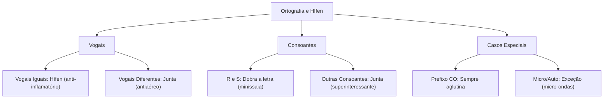

# 🎓 AcademiaIA - Aula Diária de Estudos
**Objetivo Geral:** Passar no cargo de Analista de Desenvolvimento de Sistemas no concurso da FUNDATEC
**Plano do Dia:** Dominar as regras de ortografia e o uso do hífen conforme o Acordo Ortográfico vigente, corrigindo as falhas do simulado anterior.
**Tema:** Ortografia: Hífen e Emprego de Letras segundo o Acordo Ortográfico

---

## 📅 Roteiro de Estudos Planejado pelo Diretor
* **Data:** 2026-07-23
* **Tópicos a Estudar:**
    - Ortografia: emprego de letras e do hífen conforme Acordo Ortográfico vigente (VOLP, Aulete)
* **Justificativa da Escolha:**
  O aluno selecionou obrigatoriamente a matéria de Português e o tópico de Ortografia e Hífen. O histórico de desempenho indica que, apesar de acertar as regras básicas, ele ainda possui lacunas conceituais importantes nas regras de duplicação de consoantes e nas exceções do uso do hífen, sendo necessário um reforço focado para garantir o sucesso na prova da FUNDATEC.
* **Professor Responsável:** Professor de Português

---

## 🔍 Análise Estratégica da Banca (FUNDATEC)
* **Recorrência do Assunto:** `Alta`
* **Foco da Banca nas Provas:**
  A FUNDATEC possui um perfil extremamente literal e normativo. Em questões de ortografia, a banca foca na aplicação das regras estabelecidas pelo Acordo Ortográfico de 1990 (incorporado pelo VOLP). A cobrança é direta: a banca apresenta uma lista de palavras (ou frases) e solicita que o candidato identifique a alternativa correta ou incorreta quanto à grafia. Existe uma tendência de priorizar palavras que geram dúvida frequente no cotidiano ou que sofreram alterações significativas com o novo acordo.
* **Pegadinhas Clássicas Mapeadas:**
    - Armadilha 1: Confusão entre o uso do hífen com prefixos. A banca frequentemente utiliza palavras como 'micro-ondas' (com hífen porque o segundo elemento começa com 'o') versus 'minissaia' (sem hífen e com dobra do 's'), testando se o candidato esqueceu as regras de fonética aplicada à morfologia.
  - Armadilha 2: O uso de vocábulos parônimos que possuem grafias parecidas, mas significados distintos, como 'sessão', 'seção' e 'cessão', ou 'despensa' e 'dispensa', induzindo o erro por semelhança sonora.
  - Armadilha 3: Casos de palavras que perderam o acento diferencial (como 'para' verbo versus 'para' preposição) e que a banca insiste em confundir com casos onde o acento ainda existe (como 'pôr' verbo versus 'por' preposição).
* **Atualizações Importantes:**
  Embora o Acordo Ortográfico tenha sido totalmente implementado, a FUNDATEC atualiza suas questões incorporando as últimas edições do VOLP (Vocabulário Ortográfico da Língua Portuguesa). A atenção deve estar voltada para o uso do hífen em prefixos terminados em vogal que se encontram com vogais iguais (ex: anti-inflamatório) e diferentes (ex: antiaéreo), além da supressão do hífen em prefixos terminados em consoante seguidos de vogal (ex: superinteressante).

---

### 📝 Questões Reais de Concursos Anteriores (Referência)

#### Questão de Referência 1 (2023 | Prefeitura de Bagé | Assistente Administrativo)
Assinale a alternativa em que a palavra destacada está escrita corretamente, conforme o Novo Acordo Ortográfico. A) Auto-escola B) Microondas C) Anti-inflamatório D) Infra-estrutura E) Contra-regra

* **Gabarito Oficial:** **Opção (C)**


---

## 📚 Conteúdo Expositivo da Aula: Ortografia: Hífen e Emprego de Letras segundo o Acordo Ortográfico

### 🎯 Objetivos de Aprendizagem
* **Dominar as regras de uso do hífen com prefixos conforme o VOLP.**
* **Compreender a regra de duplicação de consoantes (dobra) e supressão de hífen.**
* **Identificar as exceções e casos especiais (prefixos co-, micro-, auto-).**
* **Consolidar o conhecimento sobre a perda de acentos diferenciais e regras de acentuação.**

### 📝 Teoria Detalhada
## 1. Introdução e a "Analogia de Ouro"
Imagine que as palavras são como casais em um baile. O hífen é o "segurança" da festa. Em certas situações, o segurança precisa separar o casal porque eles são "incompatíveis" (duas vogais iguais, por exemplo). Em outras, os parceiros se abraçam tão forte que se fundem (duplicam consoantes) ou se juntam sem precisar de ajuda (sem hífen). O Acordo Ortográfico veio para simplificar essa logística do baile, tentando manter a regra: se os sons se chocam de forma estranha, o hífen ajuda; se eles fluem, o hífen desaparece.

## 2. Nivelamento e Conceituação Progressiva
Prefixos são elementos que se antepõem a radicais. O uso do hífen depende de três fatores: a letra final do prefixo, a letra inicial da palavra base e se há a formação de um novo som. 
* Regra de Ouro do Hífen: Vogais iguais se separam (anti-inflamatório). Vogais diferentes se juntam (antiaéreo).
* Regra da Consoante: Se o prefixo termina em consoante e a palavra começa em vogal, junta-se tudo (superinteressante). Se a palavra começa com a mesma consoante, mantém-se o hífen (sub-base está incorreto, o correto é subbase pelo VOLP, mas inter-regional se mantém por causa da consoante igual).

## 3. Aprofundamento Teórico Avançado
- Prefixos 'micro-' e 'auto-': Ao contrário de 'co-', estes não se fundem com vogais iguais. Ex: micro-ondas (termina em 'o', começa em 'o', usa-se hífen). 
- Prefixo 'co-': Este prefixo sempre se aglutina, mesmo com 'o'. Ex: coabitar, coobrigação.
- Duplicação de consoantes: Ao usar prefixos terminados em vogal (como mini-, ultra-, supra-) seguidos de 'r' ou 's', devemos dobrar a letra para manter o som original. Ex: minissaia, ultrarresistente.
- Acentos diferenciais: O acordo eliminou acentos de paroxítonas com ditongos abertos (ideia, jiboia) e de muitas palavras que tinham acento para diferenciar (para verbo vs para preposição). O acento diferencial permanece apenas em 'pôr' (verbo) vs 'por' (preposição) e 'pôde' (passado) vs 'pode' (presente).

## 4. Quadro Comparativo Visual
| Cenário | Regra | Exemplo Correto |
| :--- | :--- | :--- |
| Vogais Iguais | Usa-se hífen | anti-inflamatório |
| Vogais Diferentes | Aglutina-se | antiaéreo |
| Prefixo + R ou S | Dobra-se a letra | minissaia |
| Prefixo Terminado em Consoante + Vogal | Aglutina-se | superinteressante |
| Prefixos 'co-' | Sempre aglutina | coobrigação |

## 5. Mnemônicos e Técnicas de Memorização
- "Vogal igual, separa o mal (hífen). Vogal diferente, junta a gente."
- "R e S no caminho? Dobra o passinho (duplica a letra)."
- "CO é o amigão: junta tudo, não importa a situação."

## 6. Radar de Pegadinhas (Foco na Banca FUNDATEC)
1. A banca ama cobrar 'micro-ondas'. O aluno pensa que, por ser vogal igual, deve juntar, mas a regra do prefixo 'micro-' exige hífen.
2. Cuidado com 'sessão' (tempo), 'seção' (divisão) e 'cessão' (ato de ceder). São parônimos, não erros de acentuação, mas a FUNDATEC testa a escrita correta no contexto.
3. 'Sub-' antes de 'b' ou 'r': Subbase (o prefixo termina em 'b', a base começa em 'b', porém pelo novo acordo, consoantes diferentes não pedem hífen; se for igual, como 'subbibliotecário', usa-se hífen).

## 7. Perguntas de Auto-Verificação
1. Como escrevemos 'anti' + 'inflamatório'? R: Anti-inflamatório (vogais iguais se separam).
2. O prefixo 'co-' pede hífen em 'coobrigação'? R: Não, 'co-' sempre se aglutina.
3. A palavra 'para' (verbo) ainda tem acento? R: Não, o acento diferencial foi suprimido.

### 💡 Exemplos Práticos

#### Exemplo 1: Uso de Prefixos em Vogais
* **Descrição:** Demonstração da regra de vogais iguais vs. diferentes.
* **Especificação Técnica:**
```sql
Correto: anti-inflamatório (i+i), antiaéreo (a+a), coabitar (co+a), coobrigação (co+o).
```


#### Exemplo 2: Duplicação com R e S
* **Descrição:** Como evitar o erro fonético ao juntar prefixos.
* **Especificação Técnica:**
```sql
Prefixos (mini-, ultra-, anti-, supra-) + palavra com R/S:
- minissaia (não 'minisaia')
- ultrarresistente (não 'ultraresistente')
- antirrugas (não 'antirugas')
```


#### Exemplo 3: Prefixo Terminado em Consoante
* **Descrição:** Regras para prefixos como 'super', 'hiper' e 'inter'.
* **Especificação Técnica:**
```sql
super + interessante = superinteressante
hiper + ativo = hiperativo
inter + regional = inter-regional (mantém por ser consoante igual)
sub + base = subbase (aglutina, pois são consoantes diferentes)
```


### 📌 Resumo de Fixação
• Prefixos terminados em vogal: separar se a próxima letra for a mesma vogal (anti-inflamatório). Aglutinar se for diferente (antiaéreo).
• Prefixos terminados em consoante: aglutinar com vogais (superinteressante). Manter hífen se a base começar com a mesma consoante (inter-regional).
• Regra do R e S: ao adicionar prefixo terminado em vogal, dobra-se o R ou S (minissaia, ultrarresistente).
• Prefixo 'co-': Aglutina sempre (coobrigação).
• Prefixos 'micro-' e 'auto-': Não seguem a regra de aglutinação em vogais iguais (micro-ondas, autoescola).

---

## 🧠 Mapa Mental (Visualização Gráfica)


---

## 🗂️ Flashcards (Fixação Ativa)
| ❓ Pergunta | 💡 Resposta |
|---|---|
| **Como se escreve o plural de 'micro-ondas'?** | Micro-ondas (o prefixo micro não altera a regra do hífen). |
| **Por que 'minissaia' não tem hífen?** | Porque prefixos terminados em vogal + R ou S exigem a duplicação da consoante e a aglutinação. |
| **O verbo 'para' ainda é acentuado?** | Não, o acento diferencial foi suprimido pelo Acordo Ortográfico. |

---

## 📝 Simulado de Fixação (Criador de Exercícios)

### ❓ Caderno de Questões

#### Questão 1
* **Dificuldade:** `Médio` | **Edital:** *Emprego do hífen em prefixos*

Considerando as regras do uso do hífen com prefixos terminados em vogal, assinale a alternativa que apresenta a grafia correta de todas as palavras listadas.

  - **(A)** Autoescola, antiaéreo, infraestrutura.
  - **(B)** Auto-escola, anti-aéreo, infra-estrutura.
  - **(C)** Autoescola, anti-aéreo, infraestrutura.
  - **(D)** Auto-escola, antiaéreo, infra-estrutura.
  - **(E)** Autoescola, antiaéreo, infra-estrutura.


---
#### Questão 2
* **Dificuldade:** `Difícil` | **Edital:** *Emprego do hífen e duplicação de consoantes*

A regra de duplicação de consoantes é frequentemente testada pela FUNDATEC. Identifique a alternativa correta quanto à grafia de palavras formadas com prefixos terminados em vogal seguidos de 'r' ou 's'.

  - **(A)** Mini-saia, contra-regra, auto-suficiente.
  - **(B)** Minissaia, contrarregra, autossuficiente.
  - **(C)** Minisaia, contraregra, autosuficiente.
  - **(D)** Minissaia, contra-regra, auto-suficiente.
  - **(E)** Mini-saia, contrarregra, autossuficiente.


---
#### Questão 3
* **Dificuldade:** `Difícil` | **Edital:** *Acentuação gráfica*

Sobre o acento diferencial, assinale a alternativa em que a palavra destacada está grafada corretamente, considerando a supressão de acentos em determinados vocábulos pelo novo acordo.

  - **(A)** Ele pára o carro para abastecer.
  - **(B)** O pêlo do animal está muito sedoso.
  - **(C)** Devemos pôr fim a essa confusão.
  - **(D)** Ele sempre dê presentes aos netos.
  - **(E)** Eles vêem a televisão todos os dias.


---
#### Questão 4
* **Dificuldade:** `Difícil` | **Edital:** *Emprego do hífen em prefixos*

Identifique a alternativa em que a palavra composta por prefixo terminado em consoante está grafada incorretamente.

  - **(A)** Superinteressante
  - **(B)** Hiperativo
  - **(C)** Sub-base
  - **(D)** Interescolar
  - **(E)** Suboficial


---
#### Questão 5
* **Dificuldade:** `Médio` | **Edital:** *Ortografia oficial (parônimos)*

Em qual das alternativas abaixo ocorre erro no uso dos parônimos 'sessão', 'seção' e 'cessão'?

  - **(A)** A diretoria convocou uma sessão extraordinária.
  - **(B)** O documento oficial foi enviado para a seção de protocolos.
  - **(C)** Houve a cessão de todos os direitos autorais da obra.
  - **(D)** Ele estava na sessão de cinema quando o celular tocou.
  - **(E)** A seção de terras foi concluída com sucesso.


---
#### Questão 6
* **Dificuldade:** `Difícil` | **Edital:** *Emprego do hífen e duplicação*

Marque a alternativa que contém apenas palavras grafadas conforme a norma culta e o Acordo Ortográfico vigente.

  - **(A)** Micro-ondas, antissocial, semirreta.
  - **(B)** Microondas, anti-social, semi-reta.
  - **(C)** Micro-ondas, anti-social, semirreta.
  - **(D)** Microondas, antissocial, semi-reta.
  - **(E)** Micro-ondas, antissocial, semi-reta.


---
#### Questão 7
* **Dificuldade:** `Fácil` | **Edital:** *Acentuação gráfica (ditongos abertos)*

Analise a grafia das palavras abaixo e identifique aquela que está em desacordo com as regras atuais.

  - **(A)** Assembleia
  - **(B)** Ideia
  - **(C)** Jiboia
  - **(D)** Heróico
  - **(E)** Plateia


---
#### Questão 8
* **Dificuldade:** `Médio` | **Edital:** *Emprego do hífen*

Considerando o uso do hífen com prefixos terminados em vogal diante de vogais diferentes, assinale a alternativa correta:

  - **(A)** Extra-oficial, infra-estrutura, auto-escola.
  - **(B)** Extraoficial, infraestrutura, autoescola.
  - **(C)** Extra-oficial, infraestrutura, auto-escola.
  - **(D)** Extraoficial, infra-estrutura, autoescola.
  - **(E)** Extraoficial, infraestrutura, auto-escola.


---
#### Questão 9
* **Dificuldade:** `Médio` | **Edital:** *Emprego do hífen em prefixos*

Sobre o uso do hífen em prefixos terminados em consoante, qual das alternativas apresenta grafia correta?

  - **(A)** Hiper-rápido
  - **(B)** Inter-estelar
  - **(C)** Super-homem
  - **(D)** Inter-regional
  - **(E)** Super-interessante


---
#### Questão 10
* **Dificuldade:** `Difícil` | **Edital:** *Ortografia oficial (prefixos)*

Qual das palavras abaixo apresenta erro de grafia em relação aos prefixos 'auto-' e 'micro-'?

  - **(A)** Microssistema
  - **(B)** Autosserviço
  - **(C)** Micro-ondas
  - **(D)** Autoescola
  - **(E)** Micro-organismo


---

### 🔑 Gabarito e Resoluções Comentadas

#### Questão 1
* **Gabarito:** **Opção (A)**
* **Resolução e Comentário:**
  A regra define que, quando o prefixo termina em vogal e a segunda palavra começa com vogal diferente, não se usa hífen e não há aglutinação obrigatória. Portanto, 'autoescola', 'antiaéreo' e 'infraestrutura' estão corretas. O hífen só seria usado se as vogais fossem iguais (ex: anti-inflamatório) ou se o segundo elemento começasse com 'h' ou 'r' (ex: anti-higiênico).


---
#### Questão 2
* **Gabarito:** **Opção (B)**
* **Resolução e Comentário:**
  Pelo Acordo Ortográfico, quando o prefixo termina em vogal e o segundo elemento começa com 'r' ou 's', deve-se duplicar essas consoantes para manter o som original, eliminando o hífen. Logo, 'minissaia', 'contrarregra' e 'autossuficiente' são as grafias corretas.


---
#### Questão 3
* **Gabarito:** **Opção (C)**
* **Resolução e Comentário:**
  O acento diferencial em 'pôde' (passado) vs 'pode' (presente) e 'pôr' (verbo) vs 'por' (preposição) permanece. Contudo, 'para' (verbo) e 'pelo' (substantivo, antes 'pêlo') perderam o acento. 'Vêem' também perdeu o acento com o novo acordo. Portanto, 'pôr' está corretamente acentuado.


---
#### Questão 4
* **Gabarito:** **Opção (C)**
* **Resolução e Comentário:**
  A alternativa C está incorreta porque o prefixo 'sub-' terminado em consoante só exige hífen se a palavra seguinte começar com 'b', 'h' ou 'r' (neste caso, dobra-se a letra). Para 'sub' + 'base', o correto é 'subbase' (consoantes iguais se mantêm). Não se usa mais hífen para 'sub' seguido de consoante 'b' sem a duplicação.


---
#### Questão 5
* **Gabarito:** **Opção (E)**
* **Resolução e Comentário:**
  O erro está na alternativa E. 'Cessão' é o termo correto para o ato de ceder, doar ou transferir bens/terras. 'Seção' refere-se exclusivamente a divisões, repartições ou departamentos de uma organização.


---
#### Questão 6
* **Gabarito:** **Opção (A)**
* **Resolução e Comentário:**
  Em 'micro-ondas', mantém-se o hífen porque o prefixo termina em vogal e a segunda palavra inicia com a mesma vogal. 'Antissocial' não tem hífen e dobra o 's'. 'Semirreta' não tem hífen e dobra o 'r'. Apenas a alternativa A está integralmente correta.


---
#### Questão 7
* **Gabarito:** **Opção (D)**
* **Resolução e Comentário:**
  Pelo novo acordo, o ditongo aberto 'oi' em palavras paroxítonas (como heroi-co) perde o acento gráfico. Logo, a grafia correta é 'heroico', sem acento.


---
#### Questão 8
* **Gabarito:** **Opção (B)**
* **Resolução e Comentário:**
  A regra estipula que prefixos terminados em vogal seguidos de palavra iniciada por vogal diferente perdem o hífen. 'Extraoficial', 'infraestrutura' e 'autoescola' seguem corretamente essa diretriz.


---
#### Questão 9
* **Gabarito:** **Opção (C)**
* **Resolução e Comentário:**
  O prefixo terminado em consoante mantém o hífen apenas se a segunda palavra começar com a mesma consoante ou com 'h'. 'Hiper-rápido' é 'hiper-rápido' (hifenizado por ser 'r'), 'Super-homem' é correto. As outras, como 'superinteressante' (consoante+vogal), não levam hífen.


---
#### Questão 10
* **Gabarito:** **Opção (E)**
* **Resolução e Comentário:**
  A alternativa E está incorreta conforme o VOLP atual. A grafia correta é 'microrganismo', pois o prefixo termina em vogal e a segunda palavra começa com 'o', mas no caso de 'micro' + 'o', a regra de vogais iguais não se aplica de forma a manter hífen como em 'micro-ondas', devido à exceção de 'micro' com 'o'. Na verdade, o VOLP registra 'microrganismo' (sem hífen).

