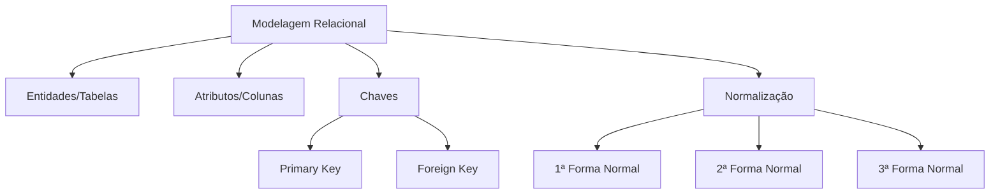

# 📚 Aula Especialista: Modelagem Relacional de Dados
**Sessão de Teste Isolado - Professor IA**

---

## 🎯 Objetivos de Aprendizagem
* **Compreender os conceitos fundamentais do Modelo Relacional (tabelas, tuplas e atributos).**
* **Identificar e aplicar chaves primárias e estrangeiras para garantir a integridade dos dados.**
* **Diferenciar os níveis de abstração na modelagem (Conceitual, Lógico e Físico).**
* **Entender os princípios da normalização para evitar redundância e anomalias.**

---

## 📝 Aula Expositiva
A Modelagem Relacional, proposta por Edgar F. Codd em 1970, baseia-se na teoria dos conjuntos e na lógica de predicados. O cerne deste modelo é a 'Relação', que visualizamos como uma tabela. Imagine que a modelagem de dados é como organizar um arquivo físico: precisamos de etiquetas claras (atributos), registros únicos (tuplas/linhas) e uma forma de conectar informações sem duplicá-las desnecessariamente. A chave primária (Primary Key) funciona como um CPF, um identificador único que garante que não confundiremos dois registros. A chave estrangeira (Foreign Key), por sua vez, é o elo que permite que uma tabela 'converse' com outra, estabelecendo o relacionamento entre entidades. Diferente de um arquivo de texto, o modelo relacional exige que os dados sejam atômicos (indivisíveis) e que as colunas possuam um domínio definido (tipo de dado). A normalização é o processo de organizar essas tabelas para evitar 'anomalias de atualização' – imagine ter que mudar o endereço de um cliente em 50 lugares diferentes; a normalização resolve isso centralizando o dado.

---

## 💡 Exemplos Práticos

### Exemplo 1: Estrutura de Relacionamento entre Clientes e Pedidos
* **Descrição:** Demonstração de como a chave estrangeira conecta duas tabelas para evitar que os dados do cliente sejam replicados em cada pedido.
* **Especificação Técnica:**
```sql
TABELA Clientes (ID_Cliente [PK], Nome, Email); TABELA Pedidos (ID_Pedido [PK], Data, Total, ID_Cliente [FK references Clientes(ID_Cliente)]);
```


---

## 📌 Resumo de Fixação
1. O modelo relacional estrutura dados em tabelas (relações). 2. A Chave Primária (PK) identifica unicamente uma tupla. 3. A Chave Estrangeira (FK) estabelece o relacionamento entre tabelas. 4. Normalização reduz a redundância e protege a integridade dos dados. 5. O processo flui do Modelo Conceitual (abstrato) para o Lógico (tabelas) e Físico (implementação no SGBD).

---

## 🧠 Mapa Mental da Aula


---

## 🗂️ Flashcards (Memória Ativa)
| ❓ Pergunta | 💡 Resposta |
|---|---|
| **O que define a Chave Primária?** | É um atributo ou conjunto de atributos que identifica de forma única cada registro (tupla) em uma tabela. |
| **Qual a função da Chave Estrangeira?** | Estabelecer uma referência (elo) entre duas tabelas, garantindo a integridade referencial. |
| **O que é normalização?** | Um processo técnico para organizar dados em tabelas, minimizando redundâncias e prevenindo anomalias de atualização. |
| **O que é uma tupla no modelo relacional?** | É o termo técnico utilizado para descrever uma linha ou um registro completo dentro de uma tabela. |
