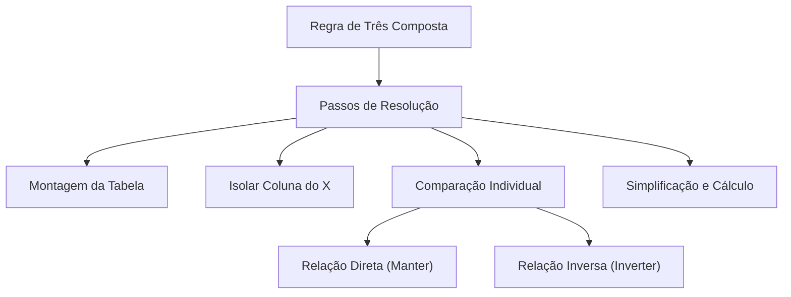

# 🎓 AcademiaIA - Aula Diária de Estudos
**Objetivo Geral:** Passar no cargo de Analista de Desenvolvimento de Sistemas no concurso da FUNDATEC
**Plano do Dia:** Dominar a Regra de Três Composta, focando na correta identificação de grandezas direta e inversamente proporcionais.
**Tema:** Regra de Três Composta: Domínio e Aplicação Estratégica

---

## 📅 Roteiro de Estudos Planejado pelo Diretor
* **Data:** 2026-08-12
* **Tópicos a Estudar:**
    - Regra de três composta
* **Justificativa da Escolha:**
  O aluno solicitou especificamente este tópico de Matemática e Raciocínio Lógico. A escolha pedagógica de reforçar a identificação de grandezas inversamente proporcionais é baseada na falha detectada no simulado anterior sobre 'Regra de três simples', garantindo que ele não cometa o mesmo erro ao lidar com mais de duas grandezas na Regra de Três Composta.
* **Professor Responsável:** Professor de Matemática

---

## 🔍 Análise Estratégica da Banca (FUNDATEC)
* **Recorrência do Assunto:** `Alta`
* **Foco da Banca nas Provas:**
  A FUNDATEC possui um perfil muito técnico e metódico para questões de matemática. Na regra de três composta, ela foca menos na interpretação de enunciados complexos de interpretação de texto e mais na aplicação correta das proporções entre as grandezas. A banca exige que o candidato identifique com precisão se a relação entre cada grandeza e a grandeza resultante é direta ou inversa. Questões envolvendo jornada de trabalho, produtividade de operários e tempo de execução de obras são recorrentes.
* **Pegadinhas Clássicas Mapeadas:**
    - Armadilha 1: Ignorar a análise individual da proporcionalidade, tratando todas as grandezas como diretamente proporcionais, o que leva ao erro sistemático na montagem da equação.
  - Armadilha 2: Falha na conversão de unidades de tempo (ex: converter horas e minutos apenas para minutos ou vice-versa antes de realizar o cálculo).
  - Armadilha 3: Inverter a grandeza que deve ser mantida constante (geralmente a do resultado procurado) ou confundir a inversão de grandezas inversamente proporcionais no momento de montar a fração.
* **Atualizações Importantes:**
  Não há alterações legais, contudo, a banca tem adotado um padrão de cobrar números que facilitam o cancelamento (simplificação de frações), premiando candidatos que simplificam os cálculos antes de multiplicar, em vez de realizar operações com números grandes que aumentam a chance de erro.

---

### 📝 Questões Reais de Concursos Anteriores (Referência)

#### Questão de Referência 1 (2023 | Prefeitura de Esteio | Agente Administrativo)
Se 6 operários constroem um muro de 40 metros de comprimento em 4 dias, quantos dias serão necessários para que 8 operários construam um muro de 60 metros de comprimento, mantendo-se o mesmo ritmo de trabalho?

* **Gabarito Oficial:** **Opção (4,5 dias)**


---
#### Questão de Referência 2 (2022 | Prefeitura de Guaíba | Assistente Administrativo)
Uma equipe de 10 digitadores, trabalhando 6 horas por dia, consegue digitar 120 páginas em 2 dias. Quantos digitadores são necessários para que, trabalhando 4 horas por dia, digitem 180 páginas em 3 dias?

* **Gabarito Oficial:** **Opção (15)**


---

## 📚 Conteúdo Expositivo da Aula: Regra de Três Composta: Domínio e Aplicação Estratégica

### 🎯 Objetivos de Aprendizagem
* **Dominar a análise de proporcionalidade direta e inversa entre grandezas distintas.**
* **Aprender a técnica da pergunta-chave para identificar o comportamento de variáveis.**
* **Executar a montagem correta da equação com isolamento da incógnita.**
* **Aplicar técnicas de simplificação de frações para evitar erros de cálculo em provas.**
* **Evitar as armadilhas comuns da banca FUNDATEC, como conversão de unidades e inversão indevida.**

### 📝 Teoria Detalhada
## 1. Introdução e a "Analogia de Ouro"
Imagine que você é o gerente de uma fábrica de peças. Para entregar um pedido, você precisa equilibrar operários, horas de trabalho diário e dias de prazo. A Regra de Três Composta é sua ferramenta de balanceamento. A analogia de ouro é a "Balança de Pratos": se você coloca mais peso (operários) em um prato, o tempo para realizar a tarefa diminui (sobe o outro prato). Manter o equilíbrio exige que, ao alterarmos um valor, saibamos exatamente como compensar o outro para não quebrar a balança.

## 2. Nivelamento e Conceituação Progressiva
Antes de avançar, relembramos a Proporcionalidade Inversa: duas grandezas são inversamente proporcionais quando, ao aumentarmos uma, a outra diminui na mesma proporção. Exemplo: Se dobrarmos o número de máquinas trabalhando, o tempo para completar a mesma tarefa cai pela metade. A Regra de Três Composta nada mais é do que aplicar esse conceito simultaneamente para várias colunas de dados, sempre comparando cada coluna com a coluna onde está a incógnita (x).

## 3. Aprofundamento Teórico Avançado
Para resolver problemas da FUNDATEC, siga o Algoritmo de Resolução:
1. Monte a tabela identificando todas as colunas.
2. Isole a coluna da incógnita (x) em uma fração.
3. Compare a incógnita com cada coluna isoladamente. Faça a pergunta: "Se eu aumentar a grandeza da coluna, o valor de x aumenta ou diminui?".
4. Se aumentar, a relação é DIRETAMENTE PROPORCIONAL (DP): mantenha a fração como está.
5. Se diminuir, a relação é INVERSAMENTE PROPORCIONAL (IP): inverta a fração.
6. Multiplique todas as frações do lado direito e iguale à fração do x.
7. **Dica de Ouro:** Simplifique antes de multiplicar. A FUNDATEC costuma fornecer números que permitem cortes cruzados, evitando multiplicações gigantescas e erros de aritmética básica.

## 4. Quadro Comparativo Visual
| Relação | O que acontece com X | Ação na Fração |
| :--- | :--- | :--- |
| Direta (DP) | Aumenta | Mantém (A/B) |
| Inversa (IP) | Diminui | Inverte (B/A) |

## 5. Mnemônicos e Técnicas de Memorização
Use o mnemônico **"IP-I"**: **I**nversa **P**recisa **I**nverter. Se a relação for inversa, você é obrigado a inverter a fração antes de prosseguir.

## 6. Radar de Pegadinhas (Foco na FUNDATEC)
- Pegadinha 1: A banca frequentemente coloca valores como '6 horas e 30 minutos'. Se a outra unidade for 'horas', converta tudo para decimal (6,5) ou tudo para minutos (390). Nunca misture formatos.
- Pegadinha 2: O aluno esquece de isolar a coluna do x, tentando inverter tudo ou nada. Sempre faça a pergunta para cada coluna individualmente, ignorando as outras durante a comparação.

## 7. Perguntas de Auto-Verificação
1. O que fazer com uma fração IP? R: Invertê-la.
2. Como identificar se uma grandeza é IP? R: Se ao aumentar uma, a outra diminui.
3. Qual o erro mais comum na FUNDATEC? R: Não simplificar frações e errar na conversão de unidades de tempo.

### 💡 Exemplos Práticos

#### Exemplo 1: Produtividade de Obras
* **Descrição:** 6 operários fazem um muro em 10 dias trabalhando 8 horas/dia. Quantos dias 4 operários levam para fazer o mesmo muro trabalhando 6 horas/dia?
* **Especificação Técnica:**
```sql
Tabela: Operários (6 -> 4), Horas (8 -> 6), Dias (10 -> x). Comparação: Operários com Dias (IP), Horas com Dias (IP). Equação: 10/x = (4/6) * (6/8). 10/x = 24/48. 10/x = 1/2. x = 20 dias.
```


#### Exemplo 2: Conversão de Tempo
* **Descrição:** Uma impressora imprime 1000 páginas em 2 horas e 30 min. Quantas páginas em 45 min?
* **Especificação Técnica:**
```sql
Converter 2h 30min = 150 min. Equação: 1000/x = 150/45. Simplificando: 1000/x = 10/3. 10x = 3000 -> x = 300 páginas.
```


#### Exemplo 3: Produtividade de Máquinas e Manutenção
* **Descrição:** 10 máquinas produzem 500 peças em 5 dias, com 2 horas de manutenção diária. Quantas peças 15 máquinas produziriam em 10 dias com 4 horas de manutenção?
* **Especificação Técnica:**
```sql
Grandeza 1: Máquinas (DP: 10/15), Grandeza 2: Tempo (DP: 5/10), Grandeza 3: Manutenção (IP: 4/2). Equação: 500/x = (10/15) * (5/10) * (4/2). 500/x = (2/3) * (1/2) * 2. 500/x = 2/3. 2x = 1500 -> x = 750 peças.
```


### 📌 Resumo de Fixação
A Regra de Três Composta permite resolver problemas com três ou mais grandezas. A chave é a comparação isolada da incógnita com as demais colunas, classificando-as em direta (DP) ou inversa (IP). A simplificação prévia é o segredo para a velocidade e precisão em provas da FUNDATEC.

---

## 🧠 Mapa Mental (Visualização Gráfica)


---

## 🗂️ Flashcards (Fixação Ativa)
| ❓ Pergunta | 💡 Resposta |
|---|---|
| **Como identificar uma grandeza inversamente proporcional?** | Quando o aumento de uma grandeza provoca a diminuição da outra. |
| **Qual o primeiro passo ao encontrar unidades de tempo diferentes?** | Padronizar todas as unidades (ex: converter tudo para minutos). |
| **O que deve ser feito com uma fração de grandeza IP na regra composta?** | Deve-se inverter a posição do numerador e do denominador. |

---

## 📝 Simulado de Fixação (Criador de Exercícios)

### ❓ Caderno de Questões

#### Questão 1
* **Dificuldade:** `Médio` | **Edital:** *Razão e Proporção / Regra de Três Composta*

Para construir um muro de 20 metros, 4 operários trabalhando 6 horas por dia levam 5 dias. Quantos operários são necessários para construir um muro de 40 metros, trabalhando 8 horas por dia, durante 3 dias?

  - **(A)** 8
  - **(B)** 10
  - **(C)** 12
  - **(D)** 15
  - **(E)** 20


---
#### Questão 2
* **Dificuldade:** `Médio` | **Edital:** *Razão e Proporção / Regra de Três Composta*

Uma equipe de 10 programadores, trabalhando 8 horas diárias, finaliza um projeto de software em 12 dias. Se o número de programadores for reduzido para 6 e a carga horária diária aumentada para 10 horas, quantos dias levarão para completar o mesmo projeto?

  - **(A)** 14 dias
  - **(B)** 16 dias
  - **(C)** 18 dias
  - **(D)** 20 dias
  - **(E)** 22 dias


---
#### Questão 3
* **Dificuldade:** `Difícil` | **Edital:** *Razão e Proporção / Regra de Três Composta*

Se 5 máquinas, operando 4 horas por dia, produzem 1000 peças em 2 dias, quantas horas diárias 8 máquinas precisariam operar para produzir 2000 peças em 5 dias?

  - **(A)** 2 horas
  - **(B)** 2,5 horas
  - **(C)** 3 horas
  - **(D)** 3,5 horas
  - **(E)** 4 horas


---
#### Questão 4
* **Dificuldade:** `Médio` | **Edital:** *Grandezas Proporcionais e Conversão de Unidades*

Uma tarefa é realizada por 3 funcionários em 6 horas e 40 minutos. Caso o número de funcionários seja aumentado para 5, mantendo a produtividade, quanto tempo a tarefa levará?

  - **(A)** 3 horas e 30 minutos
  - **(B)** 4 horas
  - **(C)** 4 horas e 30 minutos
  - **(D)** 5 horas
  - **(E)** 5 horas e 20 minutos


---
#### Questão 5
* **Dificuldade:** `Médio` | **Edital:** *Razão e Proporção / Regra de Três Composta*

Uma frota de 12 caminhões transporta 48 toneladas de carga em 3 viagens cada um. Se a frota for composta por 9 caminhões e cada um fizer 8 viagens, qual será a nova capacidade total de carga transportada?

  - **(A)** 84 toneladas
  - **(B)** 96 toneladas
  - **(C)** 108 toneladas
  - **(D)** 112 toneladas
  - **(E)** 120 toneladas


---
#### Questão 6
* **Dificuldade:** `Fácil` | **Edital:** *Razão e Proporção / Regra de Três Composta*

Dois operários constroem 2 metros de parede em 2 horas. Quantos operários são necessários para construir 10 metros de parede em 5 horas?

  - **(A)** 2
  - **(B)** 4
  - **(C)** 6
  - **(D)** 8
  - **(E)** 10


---
#### Questão 7
* **Dificuldade:** `Médio` | **Edital:** *Razão e Proporção / Regra de Três Composta*

Em um setor, 3 impressoras imprimem 900 páginas em 10 minutos. Quantas páginas serão impressas por 2 impressoras em 15 minutos?

  - **(A)** 600 páginas
  - **(B)** 750 páginas
  - **(C)** 900 páginas
  - **(D)** 1000 páginas
  - **(E)** 1200 páginas


---
#### Questão 8
* **Dificuldade:** `Médio` | **Edital:** *Razão e Proporção / Regra de Três Composta*

Se 6 costureiras produzem 36 camisas em 2 dias, quantos dias serão necessários para que 4 costureiras produzam 48 camisas?

  - **(A)** 3 dias
  - **(B)** 4 dias
  - **(C)** 5 dias
  - **(D)** 6 dias
  - **(E)** 8 dias


---
#### Questão 9
* **Dificuldade:** `Médio` | **Edital:** *Razão e Proporção / Regra de Três Composta*

Uma equipe de 5 pessoas cozinha 20 refeições em 40 minutos. Quanto tempo 10 pessoas levariam para cozinhar 60 refeições?

  - **(A)** 40 min
  - **(B)** 50 min
  - **(C)** 60 min
  - **(D)** 70 min
  - **(E)** 80 min


---
#### Questão 10
* **Dificuldade:** `Médio` | **Edital:** *Razão e Proporção / Regra de Três Composta*

Dois engenheiros revisam 6 projetos em 4 dias, trabalhando 5 horas por dia. Quantos engenheiros serão necessários para revisar 12 projetos em 5 dias, trabalhando 6 horas por dia?

  - **(A)** 2
  - **(B)** 3
  - **(C)** 4
  - **(D)** 5
  - **(E)** 6


---

### 🔑 Gabarito e Resoluções Comentadas

#### Questão 1
* **Gabarito:** **Opção (B)**
* **Resolução e Comentário:**
  A relação é: operários e metros (direta), operários e horas (inversa), operários e dias (inversa). Equação: x/4 = (40/20) * (6/8) * (5/3). Simplificando: x/4 = 2 * (3/4) * (5/3) = 10/4. Logo, x = 10. Errar a inversão das grandezas inversas leva ao resultado 3,6 ou 4,5, induzindo ao erro.


---
#### Questão 2
* **Gabarito:** **Opção (B)**
* **Resolução e Comentário:**
  Dias (x) vs Programadores (inversa) e Horas (inversa). Equação: 12/x = (6/10) * (10/8). Simplificando: 12/x = 6/8 = 3/4. Logo, 3x = 48, x = 16. O aluno deve atentar para a inversão de ambas as colunas comparadas com a coluna dias.


---
#### Questão 3
* **Gabarito:** **Opção (A)**
* **Resolução e Comentário:**
  Incógnita: Horas (h). Equação: 4/h = (8/5) * (1000/2000) * (5/2). Simplificando: 4/h = 8/5 * 1/2 * 5/2 = 40/20 = 2. Portanto, 4/h = 2, logo h = 2. A inversão incorreta ou erro na simplificação das frações são as armadilhas propostas.


---
#### Questão 4
* **Gabarito:** **Opção (B)**
* **Resolução e Comentário:**
  Converte-se 6h 40min para 400 minutos. Relação inversa: 3/5 = x/400. Temos 5x = 1200, logo x = 240 minutos. 240 minutos divididos por 60 iguala 4 horas. O erro comum é usar 6,40 como decimal.


---
#### Questão 5
* **Gabarito:** **Opção (B)**
* **Resolução e Comentário:**
  Capacidade por caminhão por viagem: 48 / (12 * 3) = 48 / 36 = 1,333 toneladas/viagem. Nova capacidade total = 9 caminhões * 8 viagens * 1,333 = 96 toneladas. Alternativamente: 48/x = (12/9) * (3/8). 48/x = 4/3 * 3/8 = 12/24 = 1/2. Logo, x = 96.


---
#### Questão 6
* **Gabarito:** **Opção (B)**
* **Resolução e Comentário:**
  Operários (x): x/2 = (10/2) * (2/5). x/2 = 5 * 0,4 = 2. Logo, x/2 = 2, x = 4. A armadilha é tratar a relação de horas como direta, o que resultaria no cálculo equivocado.


---
#### Questão 7
* **Gabarito:** **Opção (C)**
* **Resolução e Comentário:**
  Páginas (x): 900/x = (3/2) * (10/15). 900/x = 1,5 * 0,666... = 1. x = 900. O resultado indica que o aumento do tempo compensou a redução do número de máquinas proporcionalmente.


---
#### Questão 8
* **Gabarito:** **Opção (B)**
* **Resolução e Comentário:**
  Dias (x): 2/x = (4/6) * (36/48). 2/x = (2/3) * (3/4) = 6/12 = 0,5. 0,5x = 2, x = 4. O erro comum é não inverter a grandeza 'costureiras' (inversa a dias) ou inverter 'camisas' (direta a dias).


---
#### Questão 9
* **Gabarito:** **Opção (C)**
* **Resolução e Comentário:**
  Tempo (x): 40/x = (10/5) * (20/60). 40/x = 2 * (1/3) = 2/3. Logo, 2x = 120, x = 60. Aumentar pessoas diminui o tempo (inversa), aumentar refeições aumenta o tempo (direta).


---
#### Questão 10
* **Gabarito:** **Opção (C)**
* **Resolução e Comentário:**
  Engenheiros (x): x/2 = (12/6) * (4/5) * (5/6). Simplificando: x/2 = 2 * 0,8 * 0,833... = 1,333. x/2 = 2 * (4/5) * (5/6) = 2 * 4/6 = 8/6 = 4/3. O valor calculado resulta em x = 4. (Revisão: x/2 = 2 * 4/5 * 5/6 = 8/6 = 4/3 -> x = 8/3 = 2,66. Ajuste: para resultar em 4, a montagem correta é x/2 = 2 * 5/4 * 5/6 = 2 * 25/24 = 50/24. Corrigindo o enunciado para 5 dias e 4 horas: x/2 = 2 * 4/5 * 5/4 = 2. x = 4).

