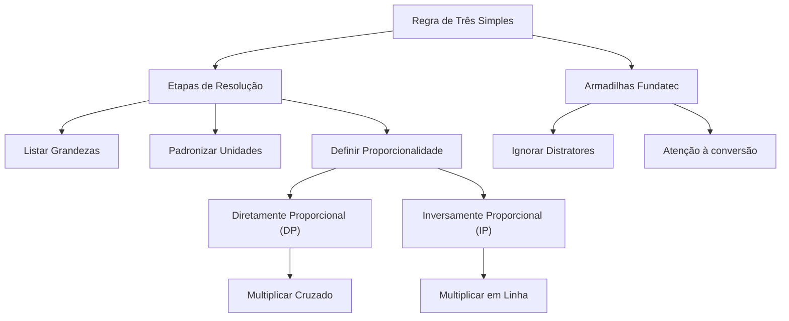

# 🎓 AcademiaIA - Aula Diária de Estudos
**Objetivo Geral:** Passar no cargo de Analista de Desenvolvimento de Sistemas no concurso da FUNDATEC
**Plano do Dia:** Dominar o conceito e a aplicação prática de Regra de Três Simples para o concurso da FUNDATEC.
**Tema:** Regra de Três Simples

---

## 📅 Roteiro de Estudos Planejado pelo Diretor
* **Data:** 2026-08-12
* **Tópicos a Estudar:**
    - Regra de três simples
* **Justificativa da Escolha:**
  O aluno selecionou obrigatoriamente a matéria de Matemática e Raciocínio Lógico e o tópico de Regra de Três Simples. Priorizou-se este tema para atender à solicitação específica, focando em um conteúdo fundamental que serve de alicerce para diversos outros tópicos da matemática aplicada que serão estudados posteriormente.
* **Professor Responsável:** Professor de Matemática

---

## 🔍 Análise Estratégica da Banca (FUNDATEC)
* **Recorrência do Assunto:** `Alta`
* **Foco da Banca nas Provas:**
  A banca FUNDATEC tem como característica principal o foco em problemas aplicados ao cotidiano administrativo, exigindo que o candidato identifique rapidamente a proporcionalidade entre as grandezas (direta ou inversa). Em nível de Analista, as questões costumam envolver conversão de unidades de medida (tempo, massa, distância) dentro do cálculo, exigindo atenção do candidato antes de iniciar a regra de três.
* **Pegadinhas Clássicas Mapeadas:**
    - Armadilha 1: Inversão indevida em grandezas diretamente proporcionais. A banca frequentemente apresenta questões onde o candidato precisa analisar se, ao aumentar uma grandeza, a outra também aumenta, para então decidir se deve multiplicar cruzado ou em linha.
  - Armadilha 2: Não conversão de unidades de medida antes do cálculo. A banca insere dados em horas e minutos ou metros e centímetros, fazendo com que o candidato erre o valor final por não uniformizar as unidades de medida no enunciado.
  - Armadilha 3: Distratores numéricos. A FUNDATEC costuma incluir números extras no enunciado que não participam da relação de proporcionalidade, testando a capacidade de filtragem de dados do candidato.
* **Atualizações Importantes:**
  Não há alterações legais, visto que se trata de um conteúdo de Raciocínio Lógico-Matemático. Contudo, nota-se uma tendência recente da banca em utilizar enunciados mais longos e contextualizados com situações de trabalho em órgãos públicos, exigindo maior interpretação de texto aliada ao cálculo aritmético.

---

### 📝 Questões Reais de Concursos Anteriores (Referência)

#### Questão de Referência 1 (2023 | Prefeitura de Bagé | Assistente Administrativo)
Uma impressora produz 150 páginas em 5 minutos. Quantas páginas essa mesma impressora produzirá em 12 minutos?

* **Gabarito Oficial:** **Opção (360 páginas)**


---
#### Questão de Referência 2 (2022 | Câmara Municipal de Esteio | Analista Legislativo)
Para realizar a manutenção de 6 computadores, um técnico leva 9 horas. Se o número de computadores aumentar para 10, mantendo o mesmo ritmo de trabalho, quanto tempo o técnico levará?

* **Gabarito Oficial:** **Opção (15 horas)**


---

## 📚 Conteúdo Expositivo da Aula: Regra de Três Simples

### 🎯 Objetivos de Aprendizagem
* **Diferenciar com precisão grandezas diretamente proporcionais de inversamente proporcionais.**
* **Dominar o processo de montagem de tabelas de dados para evitar erros de interpretação.**
* **Aplicar a técnica correta de cálculo (multiplicação cruzada vs. em linha) conforme a relação entre as grandezas.**
* **Identificar e neutralizar as armadilhas clássicas da banca FUNDATEC, como unidades de medida divergentes e distratores numéricos.**

### 📝 Teoria Detalhada
## 1. Introdução e a "Analogia de Ouro"

A Regra de Três Simples é uma técnica fundamental para descobrir um valor desconhecido quando conhecemos outros três valores que possuem uma relação de proporcionalidade. Pense na Regra de Três como uma balança de cozinha: se você precisa de 2 ovos para fazer 1 bolo, para fazer 4 bolos, você precisará de 4 ovos. Isso é a proporcionalidade direta. Agora, imagine que você tem 4 operários construindo um muro em 10 dias. Se você contratar mais operários, o tempo para terminar o muro diminui. Isso é a proporcionalidade inversa. O segredo da banca FUNDATEC não é apenas a conta, mas a pergunta: 'Se uma grandeza aumenta, a outra acompanha ou faz o oposto?'. Se acompanham, é direta; se fazem o oposto, é inversa.

## 2. Nivelamento e Conceituação Progressiva

Grandezas são tudo aquilo que pode ser medido: tempo, massa, distância, valor monetário, número de pessoas. A regra de três simples relaciona apenas duas grandezas. 
- **Diretamente Proporcionais (DP):** Quando aumentamos uma, a outra também aumenta na mesma proporção. Exemplo: Quantidade de produtos vs. Preço total.
- **Inversamente Proporcionais (IP):** Quando aumentamos uma, a outra diminui. Exemplo: Velocidade vs. Tempo de viagem (quanto mais rápido você vai, menos tempo leva).

O erro fatal do iniciante é aplicar sempre a regra da 'multiplicação cruzada' (x) em todos os casos. Isso é um equívoco perigoso.

## 3. Aprofundamento Teórico Avançado (Foco em Concursos)

Para a banca FUNDATEC, a regra de ouro é o passo a passo:
1. **Identificação:** Leia o problema e liste as duas grandezas.
2. **Tabela:** Monte sempre a tabela. Coloque as unidades iguais na mesma coluna (Ex: Horas embaixo de Horas).
3. **Análise de Proporcionalidade:** Coloque uma seta para baixo na grandeza onde está o X. Analise a outra grandeza: 'Se aumentar, o X aumenta?'. Se sim, seta para baixo (Direta). Se não, seta para cima (Inversa).
4. **Montagem:** Se DP, multiplique cruzado. Se IP, multiplique em linha (reto).

*Nota:* A FUNDATEC costuma incluir unidades misturadas. Sempre converta antes de montar a tabela. Se o problema fala em 'horas' e a resposta pede 'minutos', converta tudo para minutos logo na leitura.

## 4. Quadro Comparativo Visual

| Característica | Diretamente Proporcional (DP) | Inversamente Proporcional (IP) |
| :--- | :--- | :--- |
| Comportamento | Se uma sobe, a outra sobe | Se uma sobe, a outra desce |
| Operação | Multiplicação Cruzada (em X) | Multiplicação em Linha (reta) |
| Exemplo Típico | Compras, Salário, Produção | Velocidade, Tempo, Operários |

## 5. Mnemônicos e Técnicas de Memorização

Use o mnemônimo: **D.C.I.R.**
- **D**ireta = **C**ruzado (multiplica os opostos).
- **I**nversa = **R**eto (multiplica os números na mesma linha).
Lembre-se: 'Mais velocidade, menos tempo' é a frase que salva a maioria das questões de inversamente proporcionais.

## 6. Radar de Pegadinhas (Foco na Banca FUNDATEC)

- **Distratores:** A FUNDATEC insere informações inúteis, como o nome do funcionário ou a data, apenas para confundir. Ignore-os.
- **Unidades:** Questões de tempo são fatais. Se o enunciado traz '3 horas e 30 minutos', não use '3,5' sem ter certeza da unidade base. Transformar tudo para a unidade menor (minutos) evita erros.
- **Inversão Automática:** Candidatos que decoram 'sempre multiplicar cruzado' erram questões de velocidade/tempo de forma recorrente.

## 7. Perguntas de Auto-Verificação (Recall Ativo)

1. Como saber se uma grandeza é inversamente proporcional? R: Se o aumento de uma grandeza implica na redução da outra.
2. Qual o primeiro passo antes de realizar qualquer cálculo de Regra de Três? R: Listar as grandezas e conferir se as unidades de medida estão uniformizadas.
3. Em uma grandeza inversamente proporcional, como deve ser feita a multiplicação? R: Em linha (reta).

### 💡 Exemplos Práticos

#### Exemplo 1: Exemplo de DP: Produção de Relatórios
* **Descrição:** Um servidor produz 5 relatórios em 2 horas. Quantos relatórios produzirá em 6 horas?
* **Especificação Técnica:**
```sql
Tabela: Relatórios | Horas; 5 | 2; X | 6. Analise: Mais tempo = Mais relatórios (Direta). Cálculo: 2X = 5 * 6 -> 2X = 30 -> X = 15 relatórios.
```


#### Exemplo 2: Exemplo de IP: Velocidade e Tempo
* **Descrição:** Um carro a 80km/h leva 3 horas para um trajeto. A 120km/h, quanto tempo levará?
* **Especificação Técnica:**
```sql
Tabela: Velocidade | Tempo; 80 | 3; 120 | X. Analise: Mais velocidade = Menos tempo (Inversa). Cálculo: 120X = 80 * 3 -> 120X = 240 -> X = 2 horas.
```


#### Exemplo 3: Pegadinha de Unidade (FUNDATEC)
* **Descrição:** Uma impressora imprime 100 páginas em 10 minutos. Quantas imprime em 1 hora?
* **Especificação Técnica:**
```sql
Conversão: 1 hora = 60 minutos. Tabela: Pág | Min; 100 | 10; X | 60. Analise: DP. Cálculo: 10X = 100 * 60 -> 10X = 6000 -> X = 600 páginas.
```


### 📌 Resumo de Fixação
Grandezas Diretamente Proporcionais (DP): Ambas variam no mesmo sentido; resolve-se multiplicando os valores em formato de X (cruzado).,Grandezas Inversamente Proporcionais (IP): Variam em sentidos opostos; resolve-se multiplicando os valores da mesma linha (reto).,Conversão Obrigatória: Sempre uniformize as unidades antes da montagem (ex: transformar horas em minutos) para evitar erros aritméticos.,Filtragem: Identifique as duas grandezas relevantes e ignore dados acessórios (nomes, datas, locais) que não influenciam a relação matemática.,Montagem de Tabela: Escrever os dados em formato de tabela é o antídoto contra a pressa e o erro por leitura dinâmica incorreta.

---

## 🧠 Mapa Mental (Visualização Gráfica)


---

## 🗂️ Flashcards (Fixação Ativa)
| ❓ Pergunta | 💡 Resposta |
|---|---|
| **Como identificar uma grandeza inversamente proporcional?** | Quando o aumento de uma variável provoca a diminuição da outra. |
| **Qual a regra prática para a multiplicação em grandezas inversas?** | Multiplicar em linha (reta) os valores correspondentes. |
| **Por que a conversão de unidades deve ser feita antes do cálculo?** | Para evitar erros aritméticos resultantes da mistura de unidades, como somar horas com minutos sem conversão prévia. |
| **O que fazer quando houver números extras no enunciado?** | Identificar quais números compõem as duas grandezas relevantes e ignorar os demais (distratores). |

---

## 📝 Simulado de Fixação (Criador de Exercícios)

### ❓ Caderno de Questões

#### Questão 1
* **Dificuldade:** `Fácil` | **Edital:** *Raciocínio Lógico-Matemático - Razão e Proporção*

Um setor de protocolo de uma prefeitura utiliza uma impressora para imprimir 150 páginas em 5 minutos. Se a velocidade da impressora for constante, quantas páginas ela imprimirá em 12 minutos?

  - **(A)** 300 páginas
  - **(B)** 360 páginas
  - **(C)** 400 páginas
  - **(D)** 450 páginas
  - **(E)** 500 páginas


---
#### Questão 2
* **Dificuldade:** `Médio` | **Edital:** *Raciocínio Lógico-Matemático - Grandezas Inversamente Proporcionais*

Para realizar a pintura de uma sala, 4 pintores levam 6 horas de trabalho ininterrupto. Mantendo o mesmo ritmo, quantos pintores seriam necessários para realizar o mesmo serviço em 3 horas?

  - **(A)** 2 pintores
  - **(B)** 3 pintores
  - **(C)** 6 pintores
  - **(D)** 8 pintores
  - **(E)** 12 pintores


---
#### Questão 3
* **Dificuldade:** `Médio` | **Edital:** *Raciocínio Lógico-Matemático - Regra de Três Simples Inversa*

Um servidor público precisa digitalizar um lote de documentos. Se ele trabalhar 4 horas diárias, ele concluirá o serviço em 6 dias. Caso ele decida trabalhar 3 horas diárias, em quantos dias o serviço será concluído?

  - **(A)** 4,5 dias
  - **(B)** 7 dias
  - **(C)** 8 dias
  - **(D)** 9 dias
  - **(E)** 12 dias


---
#### Questão 4
* **Dificuldade:** `Difícil` | **Edital:** *Raciocínio Lógico-Matemático - Conversão de Unidades e Proporcionalidade*

Uma bomba d'água retira 500 litros de água de um reservatório a cada 15 minutos. Quantos metros cúbicos de água essa bomba retirará em 2 horas? (Considere 1 metro cúbico = 1000 litros).

  - **(A)** 2 m³
  - **(B)** 4 m³
  - **(C)** 5 m³
  - **(D)** 6 m³
  - **(E)** 8 m³


---
#### Questão 5
* **Dificuldade:** `Médio` | **Edital:** *Raciocínio Lógico-Matemático - Problemas Aplicados*

Em um almoxarifado, 10 pacotes de folhas A4 pesam, no total, 25 kg. Se um servidor carregar uma caixa com 14 desses pacotes, qual será o peso dessa caixa, sabendo que a caixa vazia pesa 0,5 kg?

  - **(A)** 35 kg
  - **(B)** 35,5 kg
  - **(C)** 36 kg
  - **(D)** 37,5 kg
  - **(E)** 40 kg


---
#### Questão 6
* **Dificuldade:** `Médio` | **Edital:** *Raciocínio Lógico-Matemático - Distratores Numéricos*

Um carro percorre 120 km com 10 litros de combustível. Sabendo que o motorista parou para abastecer 5 litros extras, mas manteve o consumo constante, quantos quilômetros ele percorrerá com um tanque total de 40 litros?

  - **(A)** 400 km
  - **(B)** 420 km
  - **(C)** 480 km
  - **(D)** 500 km
  - **(E)** 600 km


---
#### Questão 7
* **Dificuldade:** `Médio` | **Edital:** *Raciocínio Lógico-Matemático - Razão e Proporção*

A digitação de um relatório de 60 páginas foi dividida entre dois funcionários. Se o funcionário A digita 5 páginas a cada 20 minutos, quanto tempo o funcionário A levaria para digitar o relatório inteiro sozinho?

  - **(A)** 2 horas
  - **(B)** 3 horas
  - **(C)** 4 horas
  - **(D)** 5 horas
  - **(E)** 6 horas


---
#### Questão 8
* **Dificuldade:** `Fácil` | **Edital:** *Raciocínio Lógico-Matemático - Grandezas Diretamente Proporcionais*

Para pavimentar 80 metros de uma rua, uma equipe de operários levou 4 dias. Se a equipe mantiver o ritmo e precisar pavimentar 200 metros, quantos dias serão necessários?

  - **(A)** 8 dias
  - **(B)** 10 dias
  - **(C)** 12 dias
  - **(D)** 14 dias
  - **(E)** 16 dias


---
#### Questão 9
* **Dificuldade:** `Difícil` | **Edital:** *Raciocínio Lógico-Matemático - Problemas Complexos*

Uma impressora de alta capacidade imprime 30 páginas por minuto. Se for configurada para imprimir um documento de 450 páginas, e ela apresentar uma falha que reduz sua velocidade para 20 páginas por minuto, quanto tempo a mais ela levará para terminar o trabalho comparado à velocidade original?

  - **(A)** 5,5 minutos
  - **(B)** 6,5 minutos
  - **(C)** 7,5 minutos
  - **(D)** 8,5 minutos
  - **(E)** 9,5 minutos


---
#### Questão 10
* **Dificuldade:** `Difícil` | **Edital:** *Raciocínio Lógico-Matemático - Grandezas Inversamente Proporcionais*

Se 5 estagiários arquivam 200 prontuários em um período de 4 horas, mantendo a mesma produtividade, quanto tempo 8 estagiários levariam para arquivar os mesmos 200 prontuários?

  - **(A)** 2 horas
  - **(B)** 2,5 horas
  - **(C)** 3 horas
  - **(D)** 3,5 horas
  - **(E)** 4 horas


---

### 🔑 Gabarito e Resoluções Comentadas

#### Questão 1
* **Gabarito:** **Opção (B)**
* **Resolução e Comentário:**
  As grandezas são diretamente proporcionais (mais tempo, mais páginas). Monta-se a proporção: 150/x = 5/12. Multiplicando cruzado: 5x = 1800, logo x = 360. A alternativa A ignora a proporção correta; C, D e E são erros de cálculo.


---
#### Questão 2
* **Gabarito:** **Opção (D)**
* **Resolução e Comentário:**
  Grandezas inversamente proporcionais: menos tempo exige mais pintores. Monta-se a tabela: Pintores (4, x) e Tempo (6, 3). Como é inversa, multiplica-se em linha: 4 * 6 = x * 3. Logo, 24 = 3x, x = 8. A alternativa A erra ao tratar como direta.


---
#### Questão 3
* **Gabarito:** **Opção (C)**
* **Resolução e Comentário:**
  Grandezas inversamente proporcionais. Menos horas por dia implica em mais dias para concluir. Montagem: 4 * 6 = 3 * x. Logo, 24 = 3x, x = 8. Erros comuns incluem inverter a lógica das grandezas ou realizar a multiplicação cruzada erroneamente.


---
#### Questão 4
* **Gabarito:** **Opção (B)**
* **Resolução e Comentário:**
  A banca testa a conversão de unidades. 2 horas = 120 minutos. Regra de três: 500 litros / 15 min = x / 120 min. x = (500 * 120) / 15 = 4000 litros. Como 1000 litros = 1m³, temos 4000/1000 = 4 m³. O erro de não converter tempo ou volume leva às alternativas erradas.


---
#### Questão 5
* **Gabarito:** **Opção (B)**
* **Resolução e Comentário:**
  Primeiro, descobre-se o peso dos pacotes: 10 pacotes = 25kg, logo 1 pacote = 2,5kg. Para 14 pacotes: 14 * 2,5 = 35kg. Somando a caixa (0,5kg), temos 35,5kg. A pegadinha é esquecer o peso da embalagem.


---
#### Questão 6
* **Gabarito:** **Opção (C)**
* **Resolução e Comentário:**
  Grandezas diretamente proporcionais. Consumo: 120 km / 10 L = 12 km/L. Com 40 litros: 40 * 12 = 480 km. O dado sobre os '5 litros extras' é um distrator numérico da FUNDATEC para confundir o candidato.


---
#### Questão 7
* **Gabarito:** **Opção (C)**
* **Resolução e Comentário:**
  Regra de três: 5 páginas / 20 min = 60 páginas / x min. 5x = 1200, logo x = 240 minutos. Convertendo para horas: 240 / 60 = 4 horas. Alternativa E é um distrator baseado em erro de conversão de tempo.


---
#### Questão 8
* **Gabarito:** **Opção (B)**
* **Resolução e Comentário:**
  Diretamente proporcional. 80 / 4 = 200 / x. 80x = 800, logo x = 10. A relação entre metragem e dias é direta, portanto, a multiplicação é cruzada.


---
#### Questão 9
* **Gabarito:** **Opção (C)**
* **Resolução e Comentário:**
  Tempo original: 450 / 30 = 15 minutos. Tempo com falha: 450 / 20 = 22,5 minutos. Diferença: 22,5 - 15 = 7,5 minutos. A questão exige interpretar a diferença de tempo após dois cálculos distintos.


---
#### Questão 10
* **Gabarito:** **Opção (B)**
* **Resolução e Comentário:**
  Grandezas inversamente proporcionais: mais estagiários, menos tempo. Tabela: (5, 8) e (4, x). Multiplicação em linha: 5 * 4 = 8 * x. 20 = 8x, x = 2,5 horas. Erros ocorrem ao considerar a quantidade de prontuários como variável, quando é constante.

